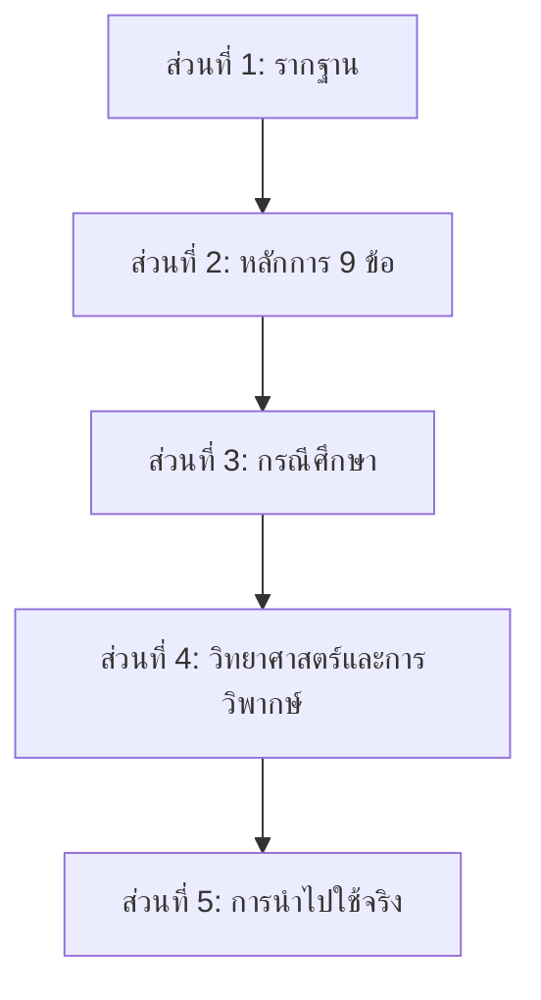

# แผนเนื้อหาค้นคว้า: Ultralearning — กลยุทธ์การเรียนรู้เร่งรัดอย่างเป็นระบบ

> แผนนี้ออกแบบมาเพื่อสั่งให้ AI Agent ค้นคว้าและสร้างรายงานทีละไฟล์ โดยเนื้อหาทุกไฟล์สามารถต่อรวมกันเป็นรายงานฉบับสมบูรณ์ได้อย่างไร้รอยต่อ

## ภาพรวมโครงสร้างรายงาน

รายงานทั้งหมดแบ่งออกเป็น **12 ไฟล์** ใน **5 ส่วนหลัก** ดังนี้:



| ส่วน | ไฟล์ | ชื่อไฟล์ | เนื้อหาหลัก |
|:---:|:---:|:---|:---|
| 1 | 01 | `01_foundation.md` | นิยาม ที่มา ปรัชญาพื้นฐาน |
| 2 | 02 | `02_metalearning_focus.md` | หลักการที่ 1-2: Metalearning & Focus |
| 2 | 03 | `03_directness_drill.md` | หลักการที่ 3-4: Directness & Drill |
| 2 | 04 | `04_retrieval_feedback.md` | หลักการที่ 5-6: Retrieval & Feedback |
| 2 | 05 | `05_retention_intuition.md` | หลักการที่ 7-8: Retention & Intuition |
| 2 | 06 | `06_experimentation.md` | หลักการที่ 9: Experimentation |
| 3 | 07 | `07_case_study_scott_young.md` | กรณีศึกษา: Scott Young — MIT Challenge |
| 3 | 08 | `08_case_study_language_masters.md` | กรณีศึกษา: Benny Lewis & ผู้เชี่ยวชาญด้านภาษา |
| 3 | 09 | `09_case_study_domain_experts.md` | กรณีศึกษา: Roger Craig, Eric Barone & อื่นๆ |
| 4 | 10 | `10_scientific_evidence.md` | หลักฐานทางวิทยาศาสตร์ |
| 4 | 11 | `11_criticism_and_limitations.md` | การวิพากษ์และข้อจำกัด |
| 5 | 12 | `12_practical_application.md` | คู่มือการนำไปใช้จริง |

---

## กฎทั่วไปสำหรับ AI Agent ทุกไฟล์

> [!IMPORTANT]
> **กฎเหล่านี้ใช้กับทุกไฟล์ — ห้ามตัดทอนหรือข้ามเนื้อหาใดๆ**

1. **ห้ามตัดทอนเนื้อหา** — เขียนให้ครบทุกหัวข้อตามที่ระบุในแต่ละไฟล์ ไม่ว่าจะยาวแค่ไหน
2. **ภาษา** — เขียนเป็นภาษาไทย แต่ศัพท์เฉพาะทาง (Technical Terms) ให้ใส่ภาษาอังกฤษกำกับในวงเล็บ เช่น "การเรียนรู้แบบดึงข้อมูลจากความจำ (Retrieval Practice)"
3. **แหล่งอ้างอิง** — ทุกข้อมูลที่ยกมาต้องระบุแหล่งที่มา ใส่ไว้ท้ายแต่ละย่อหน้าหรือท้ายไฟล์ในรูปแบบ footnote
4. **โครงสร้างหัวข้อ** — ใช้ Markdown heading ที่ต่อเนื่องกันข้ามไฟล์ (ดูรายละเอียดในแต่ละไฟล์)
5. **ส่วนเชื่อมต่อ** — ทุกไฟล์ต้องมี:
   - **ส่วนเปิด** — ย่อหน้าสั้นๆ เชื่อมจากเนื้อหาไฟล์ก่อนหน้า (ยกเว้นไฟล์ 01)
   - **ส่วนปิด** — ย่อหน้าสั้นๆ ปูทางสู่เนื้อหาไฟล์ถัดไป (ยกเว้นไฟล์ 12)
6. **ความยาวขั้นต่ำ** — แต่ละไฟล์ไม่ต่ำกว่า 2,000 คำ
7. **การอ้างอิงข้ามไฟล์** — เมื่ออ้างถึงเนื้อหาจากไฟล์อื่น ให้ใช้รูปแบบ `(ดูรายละเอียดในไฟล์ XX: ชื่อหัวข้อ)`

---

## รายละเอียดแต่ละไฟล์

---

### 📄 ไฟล์ 01: `01_foundation.md` — รากฐานของ Ultralearning

**หมายเลขบท:** บทที่ 1  
**Heading หลัก:** `# บทที่ 1: รากฐานของ Ultralearning`

#### คำสั่งสำหรับ Agent:

> ค้นคว้าและเขียนเนื้อหาครอบคลุมหัวข้อต่อไปนี้อย่างละเอียด โดยไม่ตัดทอน:

**1.1 Ultralearning คืออะไร?**
- นิยามของ Ultralearning ตามที่ Scott H. Young กำหนดไว้ในหนังสือ *Ultralearning: Master Hard Skills, Outsmart the Competition, and Accelerate Your Career* (2019)
- คำนิยามฉบับเต็ม: "A strategy for acquiring skills and knowledge that is both self-directed and intense"
- แยกองค์ประกอบสำคัญ 3 ส่วน: (1) Self-directed (2) Intense (3) Strategy — อธิบายแต่ละองค์ประกอบอย่างละเอียด
- เปรียบเทียบ Ultralearning กับการเรียนรู้แบบดั้งเดิม (Traditional Learning) และการเรียนรู้แบบ Informal Learning

**1.2 ประวัติและที่มา**
- ประวัติของ Scott H. Young — การศึกษา ภูมิหลัง ความสนใจ
- จุดเริ่มต้นของแนวคิด Ultralearning — เกิดขึ้นได้อย่างไร?
- อิทธิพลทางความคิดจากนักวิจัยและนักทฤษฎีการเรียนรู้คนสำคัญ:
  - K. Anders Ericsson (Deliberate Practice)
  - Hermann Ebbinghaus (Forgetting Curve)
  - Robert Bjork (Desirable Difficulties)
  - Benjamin Bloom (Mastery Learning)
- ไทม์ไลน์: จาก MIT Challenge (2012) สู่หนังสือ Ultralearning (2019)

**1.3 ปรัชญาพื้นฐาน**
- แนวคิด "Aggressive Self-Education" — การเรียนรู้ด้วยตนเองอย่างจริงจัง
- ความแตกต่างระหว่าง "Learning for Fun" vs "Ultralearning Project"
- หลักการ "Intensity over Duration" — ทำไมความเข้มข้นสำคัญกว่าระยะเวลา
- แนวคิด "The Transfer Problem" — ปัญหาการถ่ายโอนความรู้จากห้องเรียนสู่การใช้งานจริง
- บริบทยุคปัจจุบัน: ทำไม Ultralearning จึงสำคัญในยุคที่ทักษะเปลี่ยนเร็ว (Skill Disruption)

**1.4 ใครที่เหมาะกับ Ultralearning?**
- โปรไฟล์ของ Ultralearner ในอุดมคติ
- สถานการณ์ที่ Ultralearning เหมาะสม vs ไม่เหมาะสม
- ข้อกำหนดเบื้องต้น (Prerequisites): เวลา แรงจูงใจ ทรัพยากร

**ส่วนปิด:** ปูทางไปสู่หลักการ 9 ข้อที่เป็นหัวใจสำคัญ

#### แหล่งค้นคว้าแนะนำ:
- หนังสือ *Ultralearning* โดย Scott H. Young (2019)
- บล็อกของ Scott Young: scotthyoung.com
- งานวิจัยของ K. Anders Ericsson เรื่อง Deliberate Practice
- งานวิจัยของ Robert Bjork เรื่อง Desirable Difficulties

---

### 📄 ไฟล์ 02: `02_metalearning_focus.md` — หลักการที่ 1-2: Metalearning & Focus

**หมายเลขบท:** บทที่ 2  
**Heading หลัก:** `# บทที่ 2: Metalearning & Focus — วางแผนและมุ่งสมาธิ`

#### คำสั่งสำหรับ Agent:

**ส่วนเปิด:** เชื่อมจากบทที่ 1 — "จากรากฐานที่วางไว้ เรามาเริ่มเจาะลึกหลักการแรก..."

**2.1 หลักการที่ 1: Metalearning — "First Draw a Map" (วาดแผนที่ก่อน)**

- **นิยามเชิงลึก**: Metalearning คืออะไร? — "การเรียนรู้วิธีเรียนรู้" (Learning how to learn)
- **กรอบ WHY-WHAT-HOW:**
  - **WHY** — ทำไมคุณต้องการเรียนสิ่งนี้? (แรงจูงใจเครื่องมือ vs แรงจูงใจภายใน)
  - **WHAT** — อะไรคือสิ่งที่ต้องเรียน? (แยก Facts / Concepts / Procedures)
  - **HOW** — จะเรียนอย่างไร? (Benchmarking, Emphasize/Exclude Method)
- **เทคนิค 10% Rule**: ใช้เวลา 10% แรกของโปรเจกต์ในการวิจัยวิธีเรียนรู้
- **วิธีทำ Metalearning Map ทีละขั้นตอน:**
  1. วิเคราะห์หลักสูตรที่มีอยู่ (เช่น ดูหลักสูตรมหาวิทยาลัย)
  2. สัมภาษณ์ผู้เชี่ยวชาญ
  3. ระบุ Bottleneck ที่คาดว่าจะเจอ
  4. วางแผนทรัพยากรและเครื่องมือ
- **ตัวอย่างจริง**: Scott Young ทำ Metalearning อย่างไรก่อนเริ่ม MIT Challenge

**2.2 หลักการที่ 2: Focus — "Sharpen Your Knife" (ลับมีดให้คม)**

- **นิยามเชิงลึก**: Focus ในบริบท Ultralearning — ไม่ใช่แค่ "ตั้งใจ" แต่คือ "การจัดสรรสมาธิอย่างมีกลยุทธ์"
- **ปัญหา 3 ประเภทของการโฟกัส:**
  1. **ไม่เริ่ม (Failing to Start)** — Procrastination / ผลัดวันประกัน
  2. **ไม่ต่อเนื่อง (Failing to Sustain)** — สมาธิสั้น หลุดโฟกัสกลางทาง
  3. **ทำไม่ถูกทาง (Failing to Optimize)** — โฟกัสผิดจุด ทำงานที่ไม่สำคัญ
- **วิทยาศาสตร์ของสมาธิ:**
  - Flow State (Mihaly Csikszentmihalyi) — สภาวะลื่นไหล
  - Deep Work (Cal Newport) — เปรียบเทียบกับแนวคิดของ Ultralearning
  - Attention Residue — ผลเสียของ Multitasking
- **เทคนิคปฏิบัติ:**
  - Pomodoro Technique vs Ultralearning Sprints
  - การออกแบบสภาพแวดล้อม (Environment Design)
  - การจัดการ Distraction แบบระบบ
  - Interleaving vs Blocked Practice — ใช้เมื่อใด

**ส่วนปิด:** เชื่อมไปหลักการที่ 3-4 — "เมื่อวางแผนและมีสมาธิแล้ว ขั้นตอนต่อไปคือการลงมือทำจริง..."

#### แหล่งค้นคว้าแนะนำ:
- *Ultralearning* บทที่ 4 (Metalearning) และ บทที่ 5 (Focus)
- งานวิจัยเรื่อง Flow โดย Mihaly Csikszentmihalyi
- *Deep Work* โดย Cal Newport
- งานวิจัย Attention Residue โดย Sophie Leroy

---

### 📄 ไฟล์ 03: `03_directness_drill.md` — หลักการที่ 3-4: Directness & Drill

**หมายเลขบท:** บทที่ 3  
**Heading หลัก:** `# บทที่ 3: Directness & Drill — ลงมือทำจริง และฝึกจุดอ่อน`

#### คำสั่งสำหรับ Agent:

**ส่วนเปิด:** เชื่อมจากบทที่ 2

**3.1 หลักการที่ 3: Directness — "Go Straight Ahead" (เรียนจากการทำจริง)**

- **นิยามเชิงลึก**: Directness คือการเรียนรู้ในบริบทที่จะใช้ทักษะนั้นจริงๆ
- **ปัญหา Transfer Problem:**
  - ทำไมนักเรียนที่สอบได้ดีในห้องเรียนแต่ใช้ในชีวิตจริงไม่ได้?
  - งานวิจัยเรื่อง Transfer of Learning — Thorndike, Woodworth
  - "The Indirect Path" vs "The Direct Path" — เปรียบเทียบให้เห็นภาพ
- **กลยุทธ์ Directness 4 แบบ:**
  1. **Project-Based Learning** — เรียนผ่านโปรเจกต์จริง
  2. **Immersive Learning** — จมตัวอยู่ในสภาพแวดล้อมจริง
  3. **Simulation** — จำลองสถานการณ์ที่ใกล้เคียงจริงที่สุด
  4. **The Overkill Approach** — วางเป้าหมายสูงกว่าที่ต้องการ
- **ตัวอย่างจริง:**
  - Benny Lewis ใช้ Directness ในการเรียนภาษา (พูดตั้งแต่วันแรก)
  - Vatsal Jaiswal เรียนสถาปัตยกรรมโดยวาดอาคารจริง
  - De Montebello ฝึกพูดต่อหน้าสาธารณะโดยไปแข่ง Public Speaking จริง

**3.2 หลักการที่ 4: Drill — "Attack Your Weakest Point" (เจาะจุดอ่อนให้ทะลุ)**

- **นิยามเชิงลึก**: Drill คือการแยกทักษะย่อยที่เป็นจุดอ่อนออกมาฝึกเฉพาะ
- **ความสัมพันธ์กับ Directness**: Directness = ฝึกทั้งหมด, Drill = ซูมเข้าฝึกจุดอ่อน
- **หลักการ "Rate-Determining Step":**
  - ยืมแนวคิดจากเคมี — ขั้นตอนที่ช้าที่สุดกำหนดความเร็วทั้งหมด
  - ระบุว่าทักษะย่อยใดเป็น Bottleneck
- **ประเภทของ Drill 5 แบบ:**
  1. **Time Slicing** — ฝึกเฉพาะช่วงเวลาหนึ่งของกระบวนการ
  2. **Cognitive Components** — แยกฝึกด้านความคิด vs ด้านลงมือทำ
  3. **The Copycat** — ลอกแบบผลงานชั้นเยี่ยมเพื่อเรียนรู้โครงสร้าง
  4. **The Magnifying Glass** — ซูมเข้าฝึกส่วนเล็กอย่างละเอียด
  5. **Prerequisite Chaining** — ย้อนกลับไปเรียนพื้นฐานที่ขาด
- **ตัวอย่างจริง:**
  - Ben Franklin ฝึกเขียนโดย Drill เรื่อง Vocabulary, Structure, Argument แยกกัน
  - นักดนตรีคลาสสิกฝึก Scales และ Passages ที่ยากเป็นพิเศษ

**ส่วนปิด:** เชื่อมไปหลักการที่ 5-6

#### แหล่งค้นคว้าแนะนำ:
- *Ultralearning* บทที่ 6 (Directness) และ บทที่ 7 (Drill)
- งานวิจัย Transfer of Learning โดย Thorndike & Woodworth
- งานวิจัย Deliberate Practice โดย K. Anders Ericsson
- ตัวอย่าง Benjamin Franklin จาก Autobiography of Benjamin Franklin

---

### 📄 ไฟล์ 04: `04_retrieval_feedback.md` — หลักการที่ 5-6: Retrieval & Feedback

**หมายเลขบท:** บทที่ 4  
**Heading หลัก:** `# บทที่ 4: Retrieval & Feedback — ดึงข้อมูลจากความจำ และรับ Feedback`

#### คำสั่งสำหรับ Agent:

**ส่วนเปิด:** เชื่อมจากบทที่ 3

**4.1 หลักการที่ 5: Retrieval — "Test to Learn" (ทดสอบเพื่อเรียนรู้)**

- **นิยามเชิงลึก**: Retrieval Practice — ทดสอบตัวเองแทนการอ่านทบทวน
- **The Testing Effect — งานวิจัยสำคัญ:**
  - Roediger & Karpicke (2006) — การทดลองที่พิสูจน์ว่าการทดสอบช่วยจำได้ดีกว่าการอ่านซ้ำ
  - ผลลัพธ์เชิงตัวเลข: กลุ่มที่ทดสอบตัวเองจำได้มากกว่ากลุ่มที่อ่านซ้ำกี่เปอร์เซ็นต์?
  - การทดลองเพิ่มเติมที่สนับสนุน (Karpicke & Blunt, 2011)
- **ทำไม Retrieval ถึงได้ผล? (กลไกทางสมอง)**
  - Strengthening Neural Pathways
  - Identifying Knowledge Gaps
  - Encoding Variability
- **เทคนิค Retrieval 5 แบบ:**
  1. **Flash Cards** — Anki, SuperMemo, หลักการ SRS
  2. **Free Recall** — ปิดหนังสือแล้วเขียนสิ่งที่จำได้
  3. **Question-Book Method** — อ่านหนังสือแล้วเปลี่ยนเนื้อหาเป็นคำถาม
  4. **Self-Generated Challenges** — สร้างโจทย์ปัญหาให้ตัวเอง
  5. **Closed-Book Problem Solving** — ทำโจทย์โดยไม่เปิดตำรา
- **ข้อควรระวัง:**
  - Illusion of Competence — ความรู้สึกว่า "เข้าใจแล้ว" ทั้งที่จริงๆ ยังไม่ได้
  - Passive Review Trap — กับดักการทบทวนแบบ Passive

**4.2 หลักการที่ 6: Feedback — "Don't Dodge the Punches" (อย่าหลบ Feedback)**

- **นิยามเชิงลึก**: Feedback ที่ถูกต้อง เร็ว และตรงประเด็น คือกุญแจเร่งการเรียนรู้
- **ประเภทของ Feedback 3 ระดับ:**
  1. **Outcome Feedback** — ผลลัพธ์สุดท้าย (ผ่าน/ไม่ผ่าน, ชนะ/แพ้)
  2. **Informational Feedback** — ข้อมูลว่าผิดตรงไหน แต่ไม่บอกวิธีแก้
  3. **Corrective Feedback** — บอกทั้งว่าผิดตรงไหนและวิธีแก้ไข
- **ลำดับขั้นความมีประโยชน์ของ Feedback:**
  - Corrective > Informational > Outcome
  - แต่ Outcome Feedback ก็ดีกว่าไม่มี Feedback เลย
- **อุปสรรคของ Feedback:**
  - Ego — ความกลัวว่าจะถูกตัดสิน
  - Noise — Feedback ที่ไม่เกี่ยวข้องหรือผิด
  - Over-Correction — การปรับตัวมากเกินไปตาม Feedback เดียว
- **กลยุทธ์รับ Feedback อย่างมีประสิทธิภาพ:**
  - ใช้ Meta-Feedback — Feedback เกี่ยวกับวิธีเรียนรู้ของตัวเอง
  - ออกแบบ Tight Feedback Loops — วงจร Feedback ที่สั้นและเร็ว
  - แยก Signal จาก Noise
- **ตัวอย่างจริง:**
  - Chris Rock ทดสอบ Comedy ในคลับเล็กก่อนนำไปแสดง Special
  - โปรแกรมเมอร์ใช้ Unit Test เป็น Feedback Loop

**ส่วนปิด:** เชื่อมไปหลักการที่ 7-8

#### แหล่งค้นคว้าแนะนำ:
- *Ultralearning* บทที่ 8 (Retrieval) และ บทที่ 9 (Feedback)
- Roediger, H.L. & Karpicke, J.D. (2006). "Test-Enhanced Learning"
- Karpicke, J.D. & Blunt, J.R. (2011). "Retrieval Practice Produces More Learning than Elaborative Studying"
- งานวิจัย Feedback ในด้าน Performance Psychology

---

### 📄 ไฟล์ 05: `05_retention_intuition.md` — หลักการที่ 7-8: Retention & Intuition

**หมายเลขบท:** บทที่ 5  
**Heading หลัก:** `# บทที่ 5: Retention & Intuition — จำได้นาน และเข้าใจอย่างลึกซึ้ง`

#### คำสั่งสำหรับ Agent:

**ส่วนเปิด:** เชื่อมจากบทที่ 4

**5.1 หลักการที่ 7: Retention — "Don't Fill a Leaky Bucket" (อย่าเติมน้ำถังรั่ว)**

- **นิยามเชิงลึก**: การจัดการกับ Forgetting Curve — ทำไมเราลืม และจะป้องกันได้อย่างไร
- **วิทยาศาสตร์ของการลืม:**
  - Hermann Ebbinghaus — Forgetting Curve (กราฟการลืม)
  - ทำไมเราลืม? — Decay Theory vs Interference Theory
  - ตัวเลขจากงานวิจัย: ลืมกี่เปอร์เซ็นต์ภายใน 24 ชั่วโมง, 1 สัปดาห์, 1 เดือน
- **กลยุทธ์ต้านการลืม 4 แบบ:**
  1. **Spaced Repetition System (SRS):**
     - หลักการทำงาน — Spacing Effect
     - เครื่องมือ: Anki, SuperMemo, Mnemosyne
     - วิธีออกแบบ Deck ที่ดี
     - อัลกอริทึม SM-2 (SuperMemo Algorithm) — อธิบายอย่างเข้าใจง่าย
  2. **Procedural Memory (ความจำเชิงกระบวนการ):**
     - ทักษะที่ฝึกจนเป็นอัตโนมัติจะลืมยากกว่า
     - เปรียบเทียบ: ขี่จักรยาน vs ท่องสูตร
  3. **Overlearning:**
     - ฝึกต่อไปแม้ "เข้าใจแล้ว" — ประโยชน์และข้อจำกัด
     - จุดที่ Overlearning มีประโยชน์ vs จุดที่เป็น Diminishing Returns
  4. **Mnemonics (เทคนิคช่วยจำ):**
     - Memory Palace (Method of Loci)
     - Keyword Method
     - Acronyms and Stories
     - ข้อจำกัดของ Mnemonics — ใช้ได้ดีกับ Facts แต่ไม่เหมาะกับ Concepts

**5.2 หลักการที่ 8: Intuition — "Dig Deep Before Building Up" (ขุดลึกก่อนสร้าง)**

- **นิยามเชิงลึก**: Intuition ไม่ใช่พรสวรรค์ แต่คือ "ความเข้าใจเชิงลึกที่สะสมจากประสบการณ์"
- **Richard Feynman Technique:**
  - 4 ขั้นตอนของ Feynman Technique — อธิบายอย่างละเอียด
  - ทำไม Feynman ถือว่าเป็น Master of Intuition
  - ตัวอย่าง: Feynman อธิบาย Quantum Electrodynamics ให้คนทั่วไปฟัง
- **กลยุทธ์สร้าง Intuition:**
  1. **Don't Give Up on Hard Problems Too Easily** — กฎ "Struggle Timer"
  2. **Prove Things to Understand Them** — อย่าแค่จำสูตร ต้องเข้าใจที่มา
  3. **Always Start with a Concrete Example** — เริ่มจากตัวอย่างที่จับต้องได้
  4. **Don't Fool Yourself** — หลีกเลี่ยง Dunning-Kruger Effect
- **ความแตกต่างระหว่าง "Knowing" vs "Understanding":**
  - Surface-Level Knowledge vs Deep Understanding
  - การทดสอบ Intuition: สามารถอธิบายให้เด็ก 10 ขวบเข้าใจได้หรือไม่?
- **ตัวอย่างจริง:**
  - Ramanujan — สัญชาตญาณทางคณิตศาสตร์ที่สร้างจากการเล่นกับตัวเลข
  - Magnus Carlsen — Pattern Recognition ในหมากรุก

**ส่วนปิด:** เชื่อมไปหลักการที่ 9 (หลักการสุดท้าย)

#### แหล่งค้นคว้าแนะนำ:
- *Ultralearning* บทที่ 10 (Retention) และ บทที่ 11 (Intuition)
- Ebbinghaus, H. (1885). *Memory: A Contribution to Experimental Psychology*
- งานวิจัย Spacing Effect — Cepeda et al. (2006)
- *Surely You're Joking, Mr. Feynman!* โดย Richard Feynman

---

### 📄 ไฟล์ 06: `06_experimentation.md` — หลักการที่ 9: Experimentation

**หมายเลขบท:** บทที่ 6  
**Heading หลัก:** `# บทที่ 6: Experimentation — ทดลอง ค้นพบ สร้างสรรค์`

#### คำสั่งสำหรับ Agent:

**ส่วนเปิด:** เชื่อมจากบทที่ 5

**6.1 หลักการที่ 9: Experimentation — "Explore Outside Your Comfort Zone"**

- **นิยามเชิงลึก**: Experimentation คือการก้าวข้ามขั้น "ความสามารถ" ไปสู่ขั้น "ความเชี่ยวชาญ" และ "ความเป็นเอกลักษณ์"
- **ทำไม Experimentation จึงเป็นหลักการสุดท้าย?**
  - ลำดับขั้นการเรียนรู้: ผู้เริ่มต้น → ผู้สามารถ → ผู้เชี่ยวชาญ → ผู้สร้างสรรค์
  - Experimentation คือสะพานจาก "ทำตาม" ไปสู่ "สร้างของตัวเอง"
- **ประเภทของ Experimentation 3 แบบ:**
  1. **Learning Resources** — ทดลองเปลี่ยนวิธีเรียน (หนังสือ, วิดีโอ, mentor, ลงมือทำ)
  2. **Technique** — ทดลองเทคนิคใหม่ๆ ที่ไม่เคยใช้
  3. **Style** — พัฒนาสไตล์เฉพาะตัว (สำคัญสำหรับงานสร้างสรรค์)
- **Growth Mindset vs Fixed Mindset (Carol Dweck):**
  - ความเชื่อมโยงกับ Experimentation
  - ทำไม Growth Mindset จึงจำเป็นสำหรับ Ultralearner
- **กลยุทธ์ทดลอง:**
  - Copy then Create — ลอกแบบก่อน แล้วค่อยสร้างของตัวเอง
  - Compare Methods Side-by-Side — ทดลองเปรียบเทียบ 2 วิธีพร้อมกัน
  - Introduce New Constraints — จำกัดตัวเองเพื่อบังคับให้คิดใหม่
  - Combine Skills (Skill Stacking) — รวมทักษะต่างสาขาเพื่อสร้างคุณค่าใหม่
- **ตัวอย่างจริง:**
  - Van Gogh — ทดลองสไตล์ต่างๆ ก่อนค้นพบ Post-Impressionism
  - Eric Barone (Stardew Valley) — ทดลองเรียนรู้ทุกทักษะที่ต้องใช้สร้างเกมคนเดียว

**ส่วนปิด:** ปูทางเข้าสู่ส่วนกรณีศึกษา — "ตอนนี้เราเข้าใจทั้ง 9 หลักการแล้ว มาดูว่าคนจริงนำไปใช้ได้อย่างไร..."

#### แหล่งค้นคว้าแนะนำ:
- *Ultralearning* บทที่ 12 (Experimentation)
- *Mindset: The New Psychology of Success* โดย Carol Dweck
- ประวัติศิลปะ Van Gogh — จาก Van Gogh Museum
- สัมภาษณ์ Eric Barone (ConcernedApe) เรื่องการพัฒนา Stardew Valley

---

### 📄 ไฟล์ 07: `07_case_study_scott_young.md` — กรณีศึกษา: Scott Young & MIT Challenge

**หมายเลขบท:** บทที่ 7  
**Heading หลัก:** `# บทที่ 7: กรณีศึกษา — Scott Young และ MIT Challenge`

#### คำสั่งสำหรับ Agent:

**ส่วนเปิด:** เชื่อมจากส่วนหลักการ — "ตอนนี้เราเข้าใจทฤษฎีแล้ว มาดูการนำไปปฏิบัติจริง..."

> [!IMPORTANT]
> กรณีศึกษานี้ต้องเขียนอย่างละเอียดเพราะเป็นตัวอย่างหลักที่แสดงให้เห็นหลักการ Ultralearning ทั้ง 9 ข้อ

**7.1 MIT Challenge — ภาพรวม**
- **โปรเจกต์**: เรียนหลักสูตร Computer Science ของ MIT ทั้ง 4 ปี ภายใน 12 เดือน
- **ปี**: 2012
- **กติกา**: ผ่านข้อสอบ Final Exam ของ MIT ทุกวิชา, ทำ Programming Projects ให้ครบ
- **ทรัพยากร**: MIT OpenCourseWare (ฟรี, ออนไลน์)
- **ผลลัพธ์**: ผ่าน 33 วิชาใน 12 เดือน — ข้อมูลเชิงตัวเลขที่แม่นยำ

**7.2 วิเคราะห์ตามหลักการ 9 ข้อ**

ให้วิเคราะห์โดยอ้างอิงแต่ละหลักการที่อธิบายไว้ในไฟล์ 02-06:

| หลักการ | Scott Young ใช้อย่างไรใน MIT Challenge |
|:---|:---|
| 1. Metalearning | วิจัยหลักสูตร MIT ล่วงหน้า, วางแผนลำดับวิชา |
| 2. Focus | จัดตาราง intensive study sessions |
| 3. Directness | ทำ Final Exam และ Projects จริงของ MIT |
| 4. Drill | แยกฝึกเฉพาะ concepts ที่ยาก |
| 5. Retrieval | ทำข้อสอบเก่าซ้ำๆ โดยไม่เปิดตำรา |
| 6. Feedback | ตรวจคำตอบกับเฉลย, ปรับวิธีเรียน |
| 7. Retention | ใช้ SRS สำหรับบางวิชา, เชื่อมโยงความรู้ข้ามวิชา |
| 8. Intuition | ใช้ Feynman Technique อธิบายแนวคิดใหม่ |
| 9. Experimentation | ปรับวิธีเรียนระหว่างทาง |

(ให้อธิบายแต่ละข้ออย่างละเอียด ไม่ใช่แค่ตาราง)

**7.3 ตารางเรียนตัวอย่าง**
- แสดงตารางรายสัปดาห์ที่ Scott Young ใช้จริง (ถ้ามีข้อมูล)
- จำนวนชั่วโมงต่อวัน/สัปดาห์
- วิธีจัดลำดับวิชา (ทำทีละวิชาหรือหลายวิชาพร้อมกัน)

**7.4 โปรเจกต์อื่นของ Scott Young**
- **Year Without English** — เรียน 4 ภาษาใน 4 ประเทศ ภายใน 1 ปี (สเปน, บราซิล, จีน, เกาหลีใต้)
  - กติกา: ห้ามพูดภาษาอังกฤษ
  - ผลลัพธ์: ระดับภาษาที่ได้ในแต่ละภาษา
  - หลักการที่ใช้: Directness, Immersion, Feedback
- **Portrait Drawing Challenge** — เรียนวาดรูปภายใน 30 วัน
- บทเรียนร่วม (Common Lessons) จากทุกโปรเจกต์

**7.5 ข้อวิจารณ์ MIT Challenge**
- ข้อจำกัดที่ต้องตระหนัก: ไม่มีปฏิสัมพันธ์กับอาจารย์และเพื่อนร่วมชั้น, ไม่มี Lab
- คำถาม: "เรียนจบ" เทียบเท่ากับ "ได้ปริญญา MIT" จริงหรือ?
- Scott Young ตอบข้อวิจารณ์เหล่านี้อย่างไร

**ส่วนปิด:** เชื่อมไปกรณีศึกษาภาษา

#### แหล่งค้นคว้าแนะนำ:
- scotthyoung.com — บล็อกโพสต์เกี่ยวกับ MIT Challenge
- TEDx Talk ของ Scott Young
- สัมภาษณ์ Scott Young ใน Podcast ต่างๆ
- MIT OpenCourseWare — โครงสร้างหลักสูตร CS

---

### 📄 ไฟล์ 08: `08_case_study_language_masters.md` — กรณีศึกษา: ผู้เชี่ยวชาญด้านภาษา

**หมายเลขบท:** บทที่ 8  
**Heading หลัก:** `# บทที่ 8: กรณีศึกษา — ผู้เชี่ยวชาญด้านภาษาและ Polyglots`

#### คำสั่งสำหรับ Agent:

**ส่วนเปิด:** เชื่อมจากบทที่ 7

**8.1 Benny Lewis — "Fluent in 3 Months"**
- **ภูมิหลัง**: ชาวไอร์แลนด์ที่เคยเรียนภาษาแย่มาก จนค้นพบวิธีของตัวเอง
- **ปรัชญา "Speak from Day One":**
  - ทำไมต้องพูดตั้งแต่วันแรก?
  - วิธีจัดการกับความอาย (Fear of Embarrassment)
  - เทคนิค "Language Hacking"
- **กลยุทธ์ที่เชื่อมกับ Ultralearning:**
  - Directness — พูดกับคนจริงทันที
  - Feedback — รับ Correction จาก Native Speaker
  - Drill — ฝึก Grammar Pattern ที่ใช้บ่อยสุดก่อน
  - Metalearning — วิเคราะห์โครงสร้างภาษาก่อนเริ่ม (Pareto 80/20)
- **ผลลัพธ์ที่วัดได้:**
  - ภาษาที่เรียน ระดับที่ได้ ระยะเวลา (ตาราง)
  - ใช้มาตรฐาน CEFR (A1-C2) ในการวัด
- **ข้อวิจารณ์วิธีการของ Benny Lewis:**
  - "Fluent" ของ Lewis กับ "Fluent" ในเชิงวิชาการเหมือนกันหรือไม่?
  - ข้อจำกัดของวิธี Immersion

**8.2 ตัวอย่าง Polyglot อื่นๆ ที่ใช้หลักการ Ultralearning**
- **Luca Lampariello** — Bidirectional Translation Method
- **Alexander Arguelles** — Shadowing Technique
- **Steve Kaufmann** — Massive Input Approach (LingQ)
- เปรียบเทียบวิธีการ: ใครเน้นหลักการไหนของ Ultralearning มากที่สุด

**8.3 บทเรียนรวม: Ultralearning กับการเรียนภาษา**
- สรุปหลักการ Ultralearning ที่สำคัญที่สุดสำหรับการเรียนภาษา (จัดอันดับ)
- Framework: วิธีออกแบบ Ultralearning Language Project ของตัวเอง
- Timeline ตัวอย่าง: แผน 3 เดือนเรียนภาษาใหม่

**ส่วนปิด:** เชื่อมไปกรณีศึกษาในสาขาอื่น

#### แหล่งค้นคว้าแนะนำ:
- *Fluent in 3 Months* โดย Benny Lewis
- fluentin3months.com
- สัมภาษณ์ Polyglots ใน YouTube: Luca Lampariello, Alexander Arguelles
- Steve Kaufmann — LingQ Blog
- CEFR Framework — Council of Europe

---

### 📄 ไฟล์ 09: `09_case_study_domain_experts.md` — กรณีศึกษา: ผู้เชี่ยวชาญในสาขาต่างๆ

**หมายเลขบท:** บทที่ 9  
**Heading หลัก:** `# บทที่ 9: กรณีศึกษา — จากเกมโชว์สู่วิดีโอเกม`

#### คำสั่งสำหรับ Agent:

**ส่วนเปิด:** เชื่อมจากบทที่ 8

**9.1 Roger Craig — "Hacking Jeopardy!"**
- **ภูมิหลัง**: นักวิทยาการคอมพิวเตอร์ที่ใช้ Data Science เพื่อชนะ Jeopardy!
- **กลยุทธ์ Data-Driven:**
  - ดาวน์โหลดฐานข้อมูลคำถาม Jeopardy! ย้อนหลัง (J! Archive)
  - วิเคราะห์ Pattern: หมวดไหนออกบ่อย, คำตอบไหนซ้ำ
  - สร้างซอฟต์แวร์จำลองเกมเพื่อฝึกซ้อม
  - ออกแบบ Spaced Repetition Deck เฉพาะสำหรับ Jeopardy!
- **หลักการ Ultralearning ที่โดดเด่น:**
  - Metalearning — วิเคราะห์โครงสร้างเกมก่อนฝึก
  - Drill — เจาะเฉพาะหมวดที่อ่อน
  - Retrieval — ฝึกตอบคำถามจากความจำ
  - Directness — จำลองสถานการณ์แข่งจริง
- **ผลลัพธ์**: สถิติที่ทำลาย ชนะกี่ครั้ง เงินรางวัลเท่าไร
- **บทเรียน**: Ultralearning + Technology = Amplified Learning

**9.2 Eric Barone (ConcernedApe) — "สร้างเกมคนเดียว"**
- **ภูมิหลัง**: ไม่มีพื้นฐาน Game Development มาก่อน
- **โปรเจกต์ Stardew Valley:**
  - ทักษะที่ต้องเรียนรู้ทั้งหมด: Programming (C#), Pixel Art, Music Composition, Sound Design, Game Design, Narrative Writing
  - ระยะเวลา: ~4.5 ปี, ~70 ชั่วโมง/สัปดาห์
  - วิธีเรียนรู้แต่ละทักษะ
- **หลักการ Ultralearning ที่โดดเด่น:**
  - Experimentation — ทดลองสร้างทุกอย่างด้วยตัวเอง
  - Directness — เรียนโดยการสร้างเกมจริง
  - Drill — ฝึกวาด Pixel Art ซ้ำๆ จนได้สไตล์ที่พอใจ
- **ผลลัพธ์**: ยอดขาย, รายได้, รางวัล, คะแนนรีวิว
- **บทเรียน**: Ultralearning กับโปรเจกต์ระยะยาว (Sustained Intensity)

**9.3 กรณีศึกษาเพิ่มเติม**
- **Tristan de Montebello** — จากไม่เคยพูดต่อหน้าคน สู่แชมป์ Public Speaking ระดับโลก
  - วิธีฝึก: เข้าแข่ง Toastmasters อย่างเข้มข้น
  - หลักการที่ใช้: Directness, Feedback, Drill
- **Vatsal Jaiswal** — เรียนสถาปัตยกรรมด้วยตัวเอง
- **ตัวอย่างจากชีวิตประจำวัน** — คนธรรมดาที่ใช้ Ultralearning:
  - เรียน Programming ภายใน 3 เดือนเพื่อเปลี่ยนสายงาน
  - ฝึกวาดรูปจาก Zero สู่ Portfolio-Ready ใน 6 เดือน
  - เรียนเครื่องดนตรีใหม่ในวัยผู้ใหญ่

**9.4 ตารางเปรียบเทียบกรณีศึกษา**

| บุคคล | สาขา | ระยะเวลา | หลักการเด่น | ผลลัพธ์ |
|:---|:---|:---|:---|:---|
| Scott Young | CS/ภาษา | 12 เดือน/1 ปี | Metalearning, Directness | ผ่าน 33 วิชา MIT |
| Benny Lewis | ภาษา | 3 เดือน/ภาษา | Directness, Feedback | สนทนาได้ 10+ ภาษา |
| Roger Craig | Trivia/Strategy | หลายเดือน | Metalearning, Drill | สถิติ Jeopardy! |
| Eric Barone | Game Dev | 4.5 ปี | Experimentation, Directness | Stardew Valley |
| De Montebello | Public Speaking | ~7 เดือน | Directness, Feedback | แชมป์ระดับโลก |

**ส่วนปิด:** เชื่อมไปส่วนหลักฐานทางวิทยาศาสตร์

#### แหล่งค้นคว้าแนะนำ:
- บทความ Priceonomics เรื่อง Roger Craig
- สัมภาษณ์ Eric Barone (GDC Talk, Reddit AMA)
- *Ultralearning* — กรณีศึกษาในหนังสือ
- Toastmasters International — ข้อมูลเกี่ยวกับ De Montebello

---

### 📄 ไฟล์ 10: `10_scientific_evidence.md` — หลักฐานทางวิทยาศาสตร์

**หมายเลขบท:** บทที่ 10  
**Heading หลัก:** `# บทที่ 10: หลักฐานทางวิทยาศาสตร์ที่รองรับ Ultralearning`

#### คำสั่งสำหรับ Agent:

**ส่วนเปิด:** เชื่อมจากกรณีศึกษา — "จากตัวอย่างจริง มาดูว่าวิทยาศาสตร์บอกอะไร..."

> [!IMPORTANT]
> ไฟล์นี้ต้องอ้างอิงงานวิจัยจริง ระบุชื่อนักวิจัย ปีตีพิมพ์ และผลการวิจัยอย่างแม่นยำ

**10.1 Cognitive Load Theory (ทฤษฎีภาระทางปัญญา)**
- John Sweller — หลักการ Cognitive Load Theory
- 3 ประเภทของ Cognitive Load: Intrinsic, Extraneous, Germane
- ความเชื่อมโยงกับ Ultralearning: ทำไม Drill (การแยกฝึก) ช่วยลด Cognitive Load

**10.2 Desirable Difficulties (ความยากที่พึงประสงค์)**
- Robert Bjork & Elizabeth Bjork — นิยามและหลักการ
- ตัวอย่าง Desirable Difficulties:
  - Spacing (เว้นช่วงเรียน)
  - Interleaving (สลับเนื้อหา)
  - Variation (เปลี่ยนรูปแบบการฝึก)
  - Generation (สร้างคำตอบด้วยตัวเอง)
- งานวิจัยสนับสนุน: Bjork & Bjork (2011), Kornell & Bjork (2008)
- ความเชื่อมโยง: Ultralearning ใช้ Desirable Difficulties อย่างเป็นระบบ

**10.3 Testing Effect / Retrieval Practice**
- Roediger & Karpicke (2006) — การทดลอง landmark
  - Design: กลุ่มควบคุม vs กลุ่มทดสอบ
  - ผลลัพธ์: ตัวเลขเปรียบเทียบ
- Karpicke & Blunt (2011) — Retrieval Practice vs Concept Mapping
- Rowland (2014) — Meta-analysis ของ Testing Effect
- สรุป: ระดับความน่าเชื่อถือของหลักฐาน (Effect Size, จำนวนการศึกษา)

**10.4 Spacing Effect (ผลของการเว้นช่วง)**
- Ebbinghaus (1885) — การค้นพบดั้งเดิม
- Cepeda et al. (2006) — Meta-analysis ครั้งใหญ่
- Optimal Spacing Intervals — งานวิจัยบอกว่าควรเว้นนานแค่ไหน?
- ความเชื่อมโยงกับ Retention ใน Ultralearning

**10.5 Deliberate Practice**
- Ericsson, Krampe & Tesch-Römer (1993) — งานวิจัยดั้งเดิม
- คุณสมบัติ 4 ข้อของ Deliberate Practice
- 10,000 Hours Rule — Gladwell ตีความผิดอย่างไร?
- Macnamara et al. (2014) — Meta-analysis ที่ท้าทาย Ericsson
- ความเชื่อมโยงกับ Drill ใน Ultralearning

**10.6 Transfer of Learning**
- Thorndike & Woodworth (1901) — "Identical Elements Theory"
- Near Transfer vs Far Transfer
- งานวิจัยที่แสดงว่า Transfer เกิดขึ้นยาก
- ความเชื่อมโยงกับ Directness ใน Ultralearning — ทำไม Scott Young จึงเน้น "เรียนในบริบทจริง"

**10.7 Growth Mindset**
- Carol Dweck (2006) — *Mindset: The New Psychology of Success*
- งานวิจัยสนับสนุนและข้อวิพากษ์ (Replication Crisis)
- ความเชื่อมโยงกับ Experimentation ใน Ultralearning

**10.8 ตารางสรุปหลักฐานวิทยาศาสตร์**

| หลักการ Ultralearning | ทฤษฎีรองรับ | งานวิจัยหลัก | ระดับหลักฐาน |
|:---|:---|:---|:---|
| Metalearning | Metacognition | Flavell (1979) | แข็งแกร่ง |
| Focus | Attention & Flow | Csikszentmihalyi (1990) | แข็งแกร่ง |
| Directness | Transfer of Learning | Thorndike (1901) | ปานกลาง-แข็งแกร่ง |
| Drill | Deliberate Practice | Ericsson (1993) | แข็งแกร่ง |
| Retrieval | Testing Effect | Roediger & Karpicke (2006) | แข็งแกร่งมาก |
| Feedback | Feedback Loops | Hattie & Timperley (2007) | แข็งแกร่งมาก |
| Retention | Spacing Effect | Ebbinghaus (1885), Cepeda (2006) | แข็งแกร่งมาก |
| Intuition | Expert Cognition | Chi et al. (1981) | ปานกลาง |
| Experimentation | Growth Mindset | Dweck (2006) | ปานกลาง (มีข้อถกเถียง) |

**ส่วนปิด:** เชื่อมไปส่วนข้อวิพากษ์

#### แหล่งค้นคว้าแนะนำ:
- ฐานข้อมูลวิจัย: Google Scholar, PubMed, JSTOR
- งานวิจัยทั้งหมดที่ระบุข้างต้น
- *Make It Stick: The Science of Successful Learning* โดย Brown, Roediger & McDaniel

---

### 📄 ไฟล์ 11: `11_criticism_and_limitations.md` — การวิพากษ์และข้อจำกัด

**หมายเลขบท:** บทที่ 11  
**Heading หลัก:** `# บทที่ 11: การวิพากษ์ ข้อจำกัด และข้อควรระวัง`

#### คำสั่งสำหรับ Agent:

**ส่วนเปิด:** เชื่อมจากบทที่ 10

> [!WARNING]
> ไฟล์นี้ต้องเขียนอย่างเป็นกลาง ไม่ใช่เพื่อโจมตี Ultralearning แต่เพื่อให้ผู้อ่านมีมุมมองที่ครบถ้วน

**11.1 ข้อวิพากษ์เชิงวิธีการ (Methodological Criticisms)**
- **Survivorship Bias (อคติผู้รอด):**
  - กรณีศึกษาในหนังสือเป็นคนที่สำเร็จ — แล้วคนที่ลองแล้วล้มเหลวล่ะ?
  - ปัญหาการ Generalize จาก N=1
- **นิยาม "ความสำเร็จ" ที่ไม่ชัดเจน:**
  - "ผ่านข้อสอบ MIT" = "เข้าใจเท่า MIT grad" จริงหรือ?
  - "Fluent" ในภาษาใหม่ วัดจากมาตรฐานอะไร?
- **ขาดกลุ่มควบคุม:**
  - ไม่มีงานวิจัย Randomized Controlled Trial ที่ทดสอบ "Ultralearning" โดยตรง
  - หลักฐานส่วนใหญ่เป็น Anecdotal Evidence + ทฤษฎีรองรับ

**11.2 ข้อจำกัดเชิงปฏิบัติ (Practical Limitations)**
- **Privilege & Access:**
  - Ultralearning ต้องการเวลาว่างจำนวนมาก — ใครมีสิทธิ์นั้น?
  - ต้องการเข้าถึงอินเทอร์เน็ตและทรัพยากรการเรียนรู้
  - ปัจจัยทางเศรษฐกิจและสังคมที่ส่งผล
- **Intensity vs Sustainability:**
  - ความเสี่ยงของ Burnout
  - ผลกระทบต่อสุขภาพจิตและร่างกาย
  - ความสมดุลชีวิต (Work-Life-Learn Balance)
  - Scott Young ตอบข้อกังวลนี้อย่างไร: "ไม่จำเป็นต้อง 80 ชม./สัปดาห์"
- **ไม่เหมาะกับทุกสาขา:**
  - สาขาที่ต้องการ Mentorship ระยะยาว (เช่น แพทยศาสตร์, กฎหมาย)
  - สาขาที่ต้องการ Certification หรือ License
  - ทักษะที่ต้องใช้เวลาสะสม (เช่น ประสบการณ์ทางคลินิก)

**11.3 ข้อวิพากษ์เชิงปรัชญา (Philosophical Criticisms)**
- **"Airport Book" Criticism:**
  - เป็นการนำงานวิจัยมา repackage เป็นระบบสำเร็จรูปหรือไม่?
  - เปรียบเทียบกับหนังสือ Self-Help อื่นๆ
- **ปัญหา "Productivity Culture":**
  - การเรียนรู้ต้องวัดผลเสมอไปหรือ?
  - Joy of Learning vs Optimization of Learning
  - คุณค่าของการเรียนรู้แบบช้าๆ (Slow Learning)
- **ข้อถกเถียงเรื่อง Talent vs Effort:**
  - Deliberate Practice ไม่ใช่คำตอบทั้งหมด
  - บทบาทของพรสวรรค์ ไอคิว Working Memory

**11.4 การตอบโต้จาก Scott Young และผู้สนับสนุน**
- คำตอบต่อแต่ละข้อวิพากษ์
- การปรับปรุงแนวคิดในบทความหลังปี 2019
- คำแนะนำสำหรับการใช้ Ultralearning อย่างยั่งยืน

**ส่วนปิด:** เชื่อมไปคู่มือการนำไปใช้จริง

#### แหล่งค้นคว้าแนะนำ:
- Reddit discussions (r/ultralearning, r/learnprogramming)
- บทวิจารณ์หนังสือบน Goodreads
- บทความวิพากษ์จาก ethicsandculture.com
- งานวิจัย Burnout ในการเรียนรู้เข้มข้น
- Scott Young บล็อก — บทความตอบข้อวิพากษ์

---

### 📄 ไฟล์ 12: `12_practical_application.md` — คู่มือการนำไปใช้จริง

**หมายเลขบท:** บทที่ 12  
**Heading หลัก:** `# บทที่ 12: คู่มือการนำ Ultralearning ไปใช้จริง`

#### คำสั่งสำหรับ Agent:

**ส่วนเปิด:** สรุปจากทุกบทที่ผ่านมา — "จากทฤษฎี กรณีศึกษา หลักฐาน และข้อจำกัด มาสู่ขั้นตอนที่สำคัญที่สุด: การลงมือทำ"

> [!IMPORTANT]
> ไฟล์นี้ต้องเป็น "คู่มือที่ใช้ได้จริง" (Actionable Guide) ไม่ใช่ทฤษฎีอีกรอบ

**12.1 ขั้นตอนการออกแบบ Ultralearning Project ของตัวเอง**

**Phase 0: ประเมินตัวเอง (Self-Assessment)**
- Checklist: คุณพร้อมสำหรับ Ultralearning หรือยัง?
  - [ ] มีเป้าหมายที่ชัดเจน
  - [ ] มีเวลาอย่างน้อย X ชั่วโมง/สัปดาห์
  - [ ] มีแรงจูงใจที่แข็งแกร่งพอ
  - [ ] ยอมรับความอึดอัดได้
  - [ ] มีทรัพยากรเข้าถึงได้

**Phase 1: Metalearning (สัปดาห์ที่ 1)**
- Template: Metalearning Map
  - WHY: _____
  - WHAT (Facts/Concepts/Procedures): _____
  - HOW (Benchmark/Emphasize/Exclude): _____
- วิธีหาหลักสูตรอ้างอิง
- วิธีสัมภาษณ์ผู้เชี่ยวชาญ
- Template: ตาราง Resource List

**Phase 2: วางแผนโปรเจกต์ (สัปดาห์ที่ 1-2)**
- กำหนด Timeline (แนะนำ 1-12 เดือน)
- กำหนด Milestones
- กำหนด Metrics (วัดผลอย่างไร)
- ออกแบบ Daily/Weekly Schedule
- Template: Ultralearning Project Plan

**Phase 3: ลงมือทำ (สัปดาห์ที่ 2 เป็นต้นไป)**
- Daily Routine Framework:
  1. Review (Spaced Repetition) — 15 นาที
  2. Direct Practice — 60-120 นาที
  3. Drill — 30-60 นาที
  4. Retrieval/Self-Test — 15-30 นาที
  5. Reflect & Seek Feedback — 15 นาที
- Weekly Review Template:
  - สัปดาห์นี้ทำอะไรได้ / ไม่ได้?
  - Bottleneck อยู่ตรงไหน?
  - ปรับแผนอะไรสำหรับสัปดาห์หน้า?

**Phase 4: ปรับและทดลอง (ต่อเนื่อง)**
- สัญญาณที่บอกว่าต้องปรับแผน
- วิธีทำ A/B Test กับวิธีเรียนรู้
- เมื่อไรควรหยุดพักและเมื่อไรควร Push Through

**12.2 ตัวอย่าง Ultralearning Plans สำเร็จรูป**

ให้สร้างแผนตัวอย่างอย่างละเอียดสำหรับ 5 สาขา:

**แผน A: เรียน Programming (Python) — 3 เดือน**
- เป้าหมาย, ทรัพยากร, ตาราง, Milestones, วิธีวัดผล

**แผน B: เรียนภาษาญี่ปุ่น — 6 เดือน**
- เป้าหมาย (JLPT N4), ทรัพยากร, ตาราง, Milestones, วิธีวัดผล

**แผน C: เรียนวาดรูป (Digital Art) — 3 เดือน**
- เป้าหมาย, ทรัพยากร, ตาราง, Milestones, วิธีวัดผล

**แผน D: เรียน Data Science — 6 เดือน**
- เป้าหมาย, ทรัพยากร, ตาราง, Milestones, วิธีวัดผล

**แผน E: เรียนเครื่องดนตรี (Guitar) — 6 เดือน**
- เป้าหมาย, ทรัพยากร, ตาราง, Milestones, วิธีวัดผล

**12.3 เครื่องมือและทรัพยากรแนะนำ**

| หมวด | เครื่องมือ | ใช้กับหลักการ | ราคา |
|:---|:---|:---|:---|
| SRS | Anki | Retention, Retrieval | ฟรี |
| Focus | Forest App | Focus | มีเวอร์ชันฟรี |
| Note-taking | Obsidian | Metalearning, Intuition | ฟรี |
| Project Mgmt | Notion / Trello | Metalearning, Planning | ฟรี |
| Language | iTalki | Directness, Feedback | ตามอัตรา Tutor |
| Programming | freeCodeCamp | Directness, Drill | ฟรี |
| Time Tracking | Toggl | Focus, Accountability | มีเวอร์ชันฟรี |

**12.4 ข้อผิดพลาดที่พบบ่อยและวิธีหลีกเลี่ยง**
- ❌ ใช้เวลากับ Metalearning มากเกินไป จนไม่ได้เริ่มเรียนจริง
- ❌ ฝึก Passive Review แทน Active Retrieval
- ❌ หลีกเลี่ยง Feedback เชิงลบ
- ❌ ไม่ปรับแผนเมื่อสถานการณ์เปลี่ยน
- ❌ เปรียบเทียบตัวเองกับกรณีศึกษาสุดโต่ง
- ❌ ละเลยการพักผ่อนจนเกิด Burnout
- ✅ วิธีแก้ไขสำหรับแต่ละข้อ

**12.5 สรุปทั้งหมด (Grand Summary)**
- สรุป 9 หลักการในหน้าเดียว — Quick Reference Card
- เมื่อไรควรใช้ Ultralearning, เมื่อไรไม่ควร
- คำแนะนำสุดท้าย: "Start Small, Think Big, Learn Smart"

**ส่วนปิด (ส่วนปิดของรายงานทั้งหมด):**
- บทส่งท้าย (Epilogue)
- คำถามชวนคิดสำหรับผู้อ่าน
- รายการอ่านเพิ่มเติม (Further Reading)
- References ทั้งหมด

#### แหล่งค้นคว้าแนะนำ:
- *Ultralearning* บทที่ 13-14
- scotthyoung.com — บทความเกี่ยวกับการวางแผน Ultralearning Project
- รีวิวเครื่องมือจาก ProductHunt, AlternativeTo
- ชุมชน r/ultralearning, r/learnprogramming, r/languagelearning

---

## ลำดับการสร้างไฟล์

> [!TIP]
> สร้างตามลำดับ 01 → 12 เพื่อให้เนื้อหาต่อเนื่องกัน

```
สร้างไฟล์ 01 → ตรวจสอบ → สร้างไฟล์ 02 → ตรวจสอบ → ... → สร้างไฟล์ 12 → ตรวจสอบรวม
```

## Checklist ตรวจสอบคุณภาพแต่ละไฟล์

- [ ] ครอบคลุมทุกหัวข้อที่ระบุในแผน?
- [ ] ไม่ตัดทอนเนื้อหาใดๆ?
- [ ] มีส่วนเชื่อมต่อ (เปิด/ปิด) กับไฟล์ข้างเคียง?
- [ ] ศัพท์เฉพาะมีภาษาอังกฤษกำกับ?
- [ ] มีแหล่งอ้างอิงที่ถูกต้อง?
- [ ] ยาวไม่ต่ำกว่า 2,000 คำ?
- [ ] ตัวอย่างจริงมีความแม่นยำ (ตัวเลข วันที่ ชื่อ)?

## บันทึกเวอร์ชัน
- v1.0 — 10 มิถุนายน 2026 — แผนเริ่มต้น
