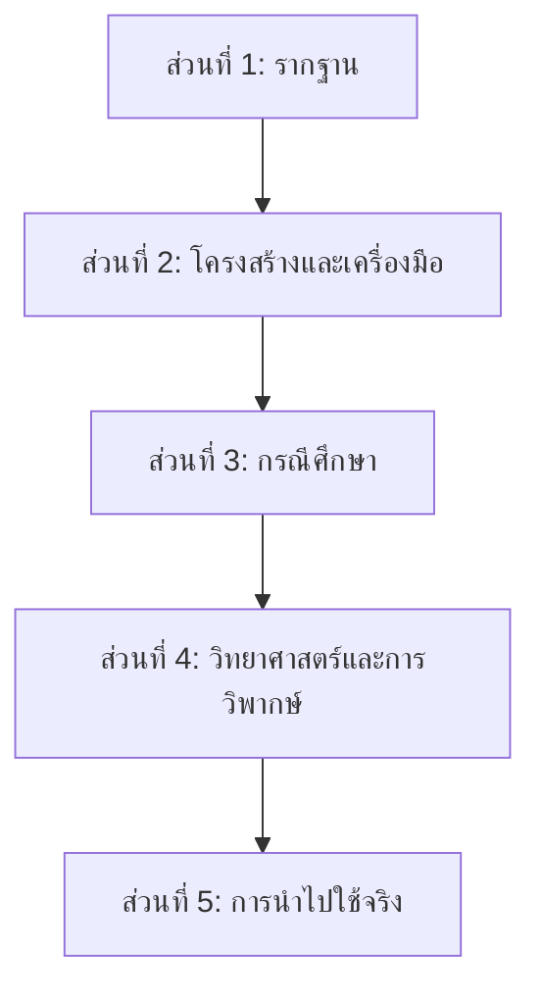

# แผนเนื้อหาค้นคว้า: Systems Thinking — การฝึกคิดอย่างเป็นระบบ

> แผนนี้ออกแบบมาเพื่อสั่งให้ AI Agent ค้นคว้าและสร้างรายงานทีละไฟล์ โดยเนื้อหาทุกไฟล์สามารถต่อรวมกันเป็นรายงานฉบับสมบูรณ์ได้อย่างไร้รอยต่อ โดยประยุกต์โครงสร้างจาก Ultralearning สู่หัวข้อการคิดอย่างเป็นระบบ

## ภาพรวมโครงสร้างรายงาน

รายงานทั้งหมดแบ่งออกเป็น **12 ไฟล์** ใน **5 ส่วนหลัก** ดังนี้:

| ส่วน | ไฟล์ | ชื่อไฟล์ | เนื้อหาหลัก |
|:---:|:---:|:---|:---|
| 1 | 01 | `01_foundation.md` | นิยาม ที่มา ปรัชญาพื้นฐานของการคิดเชิงระบบ |
| 2 | 02 | `02_elements_interconnections.md` | องค์ประกอบ ความเชื่อมโยง และจุดประสงค์ (Elements, Interconnections, Purpose) |
| 2 | 03 | `03_stocks_flows_delays.md` | คลังสะสม การไหล และความล่าช้า (Stocks, Flows, Delays) |
| 2 | 04 | `04_feedback_loops.md` | วงจรผลป้อนกลับ (Reinforcing & Balancing Loops) |
| 2 | 05 | `05_system_archetypes_1.md` | แม่แบบของระบบส่วนที่ 1 (System Archetypes 1-4) |
| 2 | 06 | `06_system_archetypes_2.md` | แม่แบบของระบบส่วนที่ 2 และ Leverage Points |
| 3 | 07 | `07_case_study_business.md` | กรณีศึกษา: ธุรกิจและอุตสาหกรรม (เช่น TPS, The Beer Game) |
| 3 | 08 | `08_case_study_global.md` | กรณีศึกษา: ปัญหาระดับโลกและสิ่งแวดล้อม |
| 3 | 09 | `09_case_study_daily_life.md` | กรณีศึกษา: การแก้ปัญหาในชีวิตประจำวัน |
| 4 | 10 | `10_cognitive_barriers.md` | อุปสรรคทางจิตวิทยาที่ขัดขวาง Systems Thinking |
| 4 | 11 | `11_criticism_limitations.md` | การวิพากษ์และข้อจำกัดของการคิดเชิงระบบ |
| 5 | 12 | `12_practical_application.md` | คู่มือการฝึกฝนและการนำไปใช้จริง (พร้อมเครื่องมือ CLD) |

---

## กฎทั่วไปสำหรับ AI Agent ทุกไฟล์

> [!IMPORTANT]
> **กฎเหล่านี้ใช้กับทุกไฟล์ — ห้ามตัดทอนหรือข้ามเนื้อหาใดๆ**

1. **ห้ามตัดทอนเนื้อหา** — เขียนให้ครบทุกหัวข้อตามที่ระบุในแต่ละไฟล์ ไม่ว่าจะยาวแค่ไหน
2. **ภาษา** — เขียนเป็นภาษาไทย แต่ศัพท์เฉพาะทาง (Technical Terms) ให้ใส่ภาษาอังกฤษกำกับในวงเล็บ เช่น "วงจรผลป้อนกลับแบบเสริมแรง (Reinforcing Feedback Loop)"
3. **แหล่งอ้างอิง** — ทุกข้อมูลที่ยกมาต้องระบุแหล่งที่มา ใส่ไว้ท้ายแต่ละย่อหน้าหรือท้ายไฟล์ในรูปแบบ footnote (อ้างอิงหลักควรมาจากงานของ Donella Meadows, Peter Senge เป็นต้น)
4. **โครงสร้างหัวข้อ** — ใช้ Markdown heading ที่ต่อเนื่องกันข้ามไฟล์
5. **ส่วนเชื่อมต่อ** — ทุกไฟล์ต้องมี:
   - **ส่วนเปิด** — ย่อหน้าสั้นๆ เชื่อมจากเนื้อหาไฟล์ก่อนหน้า (ยกเว้นไฟล์ 01)
   - **ส่วนปิด** — ย่อหน้าสั้นๆ ปูทางสู่เนื้อหาไฟล์ถัดไป (ยกเว้นไฟล์ 12)
6. **ความยาวขั้นต่ำ** — แต่ละไฟล์ไม่ต่ำกว่า 2,000 คำ
7. **การอ้างอิงข้ามไฟล์** — เมื่ออ้างถึงเนื้อหาจากไฟล์อื่น ให้ใช้รูปแบบ `(ดูรายละเอียดในไฟล์ XX: ชื่อหัวข้อ)`

---

## รายละเอียดแต่ละไฟล์

---

### 📄 ไฟล์ 01: `01_foundation.md` — รากฐานของการคิดเชิงระบบ

**หมายเลขบท:** บทที่ 1  
**Heading หลัก:** `# บทที่ 1: รากฐานของการคิดเชิงระบบ (Systems Thinking)`

#### คำสั่งสำหรับ Agent:

> ค้นคว้าและเขียนเนื้อหาครอบคลุมหัวข้อต่อไปนี้อย่างละเอียด โดยไม่ตัดทอน:

**1.1 Systems Thinking คืออะไร?**
- นิยามของการคิดเชิงระบบ ตามแนวคิดของ Donella Meadows และ Peter Senge
- ความแตกต่างระหว่าง Linear Thinking (คิดเชิงเส้น/แยกส่วน) กับ Systems Thinking (คิดเชิงระบบ/องค์รวม)
- อุปมาอุปไมย (Metaphor): การมองเห็นป่าทั้งป่า ไม่ใช่แค่ต้นไม้แต่ละต้น หรือนิทานคนตาบอดคลำช้าง

**1.2 ประวัติและที่มา**
- จุดเริ่มต้นจาก System Dynamics ที่ MIT (Jay Forrester)
- การเติบโตผ่านหนังสือ *The Fifth Discipline* (Peter Senge) และ *Thinking in Systems: A Primer* (Donella Meadows)

**1.3 ปรัชญาและมุมมอง**
- การเปลี่ยนจุดสนใจจากเหตุการณ์ (Events) ไปสู่โครงสร้าง (Structures) ที่ทำให้เกิดเหตุการณ์นั้น
- แนวคิดภูเขาน้ำแข็ง (The Iceberg Model) — อธิบาย 4 ระดับ: Events, Patterns, Structures, Mental Models
- สาเหตุที่ปัญหาหลายอย่างยิ่งแก้ยิ่งแย่ (Unintended Consequences)

**1.4 ใครที่ควรฝึกและทำไมจึงสำคัญ?**
- ความสำคัญของการคิดเชิงระบบในโลกที่ซับซ้อนและเปลี่ยนแปลงเร็ว (VUCA World)
- ประโยชน์ต่อวิศวกร (เช่น IE), ผู้บริหาร, และบุคคลทั่วไป

**ส่วนปิด:** ปูทางไปสู่โครงสร้างและองค์ประกอบของระบบ

#### แหล่งค้นคว้าแนะนำ:
- หนังสือ *Thinking in Systems: A Primer* โดย Donella Meadows
- หนังสือ *The Fifth Discipline* โดย Peter Senge

---

### 📄 ไฟล์ 02: `02_elements_interconnections.md` — องค์ประกอบ ความเชื่อมโยง และจุดประสงค์

**หมายเลขบท:** บทที่ 2  
**Heading หลัก:** `# บทที่ 2: กายวิภาคของระบบ — องค์ประกอบ ความเชื่อมโยง และจุดประสงค์`

#### คำสั่งสำหรับ Agent:

**ส่วนเปิด:** เชื่อมจากบทที่ 1 — "จากปรัชญาพื้นฐาน เรามาเริ่มผ่าโครงสร้างของระบบ..."

**2.1 องค์ประกอบ 3 ส่วนของระบบ (The 3 Parts of a System)**
- อธิบายส่วนประกอบพื้นฐานตามนิยามของ Donella Meadows
  1. **Elements (องค์ประกอบ/ชิ้นส่วน):** สิ่งที่จับต้องได้หรือไม่ได้
  2. **Interconnections (ความเชื่อมโยง):** ความสัมพันธ์และกฎเกณฑ์ที่เชื่อมชิ้นส่วน
  3. **Purpose หรือ Function (จุดประสงค์/หน้าที่):** เป้าหมายแท้จริงของระบบ (ไม่ได้วัดจากสิ่งที่ระบบบอก แต่วัดจากพฤติกรรมที่ระบบทำ)

**2.2 อะไรสำคัญที่สุดในการกำหนดพฤติกรรมของระบบ?**
- ทำไมการเปลี่ยน Elements ถึงมีผลน้อยที่สุด
- ทำไมการเปลี่ยน Interconnections ถึงมีผลกระทบมหาศาล
- ทำไมการเปลี่ยน Purpose จึงเปลี่ยนระบบไปอย่างสิ้นเชิง
- ยกตัวอย่างให้เห็นภาพชัดเจน: ร่างกายมนุษย์ (เซลล์เปลี่ยนใหม่ตลอดเวลาแต่ยังเป็นคนเดิม), ทีมฟุตบอล (เปลี่ยนผู้เล่น vs เปลี่ยนกติกา vs เปลี่ยนเป้าหมายเป็นเล่นเพื่อแพ้)

**2.3 ระบบที่ดีมีหน้าตาอย่างไร?**
- Resilience (ความยืดหยุ่น/ล้มแล้วลุกไว)
- Self-organization (การจัดระเบียบตัวเอง)
- Hierarchy (โครงสร้างลำดับชั้นที่ช่วยลดข้อมูลส่วนเกิน)

**ส่วนปิด:** เชื่อมไปหลักการเรื่องคลังสะสมและการไหล

#### แหล่งค้นคว้าแนะนำ:
- *Thinking in Systems* โดย Donella Meadows (บทที่ 1 และ 3)

---

### 📄 ไฟล์ 03: `03_stocks_flows_delays.md` — คลังสะสม การไหล และความล่าช้า

**หมายเลขบท:** บทที่ 3  
**Heading หลัก:** `# บทที่ 3: พลวัตของระบบ — Stocks, Flows และ Delays`

#### คำสั่งสำหรับ Agent:

**ส่วนเปิด:** เชื่อมจากบทที่ 2

**3.1 Stocks และ Flows (คลังสะสมและการไหล)**
- **นิยามเชิงลึก**: Stocks (สิ่งที่สะสม/สังเกตได้ ณ เวลาใดเวลาหนึ่ง) และ Flows (สิ่งที่ไหลเข้า/ออกในช่วงเวลาหนึ่ง)
- อุปมาอุปไมย: อ่างอาบน้ำ (Bathtub) พร้อมก๊อกน้ำและท่อระบาย
- หลักการทำงาน: คลังสะสมจะเพิ่มขึ้นเมื่อ Inflow > Outflow และจะลดลงเมื่อ Inflow < Outflow
- ตัวอย่าง Stocks ในโลกจริง: เงินในบัญชี, ระดับความขัดแย้ง, จำนวนสินค้าคงคลัง, คาร์บอนในชั้นบรรยากาศ

**3.2 ความเฉื่อยของระบบ (System Inertia)**
- ทำไม Stocks ถึงสร้างความเฉื่อยและทำให้ระบบค่อยๆ เปลี่ยนแปลง (ไม่เปลี่ยนแปลงแบบฉับพลัน)
- ข้อดีของความเฉื่อย: ทำหน้าที่เป็น Buffer (ตัวกันชน) หรือ Shock Absorber ให้ระบบ
- ข้อเสียของความเฉื่อย: เมื่อระบบมีปัญหา จะใช้เวลาแก้นานกว่าจะเห็นผล (เช่น การแก้ปัญหาโลกร้อน)

**3.3 Delays (ความล่าช้า)**
- นิยามของความล่าช้าในระบบ (เวลาที่ใช้ในการรับข้อมูล, ตัดสินใจ, และผลลัพธ์ปรากฏ)
- ทำไมความล่าช้าถึงทำให้มนุษย์ตอบสนองผิดพลาด (Overreaction หรือ Underreaction)
- ประเภทของความล่าช้า: Physical delays, Information delays
- อุปมาอุปไมย: การปรับอุณหภูมิน้ำตอนอาบน้ำฝักบัว

**ส่วนปิด:** เชื่อมไปเรื่องวงจรผลป้อนกลับ

#### แหล่งค้นคว้าแนะนำ:
- *Thinking in Systems* โดย Donella Meadows (บทที่ 2)
- Introduction to System Dynamics (MIT)

---

### 📄 ไฟล์ 04: `04_feedback_loops.md` — วงจรผลป้อนกลับ

**หมายเลขบท:** บทที่ 4  
**Heading หลัก:** `# บทที่ 4: กลไกควบคุมระบบ — Feedback Loops`

#### คำสั่งสำหรับ Agent:

**ส่วนเปิด:** เชื่อมจากบทที่ 3

**4.1 นิยามของ Feedback Loops (วงจรผลป้อนกลับ)**
- ความหมายของผลป้อนกลับในบริบทของระบบ (เมื่อข้อมูลเกี่ยวกับ Stocks ถูกนำมาใช้ควบคุม Flows)

**4.2 Balancing Feedback Loops (วงจรปรับสมดุล / B-Loop)**
- หน้าที่: รักษาสภาพ ควบคุมระบบให้อยู่ในเป้าหมาย (Goal-seeking behavior)
- ลักษณะกราฟพฤติกรรม (ลู่เข้าหาเส้นสมดุล)
- ตัวอย่าง: เทอร์โมสตัทของเครื่องปรับอากาศ, กลไกควบคุมอุณหภูมิร่างกายมนุษย์, การสั่งซื้อสินค้าเมื่อของขาดสต็อก
- ปัญหาเมื่อ B-Loop ทำงานผิดพลาด

**4.3 Reinforcing Feedback Loops (วงจรเสริมแรง / R-Loop)**
- หน้าที่: สร้างการเติบโตแบบทวีคูณ (Exponential Growth) หรือการพังทลายแบบทวีคูณ (Exponential Decay/Vicious Cycle)
- ลักษณะกราฟพฤติกรรม (กราฟพุ่งขึ้นหรือดิ่งลงอย่างรวดเร็ว)
- ตัวอย่างด้านบวก: ดอกเบี้ยทบต้น, Word of Mouth, ทฤษฎีเครือข่าย (Network Effect)
- ตัวอย่างด้านลบ: การระบาดของโรค, วงจรความยากจน, การนินทาที่ลุกลาม

**4.4 การทำงานร่วมกันของ Loops และความโดดเด่น (Dominance)**
- ระบบจริงไม่ได้มีแค่ Loop เดียว แต่เกิดจากการแย่งชิงการควบคุมระหว่าง R-Loop และ B-Loop
- นิยามของ Shift in Dominance (การสลับการควบคุม) ที่ทำให้ระบบเปลี่ยนจากเติบโตมาเป็นหยุดนิ่ง (เช่น S-Curve)

**ส่วนปิด:** ปูทางเข้าสู่ System Archetypes (รูปแบบพฤติกรรมซ้ำๆ ที่เกิดจากวงจรป้อนกลับ)

---

### 📄 ไฟล์ 05: `05_system_archetypes_1.md` — แม่แบบของระบบส่วนที่ 1

**หมายเลขบท:** บทที่ 5  
**Heading หลัก:** `# บทที่ 5: กับดักของระบบ — System Archetypes (ส่วนที่ 1)`

#### คำสั่งสำหรับ Agent:

**ส่วนเปิด:** เชื่อมจากบทที่ 4

**5.1 นิยามของ System Archetypes**
- อะไรคือ System Archetypes? (แม่แบบของโครงสร้างระบบที่พบเจอซ้ำๆ ในหลายสถานการณ์ ทั้งเรื่องส่วนตัว ธุรกิจ และสังคม)
- การทำความเข้าใจ Archetypes ช่วยพยากรณ์พฤติกรรมและหาทางแก้ไขที่ตรงจุด

**5.2 Archetype 1: Limits to Growth (ข้อจำกัดของการเติบโต)**
- **โครงสร้าง:** R-Loop สร้างการเติบโต ถูกผลักกลับด้วย B-Loop ที่สร้างขีดจำกัด
- **อาการ:** เติบโตอย่างรวดเร็วในช่วงแรก แล้วชะลอตัวหรือหยุดนิ่ง
- **ทางแก้:** อย่าผลักดันการเติบโต (อย่าพึ่งเหยียบคันเร่ง) แต่ให้ขจัดข้อจำกัด (ยกเบรกมือออก)

**5.3 Archetype 2: Shifting the Burden (การผลักภาระ / แก้ปัญหาที่ปลายเหตุ)**
- **โครงสร้าง:** แก้ปัญหาด้วยวิธีระยะสั้นที่ได้ผลไว (Symptomatic Solution) ทำให้วิธีแก้ปัญหาที่รากฐาน (Fundamental Solution) อ่อนแอลง เกิดผลข้างเคียง (Side Effect)
- **อาการ:** ปัญหาถูกแก้แบบชั่วคราว แต่จะกลับมาใหม่และรุนแรงขึ้น อาศัยวิธีแก้ชั่วคราวมากขึ้นเรื่อยๆ (Addiction)
- **ทางแก้:** โฟกัสที่วิธีแก้ปัญหาพื้นฐาน (Fundamental) และหยุดใช้หรือค่อยๆ ลดยาแก้ปวดระยะสั้น

**5.4 Archetype 3: Eroding Goals (เป้าหมายที่ถูกลดทอน)**
- **โครงสร้าง:** เหมือน Shifting the Burden แต่ "ยาแก้ปวด" คือการลดมาตรฐานหรือเป้าหมายลง แทนที่จะพยายามพัฒนาเพื่อไปให้ถึงเป้าหมาย
- **อาการ:** ประสิทธิภาพค่อยๆ ตกลงอย่างช้าๆ โดยมีข้ออ้างให้ยอมรับสภาพ (Boiled Frog Syndrome)
- **ทางแก้:** ยึดมั่นในวิสัยทัศน์หรือเป้าหมายเดิมอย่างเด็ดขาด ห้ามปล่อยให้มาตรฐานลดลงตามสถานการณ์

**5.5 Archetype 4: Escalation (การยกระดับความขัดแย้ง)**
- **โครงสร้าง:** B-Loop สองวงที่แข่งกัน โดยแต่ละฝ่ายพยายามรักษาสถานะนำของตนเอง
- **อาการ:** สงครามราคา, แข่งขันสะสมอาวุธ (Arms Race), การทะเลาะที่รุนแรงขึ้นเรื่อยๆ
- **ทางแก้:** ฝ่ายใดฝ่ายหนึ่งต้องหยุดและถอนตัวจากการแข่งขันด้านนั้น (Disarmament) หรือร่วมมือตกลงเพื่อเปลี่ยนกติกา

**ส่วนปิด:** เชื่อมไป System Archetypes ส่วนที่ 2

---

### 📄 ไฟล์ 06: `06_system_archetypes_2.md` — แม่แบบของระบบส่วนที่ 2 และ Leverage Points

**หมายเลขบท:** บทที่ 6  
**Heading หลัก:** `# บทที่ 6: แม่แบบของระบบส่วนที่ 2 และ จุดคานงัด (Leverage Points)`

#### คำสั่งสำหรับ Agent:

**ส่วนเปิด:** เชื่อมจากบทที่ 5

**6.1 Archetype 5: Success to the Successful (ความสำเร็จตกแก่ผู้สำเร็จ)**
- **โครงสร้าง:** สองกลุ่มแข่งกันชิงทรัพยากรที่มีจำกัด ฝ่ายที่ชนะครั้งแรกจะได้ทรัพยากรมากขึ้น ทำให้โอกาสชนะครั้งต่อไปสูงขึ้น (Rich get richer)
- **อาการ:** ความเหลื่อมล้ำที่ถ่างกว้างขึ้นเรื่อยๆ, ระบบผูกขาด (Monopoly)
- **ทางแก้:** ตัดการเชื่อมโยงของการได้เปรียบ หรือกระจายทรัพยากร (เช่น กฎหมายต่อต้านการผูกขาด, เกมกีฬาดราฟท์ผู้เล่น)

**6.2 Archetype 6: Tragedy of the Commons (โศกนาฏกรรมของสมบัติสาธารณะ)**
- **โครงสร้าง:** ทรัพยากรส่วนรวมที่ทุกคนเข้าถึงได้ ทุกคนพยายามตักตวงผลประโยชน์ส่วนตัว จนสุดท้ายทรัพยากรพังพินาศและทุกคนเสียประโยชน์
- **อาการ:** รถติด, ฝุ่น PM2.5, การจับปลาจนหมดทะเล
- **ทางแก้:** ต้องมีการจัดการทรัพยากรส่วนกลาง ผ่านการให้ความรู้ การตั้งกฎหมาย (Regulation) หรือแปรรูปเป็นของเอกชน (Privatization)

**6.3 Archetype 7: Fixes that Fail (การแก้ปัญหาที่ล้มเหลว)**
- **โครงสร้าง:** การแก้ปัญหาที่ดูเหมือนจะได้ผลในระยะสั้น แต่มีผลกระทบตามมาโดยไม่ตั้งใจ (Unintended consequence) ที่ทำให้ปัญหาเดิมแย่ลงในระยะยาว
- **อาการ:** ยิ่งแก้ยิ่งยุ่ง (เช่น ตัดถนนเพิ่มเพื่อแก้รถติด แต่ยิ่งทำให้คนขับรถมากขึ้น)
- **ทางแก้:** ต้องวิเคราะห์ล่วงหน้าถึงผลกระทบระยะยาว ยอมรับความเจ็บปวดระยะสั้น

**6.4 Leverage Points (จุดคานงัด)**
- นิยามของ Leverage Points จาก Donella Meadows ("Places to Intervene in a System")
- สรุปจุดที่ได้ผลน้อย (เช่น การเปลี่ยนพารามิเตอร์, ตัวเลข) ไปจนถึงจุดที่ได้ผลมหาศาล
- เน้นจุดคานงัด 3 อันดับแรกที่มีพลังมากที่สุด:
  1. เป้าหมายของระบบ (Goals of the system)
  2. กระบวนทัศน์ที่ระบบถูกสร้างขึ้น (Paradigm/Mindset)
  3. พลังในการก้าวข้ามกระบวนทัศน์ (Transcending Paradigms)

**ส่วนปิด:** ปูทางเข้าสู่ส่วนกรณีศึกษา

#### แหล่งค้นคว้าแนะนำ:
- หนังสือ *The Fifth Discipline* (Appendix 2: Systems Archetypes)
- บทความ *Leverage Points: Places to Intervene in a System* โดย Donella Meadows

---

### 📄 ไฟล์ 07: `07_case_study_business.md` — กรณีศึกษาทางธุรกิจและอุตสาหกรรม

**หมายเลขบท:** บทที่ 7  
**Heading หลัก:** `# บทที่ 7: กรณีศึกษา — การคิดเชิงระบบในธุรกิจและอุตสาหกรรม`

#### คำสั่งสำหรับ Agent:

**ส่วนเปิด:** เชื่อมจากส่วนเครื่องมือและแม่แบบระบบ

**7.1 เกมจำลองธุรกิจ: The Beer Game (เกมจำลองสายโซ่อุปทาน)**
- เล่าบริบทของ The Beer Game ที่สอนใน MIT Sloan School of Management
- โครงสร้างของเกม (Factory, Distributor, Wholesaler, Retailer)
- พฤติกรรมที่เกิดขึ้น: Bullwhip Effect (ปรากฏการณ์แส้สะบัด) ที่ Orders แกว่งอย่างรุนแรง
- วิเคราะห์ตามหลัก Systems Thinking (อิทธิพลของ Delay, ขาด Information Flow, Bounded Rationality)

**7.2 อุตสาหกรรมที่ตกหลุมพราง Archetype**
- กรณีศึกษา: Nokia หรือ Blockbuster (Limits to Growth หรือ Shifting the Burden หรือ Success to the Successful) — วิเคราะห์อย่างละเอียดผ่านเลนส์ของ Archetype และ Feedback Loops
- ชี้ให้เห็นโครงสร้างระบบที่เป็นต้นเหตุ ไม่ใช่แค่ "ผู้บริหารโง่"

**7.3 กรณีศึกษาทางบวก: Toyota Production System (TPS)**
- การใช้การคิดเชิงระบบในอุตสาหกรรมการผลิต (Industrial Engineering)
- กระบวนการผลิตมองแบบองค์รวม (Whole Systems Optimization)
- JIT (Just-In-Time) คือการจัดการ Stocks และ Flows เพื่อแก้ปัญหา Delays อย่างไร
- Jidoka และ Andon Cord — ตัวอย่างของการสร้าง Tight Feedback Loop

**ส่วนปิด:** เชื่อมไปปัญหาระดับโลก

---

### 📄 ไฟล์ 08: `08_case_study_global.md` — กรณีศึกษาปัญหาระดับโลกและสิ่งแวดล้อม

**หมายเลขบท:** บทที่ 8  
**Heading หลัก:** `# บทที่ 8: กรณีศึกษา — ปัญหาสิ่งแวดล้อมและสังคมระดับโลก`

#### คำสั่งสำหรับ Agent:

**ส่วนเปิด:** เชื่อมจากบทที่ 7

**8.1 Climate Change (การเปลี่ยนแปลงสภาพภูมิอากาศ)**
- วิเคราะห์เป็นภาพรวมด้วย Stocks & Flows (Stock = CO2 ในชั้นบรรยากาศ, Inflow = การปล่อยก๊าซ, Outflow = การดูดซับโดยธรรมชาติ)
- อธิบายด้วย Reinforcing Loops ของความร้อน (เช่น ทะเลน้ำแข็งละลาย -> พื้นที่สะท้อนแสงอาทิตย์ลดลง -> โลกดูดซับความร้อนมากขึ้น -> ทะเลน้ำแข็งละลายเร็วขึ้น (Albedo Effect))
- ปัญหา Delays ในระบบโลกร้อนที่ทำให้มนุษย์ลงมือช้า (ผลลัพธ์ของการกระทำวันนี้จะเห็นในอีก 20 ปี)

**8.2 ความเหลื่อมล้ำและวัฏจักรความยากจน**
- วิเคราะห์ด้วย Archetype "Success to the Successful"
- คนที่มีทุน (เงินตรา, การศึกษา, Connection) มีโอกาสเข้าถึงทรัพยากรมากกว่า ทำให้มีทุนมากขึ้น
- ทางแก้ที่ระบบทำอยู่ (เช่น การเก็บภาษีอัตราก้าวหน้า, นโยบายรัฐสวัสดิการ) คือการพยายามขัดขวาง Archetype นี้

**8.3 ระบบนิเวศ: การคืนหมาป่าสู่ Yellowstone (Trophic Cascade)**
- เล่าเหตุการณ์จริง: การนำหมาป่ากลับอุทยานแห่งชาติ Yellowstone ในปี 1995
- ผลกระทบเชิงลูกโซ่ (Ripple Effects): หมาป่าลดจำนวนกวาง -> กวางเลิกกินต้นไม้ริมน้ำ -> ต้นไม้โตขึ้นริมฝั่งแม่น้ำ -> บีเวอร์กลับมาสร้างเขื่อน -> เกิดที่อยู่อาศัยของปลาและนก -> แม่น้ำเปลี่ยนเส้นทาง
- นี่คือสุดยอดตัวอย่างของ Interconnections ในโลกธรรมชาติ

**ส่วนปิด:** เชื่อมไปเรื่องใกล้ตัวในชีวิตประจำวัน

---

### 📄 ไฟล์ 09: `09_case_study_daily_life.md` — กรณีศึกษาการแก้ปัญหาในชีวิตประจำวัน

**หมายเลขบท:** บทที่ 9  
**Heading หลัก:** `# บทที่ 9: กรณีศึกษา — การคิดเชิงระบบในชีวิตประจำวันและการทำงาน`

#### คำสั่งสำหรับ Agent:

**ส่วนเปิด:** เชื่อมจากบทที่ 8

**9.1 การลดน้ำหนักและสุขภาพ (The Dieting Trap)**
- วิเคราะห์น้ำหนักผ่าน Stocks & Flows (Inflow = แคลอรี่เข้า, Outflow = เผาผลาญ)
- ปรากฏการณ์โยโย่ (Yo-Yo Effect) ผ่าน Shifting the Burden: เมื่อต้องการลดน้ำหนักไว จะหันไปพึ่งยาลดความอ้วนหรือการอดอาหารสุดโต่ง (Symptomatic Solution) ทำให้พฤติกรรมกินดีและออกกำลังกาย (Fundamental Solution) หายไป กล้ามเนื้อลดลง (Side Effect) เผาผลาญลดลง พอน้ำหนักเด้งกลับจึงยิ่งอ้วนกว่าเดิม

**9.2 ความสัมพันธ์และปัญหาครอบครัว**
- วิเคราะห์ผ่าน Escalation Archetype: สามีเงียบเพราะภรรยาบ่น -> ภรรยายิ่งบ่นเพราะสามีเงียบ -> ห่างเหินกันมากขึ้น
- วิเคราะห์ผ่าน Shifting the Burden: ดื่มเหล้าแก้เครียดจากงาน ทำให้ประสิทธิภาพลดลง งานยิ่งแย่ ยิ่งเครียด ยิ่งดื่ม
- วิธีตัดวงจร (Breaking the loop) ในความสัมพันธ์

**9.3 การจัดการการเงินส่วนบุคคล**
- หนี้บัตรเครดิตและการจ่ายขั้นต่ำ: วิเคราะห์ผ่าน Reinforcing Loop ของดอกเบี้ย
- กองทุนเกษียณอายุ (Retirement Fund) และดอกเบี้ยทบต้น

**9.4 ความเหนื่อยล้าในการทำงาน (Burnout)**
- วงจรทำงานหนัก -> นอนน้อย -> ประสิทธิภาพลดลง -> ต้องทำงานหนักขึ้นเพื่อชดเชยเวลา (Limits to Growth + Eroding Goals)
- การจัดการพลังงานและเวลาในฐานะทรัพยากร (Stocks)

**ส่วนปิด:** ปูทางไปสู่ส่วนปัญหาทางจิตวิทยา

---

### 📄 ไฟล์ 10: `10_cognitive_barriers.md` — อุปสรรคทางจิตวิทยา

**หมายเลขบท:** บทที่ 10  
**Heading หลัก:** `# บทที่ 10: อุปสรรคทางจิตวิทยา — ทำไมสมองเราถึงต่อต้านการคิดเชิงระบบ`

#### คำสั่งสำหรับ Agent:

**ส่วนเปิด:** เชื่อมจากกรณีศึกษา

**10.1 ข้อจำกัดเชิงวิวัฒนาการ (Evolutionary Constraints)**
- ทำไมสมองมนุษย์ถึงถูกออกแบบมาให้แก้ปัญหาเฉพาะหน้า (Linear & Event-oriented) เช่น เจอเสือวิ่งหนี หิวล่าสัตว์
- การคิดล่วงหน้ายาวๆ และคิดแบบเชื่อมโยงซับซ้อน เป็นสิ่งใหม่ในประวัติศาสตร์มนุษยชาติ
- ทำไมเราถึงหลงใหลในเหตุและผลระยะสั้น (Short-term Cause and Effect)

**10.2 ความมีเหตุผลที่ถูกจำกัด (Bounded Rationality)**
- นิยามของ Bounded Rationality (Herbert Simon)
- มนุษย์ตัดสินใจได้อย่างสมเหตุสมผลภายใต้ขอบเขตข้อมูลเป้าหมายและข้อจำกัดของตัวเองเท่านั้น
- ผลพวงต่อระบบ: แต่ละคนพยายามทำสิ่งที่ดีที่สุดสำหรับส่วนของตน แต่นำไปสู่หายนะของระบบโดยรวม (เช่น Tragedy of the Commons)

**10.3 Cognitive Biases (อคติทางปัญญาที่ปิดกั้น Systems Thinking)**
- **Illusion of Control (ภาพลวงตาของการควบคุม):** เชื่อว่าตัวเองควบคุมความซับซ้อนได้
- **Fundamental Attribution Error:** โทษพฤติกรรมคน (เช่น คนขับรถไม่ดี) มากกว่าการมองโครงสร้างระบบ (เช่น กฎหมายจราจร ผังเมืองห่วย)
- **Availability Heuristic:** ตัดสินปัญหาจากข้อมูลที่หาได้ง่ายสุด ไม่ใช่มองระบบทั้งหมด

**10.4 ทำไมเราถึงรับมือกับ Non-linear และ Exponential Growth ไม่ได้**
- ข้อจำกัดของการกะเกณฑ์อัตราก้าวหน้าทวีคูณ (เช่น พับกระดาษ 42 ครั้งจะหนาถึงดวงจันทร์)
- ความเข้าใจผิดเกี่ยวกับ Stocks (คิดว่าถ้าลดการปล่อยก๊าซคาร์บอนแล้ว ปริมาณคาร์บอนจะลดทันที โดยลืมไปว่า Inflow ยังมากกว่า Outflow)

**ส่วนปิด:** เชื่อมไปการวิพากษ์และข้อจำกัด

---

### 📄 ไฟล์ 11: `11_criticism_limitations.md` — การวิพากษ์และข้อจำกัด

**หมายเลขบท:** บทที่ 11  
**Heading หลัก:** `# บทที่ 11: การวิพากษ์และข้อจำกัดของการคิดเชิงระบบ`

#### คำสั่งสำหรับ Agent:

**ส่วนเปิด:** เชื่อมจากบทที่ 10

**11.1 คำวิจารณ์ต่อ Systems Thinking**
- เป็นนามธรรมมากเกินไป (Too Abstract)? นำไปปฏิบัติจริงได้ยากหรือไม่?
- การวิเคราะห์ที่ซับซ้อนเกินไป (Analysis Paralysis) จนไม่เกิดการลงมือทำ
- ปัญหาของการสร้างแบบจำลอง (All models are wrong, but some are useful — George E.P. Box) การทำแผนภาพเป็นเพียงการลดทอนความจริง

**11.2 การกำหนดขอบเขตของระบบ (System Boundaries)**
- ปัญหาใหญ่สุด: เราจะขีดเส้นแบ่งระบบแค่ไหน?
- ระบบทุกระบบเชื่อมโยงกันเป็นระบบที่ใหญ่ขึ้นเรื่อยๆ จนถึงระดับจักรวาล
- ถ้าวาด Boundary เล็กไป ก็จะเจอผลกระทบภายนอกทุบตี (Blind spots)
- ถ้าวาด Boundary ใหญ่ไป ก็ซับซ้อนจนแก้ปัญหาไม่ได้

**11.3 เมื่อระบบซับซ้อน (Complex Systems) ไม่ใช่แค่ระบบที่ยุ่งยาก (Complicated Systems)**
- ความแตกต่างระหว่าง Complicated (เช่น เครื่องบินซับซ้อนแต่คาดเดาได้) และ Complex Adaptive Systems (เช่น ตลาดหุ้น นิเวศวิทยา คาดเดาไม่ได้ร้อยเปอร์เซ็นต์)
- ขีดจำกัดของการทำนายผลลัพธ์ในอนาคต

**ส่วนปิด:** เชื่อมไปคู่มือปฏิบัติจริง

---

### 📄 ไฟล์ 12: `12_practical_application.md` — คู่มือการนำไปใช้จริง

**หมายเลขบท:** บทที่ 12  
**Heading หลัก:** `# บทที่ 12: คู่มือภาคปฏิบัติ — สู่การเป็นนักคิดเชิงระบบ`

#### คำสั่งสำหรับ Agent:

**ส่วนเปิด:** เชื่อมจากบทที่ 11

**12.1 เครื่องมือพื้นฐาน (Systems Thinking Tools)**
- **Behavior Over Time (BOT) Graphs:** กราฟวาดเส้นแนวโน้มพฤติกรรมข้ามกาลเวลา (จุดเริ่มต้นของการออกจาก Event Level)
- **Causal Loop Diagrams (CLD):** วิธีวาดแผนภาพวงจรเชิงสาเหตุ (การใช้หัวลูกศร S/O หรือ +/- และการระบุ R-Loop / B-Loop)
- **Stock and Flow Diagrams:** (พื้นฐานการวาด ท่อ วาล์ว และถังเก็บ)

**12.2 ขั้นตอนการวิเคราะห์ปัญหาแบบ System Thinker (Step-by-Step Guide)**
1. **ระบุปัญหาที่แท้จริง (Define the Problem):** ต้องไม่ใช่ปัญหาที่เกิดขึ้นครั้งเดียว แต่เป็นรูปแบบพฤติกรรม (Pattern)
2. **ขยายมุมมองเวลาและขอบเขต (Expand Time and Boundaries):** วาดกราฟ BOT
3. **วาดโครงสร้าง (Map the Structure):** สร้าง CLD ให้เห็น Interconnections
4. **มองหาแม่แบบ (Identify Archetypes):** โครงสร้างนี้ตรงกับ System Archetype ใด
5. **หาจุดคานงัด (Find Leverage Points):** จุดใดที่ใช้แรงน้อยแต่สร้างอิมแพคสูงสุดเพื่อแก้โครงสร้าง
6. **ทดสอบและเรียนรู้ (Test and Learn):** ประเมินผลและระวัง Unintended Consequences

**12.3 นิสัย 14 ประการของนักคิดเชิงระบบ (Habits of a Systems Thinker)**
- อ้างอิงชุดเครื่องมือจาก The Waters Center for Systems Thinking (เลือกมาเฉพาะข้อที่เด่นๆ เช่น เปลี่ยนมุมมอง, ดูผลกระทบระยะสั้นและยาว, ทดสอบสมมติฐาน)

**12.4 บทสรุปทิ้งท้าย**
- สรุปความสำคัญของการเข้าใจระบบทั้งหมด
- โลกนี้ไม่ใช่เครื่องจักร (Machine) ที่ถอดประกอบชิ้นส่วนได้ แต่เป็นสิ่งมีชีวิต (Organism)
- เสนอแนะแหล่งศึกษาเพิ่มเติมสำหรับผู้อ่าน

**ส่วนปิด:** สรุปจบรายงานอย่างเป็นทางการ

#### แหล่งค้นคว้าแนะนำ:
- Systems Thinking Playbook โดย Linda Booth Sweeney & Dennis Meadows
- The Waters Center for Systems Thinking (Habits of a Systems Thinker)
