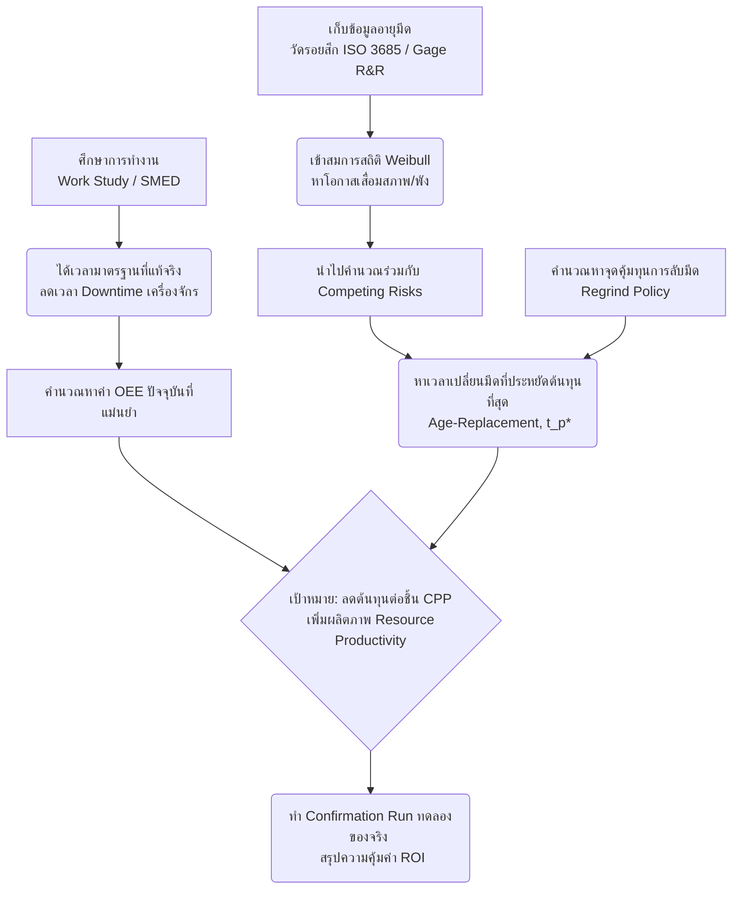

# รายงานสรุปคำศัพท์เทคนิคและทฤษฎี (ฉบับผู้เริ่มต้น)
**อ้างอิงจากเอกสาร: กรอบการทำปริญญานิพนธ์ v4**

รายงานฉบับนี้จัดทำขึ้นเพื่ออธิบายคำศัพท์ ทฤษฎี และสมการทางวิศวกรรมที่อยู่ในไฟล์ `Thesis_Framework_v4_TH.md` โดยใช้ภาษาที่เข้าใจง่าย มีการเปรียบเทียบกับชีวิตประจำวัน (Analogy) เพื่อให้คุณสามารถอ่านแล้วเข้าใจภาพรวม และนำไปใช้วางแผนดำเนินการตามเฟรมเวิร์คปริญญานิพนธ์ได้อย่างมั่นใจครับ

---

## 1. กลุ่มประสิทธิภาพและเวลา (Efficiency & Time)

### 1.1 OEE (Overall Equipment Effectiveness) - ประสิทธิผลโดยรวมของเครื่องจักร
- **เกริ่นนำ:** เครื่องจักรที่เรามีอยู่ ถูกใช้งานได้คุ้มค่าแค่ไหน?
- **ความหมายง่ายๆ:** ตัวชี้วัดที่บอกว่าเครื่องจักรทำงานได้เต็มประสิทธิภาพ 100% หรือไม่ โดยหักเวลาที่เสียไป ของเสีย และความเร็วที่ตกหล่น
- **เปรียบเทียบ:** เหมือนการเช่ารถแท็กซี่มาขับ 8 ชั่วโมง (100%) แต่ติดไฟแดงไป 1 ชม. ขับช้าเพราะรถติด 1 ชม. และหลงทางจนลูกค้าไม่จ่ายเงิน 1 ชม. สุดท้ายทำงานได้คุ้มค่าเกิดรายได้จริงๆ แค่ 5 ชม.
- **การใช้งานในโปรเจกต์:** ใช้ประเมินว่าเครื่อง CNC เครื่องนี้ มีการสูญเสียเวลาไปกับการเปลี่ยนมีดหรือรอชิ้นงานมากแค่ไหน
- **ทฤษฎี/สมการ:** `OEE = Availability (ความพร้อมใช้) x Performance (ประสิทธิภาพการเดินเครื่อง) x Quality (คุณภาพ)`
- **จุดเช็คความเข้าใจ:** ถ้าเครื่องจักรผลิตงานได้เร็วมาก (Performance สูง) แต่ชิ้นงานเสียหมดเลย (Quality ต่ำ) ค่า OEE จะสูงหรือต่ำ? *(คำตอบ: ต่ำ เพราะตัวคูณ Quality จะดึงให้ผลลัพธ์ร่วงลงมา)*

### 1.2 Work Study (การศึกษาการทำงาน) & Standard Time (เวลามาตรฐาน)
- **ความหมายง่ายๆ:** การจับเวลาและวิเคราะห์ท่าทางการทำงาน เพื่อหาวิธีที่รวดเร็วและเหนื่อยน้อยที่สุด พร้อมกำหนด "เวลามาตรฐาน" ว่างานชิ้นนี้ควรใช้เวลาทำกี่นาที
- **เปรียบเทียบ:** เหมือนการจับเวลาทำบะหมี่กึ่งสำเร็จรูป ถ้าทำแบบลวกๆ ใช้เวลา 2 นาที (แต่มันดิบ) ถ้าทำแบบพิถีพิถันอาจจะ 5 นาที "เวลามาตรฐาน" คือเวลาที่เหมาะสมที่สุดที่คนทั่วไปทำได้ต่อเนื่องโดยไม่เหนื่อยเกินไป
- **ทฤษฎี/สมการ:** `เวลามาตรฐาน (ST) = เวลาปกติที่คนทำงาน + เวลาเผื่อความเหนื่อยล้า (Allowance)`
- **Hawthorne Effect (ฮอว์ธอร์น):** เป็นคำศัพท์ทางจิตวิทยา หมายถึง อาการที่พนักงาน "ตั้งใจทำงานมากกว่าปกติ" เมื่อรู้ว่ามีคนจับเวลาหรือมีกล้องวงจรปิดแอบดู ในเฟรมเวิร์คจึงแก้ปัญหานี้ด้วยการดูกล้องวงจรปิดย้อนหลังหลายๆ วันแทนเพื่อดูพฤติกรรมตามธรรมชาติ

### 1.3 SMED (Single-Minute Exchange of Die)
- **ความหมายง่ายๆ:** เทคนิคการปรับเปลี่ยนอุปกรณ์หรือตั้งค่าเครื่องจักรให้เสร็จอย่างรวดเร็ว
- **เปรียบเทียบ:** เหมือนการเปลี่ยนยางรถแข่ง F1 (Pit Stop) ที่ทีมงานเตรียมทุกอย่างไว้ล่วงหน้า รถจอดปุ๊บเปลี่ยนเสร็จใน 2 วินาที แทนที่จะให้รถจอดก่อนแล้วค่อยเดินไปหยิบประแจ
- **การใช้งาน:** การเปลี่ยนใบมีดกลึงให้เร็วที่สุด เพื่อลดเวลาที่เครื่องจักรต้องหยุดทำงาน (Downtime)

---

## 2. กลุ่มความน่าเชื่อถือและการบำรุงรักษา (Reliability & Maintenance)

### 2.1 Preventive Maintenance (PM) - การบำรุงรักษาเชิงป้องกัน
- **ความหมายง่ายๆ:** การซ่อมแซมหรือเปลี่ยนอะไหล่ "ก่อน" ที่มันจะพัง
- **เปรียบเทียบ:** เหมือนการถ่ายน้ำมันเครื่องรถยนต์ทุกๆ 10,000 กิโลเมตร เราไม่รอให้เครื่องยนต์พังก่อนแล้วค่อยเปลี่ยน

### 2.2 Weibull Distribution (การแจกแจงแบบไวบูลล์)
- **เกริ่นนำ:** เราจะรู้ได้อย่างไรว่าใบมีดจะพังเมื่อไหร่ ในเมื่อแต่ละใบพังไม่พร้อมกัน?
- **ความหมายง่ายๆ:** มันคือสูตรคณิตศาสตร์ (กราฟสถิติ) ที่วิศวกรใช้ทำนาย "อายุขัย" ของสิ่งของ ว่ามันมักจะพังตอนไหน
- **ทฤษฎี/สมการ:** กราฟนี้มีตัวแปรสำคัญคือ **Beta (β)** หรือ Shape Parameter
  - ถ้า β < 1 : ของพังตั้งแต่เพิ่งเริ่มใช้ (ของหลุด QC)
  - ถ้า β = 1 : ของพังแบบสุ่ม (เดาไม่ได้)
  - ถ้า β > 1 : ของพังเพราะ "สึกหรอ" (ยิ่งใช้นานยิ่งมีโอกาสพัง) -> *ในโปรเจกต์นี้เราคาดหวังว่าใบมีดจะเป็นแบบนี้*
- **คำศัพท์ย่อยที่เกี่ยวข้อง:**
  - **Right-Censored Data:** ข้อมูลเชิงสถิติของมีดที่ "ยังไม่พัง" (เราถอดใบมีดออกก่อนที่มันจะหมดอายุ) ข้อมูลแบบนี้ก็เอามาคำนวณในสมการไวบูลล์ได้
  - **MRR / Bayesian prior:** เทคนิคทางสถิติขั้นสูงที่ใช้ช่วยเหลือเมื่อเรามี "ข้อมูลการทดลองน้อย" (เช่น ทดลองใช้มีดใหม่แค่ 5 ใบ) เพื่อให้สูตรยังคงคำนวณออกมาได้แม่นยำ

### 2.3 Competing Risks (ความเสี่ยงเชิงแข่งขัน)
- **ความหมายง่ายๆ:** การที่ใบมีดพังได้จาก "หลายสาเหตุ" แข่งขันกัน เช่น สาเหตุที่ 1: "ค่อยๆ สึกหรอ" (ปลอดภัย) กับ สาเหตุที่ 2: "บิ่นหักคาเครื่องทันที" (อันตราย งานพัง)
- **เปรียบเทียบ:** เหมือนคนเราอาจจะเสียชีวิตด้วยโรคชรา หรือเกิดอุบัติเหตุ ทั้งสองอย่างนี้มีความน่าจะเป็นแข่งกันอยู่ ในโมเดลของวิทยานิพนธ์ฉบับนี้ จึงต้องเอาความเสี่ยงของการบิ่นหักแบบปุบปับ ($p_{cat}$) มาถ่วงน้ำหนักด้วย

### 2.4 Age-Replacement Policy และ เวลาที่เหมาะสม ($t_p^*$)
- **ความหมายง่ายๆ:** นโยบายการหา "เวลาที่เหมาะสมที่สุด" ($t_p^*$) ที่ควรจะเปลี่ยนใบมีด เพื่อให้เสียเงินโดยรวมน้อยที่สุด
- **เปรียบเทียบ:** ถ้าเปลี่ยนใบมีดบ่อยไป (เปลี่ยนเร็ว) ก็เปลืองค่าซื้อใบมีด แต่ถ้าเปลี่ยนช้าไป (รอจนหัก) ก็เสียค่าชิ้นงานพังและเครื่องหยุด งานนี้คือการหาจุดกึ่งกลางที่สมดุลที่สุด

---

## 3. กลุ่มวิศวกรรมการตัดเฉือนและคุณภาพ (Machining & Quality)

### 3.1 ISO 3685 & Flank Wear (ระยะสึกหรอ VB)
- **ความหมายง่ายๆ:** มาตรฐานสากลที่บอกว่า "เราจะรู้ได้ยังไงว่าใบมีดทื่อแล้ว (หมดอายุ)?" โดยมาตรฐานนี้ให้วัดจากการสึกหรอที่สันของใบมีด (Flank Wear หรือระยะ VB)
- **เปรียบเทียบ:** เหมือนดอกยางรถยนต์ที่มีแถบวัดความลึก ถ้าดอกยางสึกจนถึงแถบนี้แปลว่าหมดอายุ
- **การใช้งาน:** ตั้งเกณฑ์ว่าถ้ารอยสึก (VB) ถึง 0.3 มิลลิเมตร ให้ถือว่าใบมีดหมดอายุทันที (ห้ามใช้จนบิ่นหักคาเครื่อง)

### 3.2 Regrind Policy (นโยบายการลับมีดใหม่)
- **ความหมายง่ายๆ:** ใบมีดที่ทื่อสามารถนำไป "ลับคมใหม่" เพื่อใช้ต่อได้ แต่ลับได้สูงสุดกี่ครั้ง?
- **ข้อกำหนดในงานวิจัย (Geometry-bound + Economic limit):**
  - **Geometry (ข้อจำกัดทางกายภาพ):** มีเนื้อเหล็กเหลือให้ลับได้กี่มิลลิเมตร (เช่น มีเนื้อ 3 mm ลับออกครั้งละ 0.5 mm = ลับได้ 6 ครั้ง)
  - **Economic (ข้อจำกัดทางเศรษฐศาสตร์):** ถ้านำไปลับหลายๆ รอบ อายุการใช้งานใบมีดรอบถัดไปอาจจะสั้นลง จนถึงจุดที่ "ซื้อมีดใหม่คุ้มกว่า"
  - เฟรมเวิร์คนี้จะออกแบบว่าจะเลือกลับกี่ครั้งถึงจะประหยัดที่สุด

### 3.3 Gage R&R (การวิเคราะห์ระบบการวัด)
- **ความหมายง่ายๆ:** การทดสอบว่า "เครื่องมือวัด" และ "คนวัด" ทำงานได้แม่นยำและคงที่หรือไม่
- **เปรียบเทียบ:** ถ้าน้ำหนักเราคือ 60 กก. แต่ตาชั่งที่บ้าน ชั่งกี่ทีก็ได้ 58 บ้าง 62 บ้าง (เครื่องไม่นิ่ง) หรือให้คนอื่นมาช่วยอ่านตัวเลขแล้วอ่านไม่ตรงกัน (คนไม่นิ่ง) แบบนี้ถือว่าเครื่องมือวัดตกมาตรฐาน
- **การใช้งาน:** ใช้พิสูจน์ว่าค่าการสึกหรอของมีดที่เราใช้กล้องจุลทรรศน์ส่องวัดนั้น "เป็นตัวเลขที่เชื่อถือได้จริงๆ"

### 3.4 Taylor Tool Life Equation & Gilbert Economic Tool Life
- **ความหมายง่ายๆ:** ทฤษฎีคลาสสิกของวิศวกรรม 
  - **Taylor** ค้นพบว่าความเร็วรอบเครื่องมีผลต่ออายุมีด 
  - **Gilbert** นำมาต่อยอดว่า เราควรเดินเครื่องที่ความเร็วเท่าไหร่ถึงจะได้ "ต้นทุนการผลิตถูกที่สุด" ซึ่งเป็นรากฐานไอเดียของวิทยานิพนธ์ฉบับนี้

### 3.5 Optimal Inspection Interval & SPC Control Chart
- **ความหมายง่ายๆ:**
  - **Optimal Inspection (ความถี่การตรวจที่เหมาะสม):** การหาว่าควรจะสุ่มตรวจชิ้นงานบ่อยแค่ไหน? (ตรวจบ่อยไปก็เสียเวลา ตรวจน้อยไปของเสียก็อาจจะหลุดลอดไปได้เยอะ)
  - **Control Chart (แผนภูมิควบคุม):** กราฟจุดที่เอาไว้พล็อตกราฟเพื่อตรวจจับว่า "กระบวนการผลิตเริ่มมีความผิดปกติแล้วหรือยัง"

---

## 4. กลุ่มต้นทุนและเศรษฐศาสตร์ (Cost & Economics)

### 4.1 Resource / Cost Productivity (ผลิตภาพด้านทรัพยากรและต้นทุน)
- **ความหมายง่ายๆ:** การทำงานให้ได้ผลผลิต *เท่าเดิม* แต่ใช้ "ต้นทุน" (ค่าใบมีด, ค่าของเสีย, เวลาเครื่องหยุด) *น้อยลง*
- **เกร็ดความรู้:** ทำไมวิทยานิพนธ์นี้ไม่เน้นการผลิตให้ได้จำนวนชิ้นเยอะๆ? เพราะโรงงานถูกจำกัดด้วยยอดสั่งซื้อจากลูกค้า การผลิตออกมาเยอะเกินไปจะกลายเป็นสต็อกล้น (Overproduction) การเพิ่มผลิตภาพในบริบทนี้จึงแปลว่า "ลดต้นทุน" นั่นเอง

### 4.2 Net Scrap Loss (มูลค่าของเสียสุทธิ)
- **ความหมายง่ายๆ:** ต้นทุนที่เสียไปจริงๆ เมื่อเกิดชิ้นงานเสีย 
- **การตีความในเล่ม:** ชิ้นงานที่เป็นทองเหลือง เมื่อผลิตเสียสามารถนำไปขายเป็นเศษเหล็กหรือหลอมใหม่ได้ ดังนั้นความสูญเสียจริงๆ จึงไม่ใช่วัตถุดิบทองเหลือง แต่คือ "ค่าแรง, ค่าไฟ, และเวลาของเครื่องจักร" ที่ทำสูญเปล่าไปกับการผลิตของชิ้นนั้นต่างหาก (หากไม่มองมุมนี้ จะกลายเป็นการตีมูลค่าการสูญเสียสูงเกินจริง)

### 4.3 CPP (Cost Per Part) & ROI (Return on Investment)
- **CPP (ต้นทุนต่อชิ้น):** เอาค่ามีด ค่าลับ ค่าไฟ ค่าของเสีย มารวมกันแล้วหารด้วยจำนวนชิ้นงานดีที่ผลิตได้
- **ROI (ผลตอบแทนจากการลงทุน):** ถ้าโรงงานลงทุนทำตามวิทยานิพนธ์นี้ ภายใน 1 ปีจะประหยัดเงินคืนมาได้เท่าไหร่ คุ้มค่าหรือไม่? 

### 4.4 Confirmation Run (การทดลองรันเพื่อยืนยันผล)
- **ความหมายง่ายๆ:** เมื่อเราใช้คณิตศาสตร์และสถิติทายไว้ว่า "ถ้าทำตามตารางเวลาใหม่จะประหยัดเงินได้ X บาท" เราต้องเอาไป **ทดลองใช้จริงในการผลิต** เพื่อเทียบดูว่าของจริงประหยัดได้เท่าที่ทำนายไว้หรือไม่ เพื่อเป็นหลักฐานตอกย้ำว่าทฤษฎีใช้งานได้จริง (Defendable)

---

## ภาพสรุปความสัมพันธ์ของวิทยานิพนธ์ (The Big Picture)

> **คำแนะนำสำหรับการเริ่มต้น (Next Step):** 
> ตอนนี้คุณได้เข้าใจภาพรวมทั้งหมดเป็นภาษาง่ายๆ แล้ว หากจะเริ่มลงมือทำตามเฟรมเวิร์ค ขอแนะนำให้เริ่มจาก **PDCA ที่ 1** คือการใช้กล้องวงจรปิดจับเวลาเพื่อหาเวลามาตรฐาน (Work Study) และคำนวณ OEE ตามความจริงก่อนครับ หากถึงขั้นตอนใดที่ต้องเข้าสมการสถิติที่ซับซ้อน สามารถสอบถามและให้ผมช่วยคำนวณให้ได้เสมอครับ!
