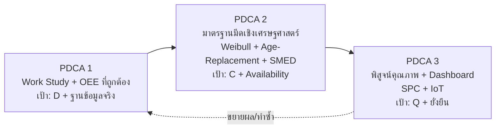

# กรอบการทำปริญญานิพนธ์ (ฉบับ v2 — ปรับตามข้อมูลจริง)

> **ชื่อเรื่อง (ล็อก — ห้ามแก้):** การเพิ่มผลิตภาพกระบวนการกลึง CNC ในการผลิตมาตรวัดน้ำ โดยประยุกต์ใช้การศึกษาการทำงานและการบำรุงรักษาเชิงป้องกัน
> *(Productivity Improvement of CNC Turning Process in Water Meter Production by Applying Work Study and Preventive Maintenance)*
>
> **ผู้จัดทำ:** ธีรศักดิ์ คิดอ่าน (680401700600) — วศ.บ. วิศวกรรมอุตสาหการ มหาวิทยาลัยเกษมบัณฑิต
> **อาจารย์ที่ปรึกษา:** ผศ. สหรัตน์ วงษ์ศรีษะ (หลัก), ผศ. ชานนท์ มูลวรรณ (ร่วม), อ. วีรญา กรทิพย์ (ร่วม)
> **สถานะ:** v2 — ปรับเนื้อหาใต้ชื่อเรื่องเดิม ให้ตรงกับข้อมูลจริงหน้างาน (มิ.ย. 2569)
> **อ้างอิง:** [[Thesis_Framework_v1_TH]], [[Profile_Context]]

---

## 0. สรุปการปรับทิศ (ทำไมต้องมี v2)

หลังตรวจสอบข้อมูลจริง 2 ชุดในรีโป — [เปลี่ยนใบมีดเครื่อง1569.csv](../รายงาน/ข้อมูลประกอบ/เปลี่ยนใบมีดเครื่อง1569.csv) และ [ข้อมูล ดาวทามเครื่องจักร.csv](../รายงาน/ข้อมูลประกอบ/ข้อมูล%20ดาวทามเครื่องจักร.csv) — พบว่าสมมติฐานเดิมใน v1/V3 หลายข้อ **ไม่ตรงกับสภาพปัจจุบัน** จึงต้องปรับ 3 จุดหลัก:

| ประเด็น | v1 / ข้อเสนอ V3 (เดิม) | ความจริงปัจจุบัน (v2) |
|---|---|---|
| มีดกลึง | "1 ตัว อายุ 18,000 ชิ้น" | มี 2 ตัว และ **มีดปาดหน้าเลิกใช้แล้ว** (เปลี่ยนดีไซน์เป็นแชมเฟอร์) → เหลือ **มีดด้านเกลียว** ตัวเดียวที่เกี่ยวข้อง |
| Downtime อันดับ 1 | จะลด Unplanned Downtime จากมีด | 82% ของ downtime คือ "ไม่มีลังจากประกอบ" ซึ่งเป็น **การหยุดตามดีมานด์ (กัน WIP/Overproduction)** ไม่ใช่ความสูญเสียที่ต้องกู้คืน |
| คุณภาพ (Q) | จะลดของเสีย | ของเสียต่ำอยู่แล้ว → เปลี่ยนเป็น **"ป้องกัน/พิสูจน์ว่า PM รักษา Q ได้"** |

**จุดขายเล่มที่ปรับใหม่:** จาก "ลดต้นทุนเยอะ ๆ" → เป็น **"สร้างมาตรฐานการจัดการมีด + ระบบวัดผลที่ถูกต้อง (OEE) + Dashboard เฝ้าระวัง ที่พิสูจน์การประหยัดเป็นตัวเงินได้จริง และทำซ้ำ/ขยายผลได้"** ซึ่งยังอยู่ใต้ร่มชื่อเรื่องเดิม (Work Study = แก้เวลามาตรฐาน/OEE, Preventive Maintenance = มาตรฐานมีดเชิงเศรษฐศาสตร์)

---

## 1. ข้อมูลจริงที่ใช้เป็นฐาน (Baseline Facts)

### 1.1 อายุมีดด้านเกลียว (จากไฟล์จริง, n = 9 ค่า)
ค่าที่บันทึกได้ (ชิ้น): 15,800 / 9,600 / 12,300 / 13,800 / 17,287 / 19,613 / 9,720 / 15,050 / 12,750

- ค่าเฉลี่ย ≈ **13,991 ชิ้น**
- ต่ำสุด = 9,600 / สูงสุด = 19,613
- SD ≈ 3,332 → **CV ≈ 24%** (แปรปรวนปานกลาง เหมาะกับการตั้งมาตรฐาน PM)
- หมายเหตุ: ข้อมูลส่วนใหญ่เป็น "มีดลับมา (regrind)" → ต้องแยกวิเคราะห์ มีดใหม่ vs มีดลับ และจำนวนครั้งที่ลับ

### 1.2 โครงสร้าง Downtime (รวม 1,808 นาที)
| อันดับ | สาเหตุ | นาที | % | จัดประเภทใหม่ (v2) |
|---|---|---|---|---|
| 1 | ไม่มีลังจากประกอบ | 1,483 | 82.02% | **Planned / No-demand** (กัน WIP) — ไม่ใช่ loss |
| 2 | เปลี่ยนมีดปาดหน้า | 112 | 6.19% | เลิกเกี่ยวข้อง (มีดปาดหน้าเลิกใช้) |
| 3 | พนักงานพักก่อนเวลา | 81 | 4.48% | ระเบียบ/วินัย (นอกขอบเขตหลัก) |
| 4 | แขนกลเหวี่ยงชนเครื่อง | 60 | 3.32% | Unplanned (เฝ้าระวังด้วย Dashboard) |
| 5 | เปลี่ยนมีดด้านเกลียว | 39 | 2.16% | **เป้าหมายหลักของ PM/SMED** |
| 6–10 | อื่น ๆ | 33 | 1.83% | ย่อย |

> ข้อสังเกตเชิงเฟรม: ถ้าตัด "ไม่มีลัง" (planned) ออก เหลือ downtime ที่เครื่องควบคุมได้ = 325 นาที — ในจำนวนนี้ มีดด้านเกลียวยังเป็นสัดส่วนเล็ก (39/325 ≈ 12%) ดังนั้น **ห้ามเคลมว่า PM จะลด downtime รวมได้มาก** มูลค่าที่แท้จริงอยู่ที่ "การกันมีดพังเกินจุด → กัน scrap ทองเหลือง + เปลี่ยน unplanned เป็น planned + วางแผนแม่นขึ้น"

---

## 2. วัตถุประสงค์ (คงเดิมตามข้อเสนอ V3)

1. เพื่อศึกษาสภาพปัญหาและประเมินประสิทธิภาพการทำงานปัจจุบันของกระบวนการกลึง CNC (เครื่อง MACOD 1569, ชิ้นงาน HC15-25)
2. เพื่อปรับปรุงผลิตภาพของกระบวนการกลึง CNC ด้วยการประยุกต์ใช้การศึกษาการทำงาน (Work Study) และการบำรุงรักษาเชิงป้องกัน (Preventive Maintenance)

---

## 3. โครงสร้าง PDCA 3 รอบ (ปรับใหม่ — mapping Q/C/D)

### 3.1 PDCA 1 — Work Study + นิยาม OEE ใหม่ (เป้าหลัก: D)
- **Plan:** ทบทวน SCT/ICT ที่ลงทะเบียน, ออกแบบ Time Study (อัดวิดีโอ + PotPlayer ระดับมิลลิวินาที), กำหนดขนาดตัวอย่างทางสถิติ
- **Do:** จับเวลา ≥30 รอบ หลายกะ, แยก Auto Machining Time vs Manual Time
- **Check:** คำนวณ Mean, SD, Normal Time, Standard Time (= Normal × (1+Allowance)); คำนวณ OEE ใหม่
- **Act:** เสนอ SCT ใหม่ + **นิยาม OEE แบบ demand-adjusted** (ดูข้อ 4.1)
- **ส่งมอบ:** SCT/ICT ที่ถูกต้อง, OEE baseline ที่สมจริง, นิยามการนับ downtime (planned vs unplanned)
- **ผลคาด:** Performance จาก >100% → 80–95%

### 3.2 PDCA 2 — มาตรฐานมีดด้านเกลียวเชิงเศรษฐศาสตร์ (เป้าหลัก: C + Availability) ← จุดเด่น
- **Plan:** เบิกมีดเกลียว **ใหม่ 5 ตัว** (ตามคำแนะนำอาจารย์) ทำ run-to-failure + รวมข้อมูลเก่า 9 ค่า; วิเคราะห์สาเหตุการตายด้วย Fishbone/5-Why
- **Do:** บันทึกอายุ (ชิ้น) ของมีดใหม่จนสิ้นสภาพ + บันทึกจำนวนครั้งลับ; ทดลอง SMED จังหวะเปลี่ยนมีด
- **Check:** Fit Weibull (β, η, B10), หา **จุดเปลี่ยนคุ้มสุด \(t_p^*\)** ด้วย Age-Replacement, คำนวณ CPP ก่อน/หลัง + ROI
- **Act:** จัดทำ PM standard (เปลี่ยนที่ \(t_p^*\)) + **นโยบายลับมีดซ้ำ** (ลับได้กี่ครั้งก่อน scrap) + Work Instruction
- **ส่งมอบ:** Weibull model, \(t_p^*\), regrind policy, WI, CPP/ROI

### 3.3 PDCA 3 — พิสูจน์คุณภาพ + Dashboard (เป้าหลัก: Q + ความยั่งยืน)
- **Plan:** ออกแบบแผนวัด Critical Dimension + เลือกความถี่สุ่ม
- **Do:** วัดขนาดตลอดอายุมีด 1–2 รอบ (Vernier ทุก 500 ชิ้น, Go/No-Go ทุก 100 ชิ้น)
- **Check:** Trend + Control Chart (X̄-R) + Western Electric Rules; ตรวจว่า Q ≥ 98% จนถึง \(t_p^*\)
- **Act:** ยืนยัน/ปรับ \(t_p^*\); สร้าง **Dashboard** ต่อ IoT (cycle count + run/stop) → live OEE + tool-life countdown + แจ้งเตือนใกล้ PM
- **ส่งมอบ:** Control Chart, Dashboard prototype, PM+WI ฉบับยืนยัน

---

## 4. โมเดล/สูตรหลัก (คำนวณด้วย Python — ดู `รายงาน/scripts/`)

### 4.1 OEE แบบ demand-adjusted (จุดที่แก้จาก v1)
ปัญหาเดิม: เครื่องว่างเพราะ "ไม่มีลัง" ถูกนับเป็น Availability loss ทำให้ OEE บิดเบือน v2 แยกเวลาออกชัดเจน:

- เวลารับภาระจริง (Effective Loading Time) = เวลาเปิดกะ − เวลาหยุดตามดีมานด์ (No-demand) − เวลาพักตามระเบียบ
- **Availability** = (Effective Loading − Unplanned Downtime) / Effective Loading
- **Performance** = (ICT × จำนวนชิ้นที่ผลิต) / Run Time  *(ใช้ ICT ที่ถูกต้องจาก PDCA 1)*
- **Quality** = ชิ้นดี / ชิ้นทั้งหมด
- **OEE** = A × P × Q
- รายงานคู่กับ **Utilization** = Run Time / เวลาเปิดกะ (สะท้อนผลของ no-demand แยกต่างหาก ไม่ปนกับ OEE)

### 4.2 Standard Time
\[ ST = NT \times (1 + Allowance),\quad NT = \overline{X} \times Rating \]
ขนาดตัวอย่าง: \( N' = \left( \dfrac{40\sqrt{N\sum X^2 - (\sum X)^2}}{\sum X} \right)^2 \) (95% CI, ±5%)

### 4.3 Weibull (อายุมีด)
\[ R(t) = e^{-(t/\eta)^\beta},\quad B10:\ R(t)=0.90 \]
ทดสอบความเหมาะสมด้วย Anderson–Darling (เทียบ Weibull/Lognormal/Exponential)

### 4.4 Age-Replacement (หาจุดเปลี่ยนคุ้มสุด)
ต้นทุนต่อหน่วยเวลา/ชิ้น เป็นฟังก์ชันของจุดเปลี่ยนตามแผน \(t_p\):
\[ C(t_p) = \frac{C_p\,R(t_p) + C_f\,[1 - R(t_p)]}{\int_0^{t_p} R(t)\,dt} \]
- \(C_p\) = ต้นทุนเปลี่ยนตามแผน = ค่ามีด(หรือค่าลับ) + (เวลา SMED × Machine-Hour Rate)
- \(C_f\) = ต้นทุนมีดพังกลางคัน = ค่ามีด + (Downtime ฉุกเฉิน × Machine-Hour Rate) + Scrap Cost ของ HC15-25
- **หา \(t_p^*\) แบบเชิงตัวเลข (grid search / scipy.optimize)** — ไม่ต้องหาอนุพันธ์ด้วยมือ (สอดคล้องข้อจำกัดด้านแคลคูลัส)

### 4.5 CPP / ROI
\[ CPP = \frac{\text{ต้นทุนรวมต่อช่วง}}{\text{จำนวนชิ้นดีต่อช่วง}},\quad ROI = \frac{\text{เงินประหยัดต่อปี}}{\text{เงินลงทุนมาตรการ}} \]

---

## 5. KPI ที่สมจริง (กันการเคลมเกินจริง)

| ตัวชี้วัด | Baseline | เป้าหมาย | หมายเหตุความสมจริง |
|---|---|---|---|
| OEE Performance | >100% (ผิด) | 80–95% (ถูก) | เป็นการ "แก้ความถูกต้อง" ไม่ใช่ประหยัดเงิน |
| สัดส่วนเปลี่ยนมีดแบบ planned | ต่ำ/ไม่ชัด | unplanned → ~0 | ตัวชี้วัดความน่าเชื่อถือ |
| ต้นทุนมีดต่อชิ้น (รวมค่าลับ) | TBD | ลด X% จาก \(t_p^*\) | ขนาดเล็ก — รายงานตามจริง |
| Changeover time (SMED) | TBD | ลด ≥20% | วัดก่อน/หลัง |
| Quality Rate | ~98–99% | รักษา ≥98% | เน้นป้องกัน |
| Scrap ทองเหลืองจากมีดพัง | TBD | ลดเหตุการณ์มีดพังกลางคัน | มูลค่าหลักที่จับต้องได้ |

---

## 6. การประเมินต้นทุนอย่างซื่อสัตย์ (Honest Cost Statement)

- downtime จากมีดเกลียวมีขนาดเล็ก (~2% ของ downtime เดิม) → **เงินประหยัดจากการลด downtime โดยตรงน้อย**
- มูลค่าหลักที่นำเสนอได้จริง:
  1. **กัน scrap ทองเหลือง** จากมีดพังเกินจุด (ของแพง ต่อชิ้นสูง)
  2. **นโยบายลับมีดที่คุ้ม** (ลับ vs ซื้อใหม่ + จำนวนครั้งลับที่เหมาะสม)
  3. **วางแผนการผลิตแม่นขึ้น** จาก SCT/OEE ที่ถูกต้อง
  4. **ทำซ้ำ/ขยายผล** ไปเครื่อง/มีดอื่น (Process & Management Innovation)
- นำเสนอผลเป็น **"ต่อปี / ต่อเครื่อง"** พร้อมระบุสมมติฐาน (Machine-Hour Rate, Scrap Cost, ราคามีด/ค่าลับ) อย่างโปร่งใส

---

## 7. ความเสี่ยงและการรับมือ

| ความเสี่ยง | การรับมือ |
|---|---|
| กำลังสถิติจำกัด (รอบมีด ~9–10 วัน) | รวมข้อมูลเก่า 9 ค่า + มีดใหม่ 5 ตัว, ใช้ Weibull แทนการรอเก็บนาน |
| คณิตศาสตร์ขั้นสูง (อนุพันธ์/Weibull) | ใช้ Python (AI เขียน, ผู้วิจัย review ด้วยข้อมูลจริง) — แก้ \(t_p^*\) เชิงตัวเลข |
| IoT ดึงได้แค่ count + run/stop | Dashboard ใช้เท่าที่มี, การวัด/นับมือเป็นหลัก |
| มูลค่าประหยัดเล็ก ถูกมองว่าไม่เด่น | ชูชั้นเชิงวิธีการ (Weibull+Economic Optimization+Regrind policy+Dashboard) เป็นนวัตกรรมเชิงระบบ |
| อาจารย์อยากได้แค่ "หาอายุมีด 5 ตัว" | เฟรมว่าเป็น "ฐานข้อมูลของโมเดล" — โมเดลเศรษฐศาสตร์คือส่วนต่อยอดที่ทำให้เป็นปริญญานิพนธ์ |

---

## 8. ผลลัพธ์/ไฟล์ของโครงการ v2

- กรอบนี้: `แผน/Thesis_Framework_v2_TH.md`
- เทมเพลตเก็บข้อมูล: `รายงาน/ข้อมูลประกอบ/templates/`
- สคริปต์วิเคราะห์: `รายงาน/scripts/` (Weibull, Age-Replacement, OEE/CPP)
- บทที่ 3–4 ปรับใน `แผน/V4/`
- สเปก Dashboard: `แผน/dashboard-plan/Dashboard_OEE_ToolLife_Spec.md`

**แท็ก:** #thesis #framework #v2 #oee #pm #weibull #toollife #cnc #ie
