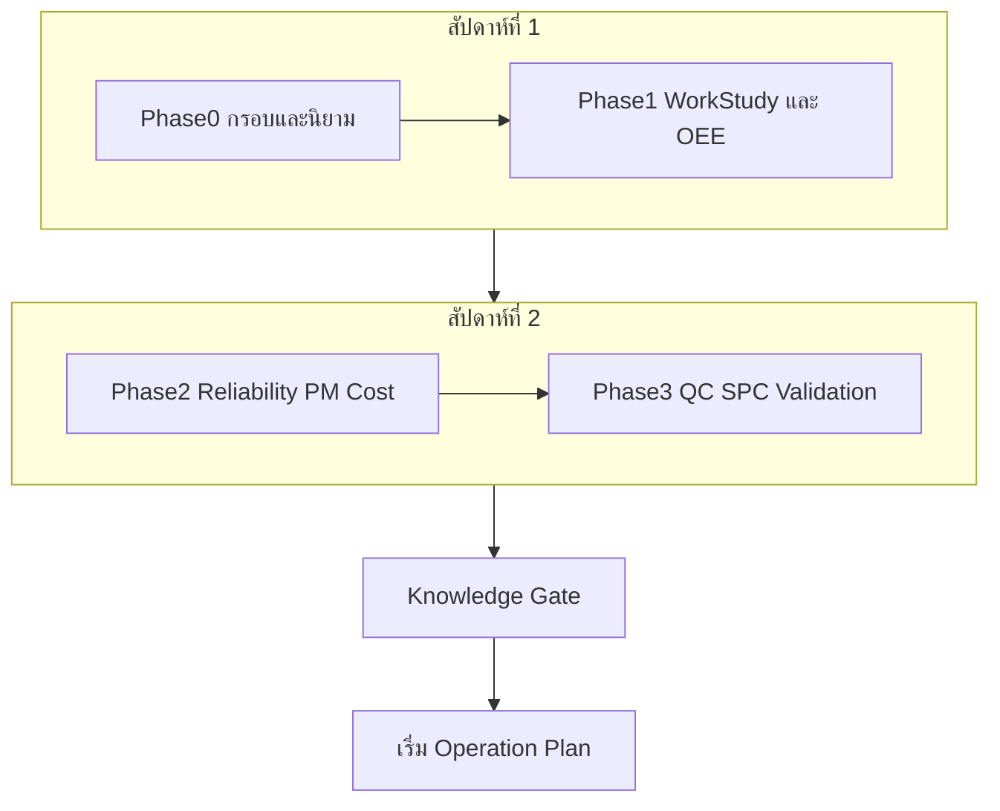
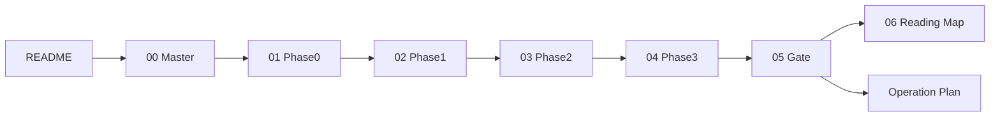
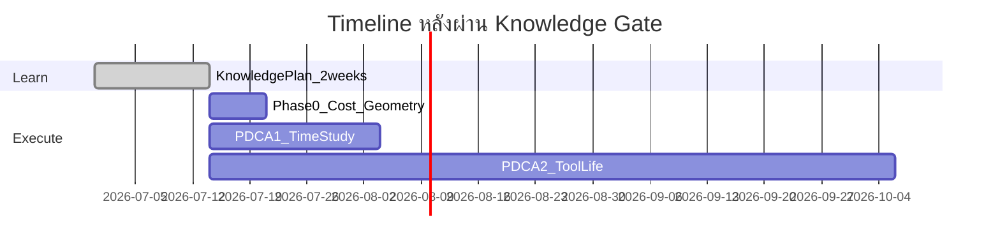

# แผนการเรียนรู้ทฤษฎี — ก่อนเก็บข้อมูล (2 สัปดาห์เข้มงวด)

> **ผู้เรียน:** ธีรศักดิ์ คิดอ่าน (680401700600)  
> **ตำแหน่งโฟลเดอร์:** `แผน/V4/Knowledge-Plan/`  
> **ชื่อเรื่อง (ล็อก):** การเพิ่มผลิตภาพกระบวนการกลึง CNC ในการผลิตมาตรวัดน้ำ โดยประยุกต์ใช้การศึกษาการทำงานและการบำรุงรักษาเชิงป้องกัน  
> **เครื่องเป้าหมาย:** CNC MACOD 1569 / HC15-25 / มีดด้านเกลียว  
> **อ้างอิง:** [Thesis_Framework_v4_TH_Full-name.md](../../Thesis_Framework_v4_TH_Full-name.md) | [Operation_Plan_v4.md](../Operation_Plan_v4.md)

---

## 1. เป้าหมายของแผนนี้

เมื่อจบ 2 สัปดาห์นี้ คุณต้อง:

1. **อธิบายได้** ทุกนิยามที่ใช้ตอนเก็บข้อมูล (ICT, อายุมีด, EOL, failure mode, censored)
2. **คำนวณได้** OEE แบบ demand-adjusted และเข้าใจว่าทำไม Performance เดิม >100%
3. **ตีความได้** Weibull, competing risks, t_p*, N_max — พอ defend ต่ออาจารย์/กรรมการ
4. **ออกแบบได้** แผน Gage R&R และ SPC ก่อนลงมือวัดจริง
5. **ผ่าน Knowledge Gate** ใน [05_Knowledge_Gate_Checklist.md](05_Knowledge_Gate_Checklist.md)

**กฎเหล็ก:** ห้ามเก็บข้อมูลทดลองใด ๆ (รวม piggyback อายุมีด) จนกว่าจะผ่าน Gate

---

## 2. งบเวลา

| รายการ | ค่า |
|--------|-----|
| ชม./สัปดาห์ (หลังหัก Kaizen) | ~9–10 ชม. |
| รวม 2 สัปดาห์ | ~18–20 ชม. |
| วันเรียน | จ.–ศ. เย็น ~2.5 ชม./วัน |

---

## 3. แผนที่ความรู้

---

## 4. ตารางรายสัปดาห์

### สัปดาห์ที่ 1 (~10 ชม.)

| วัน | Phase | ชม. | ไฟล์หลัก | ผลลัพธ์ที่ต้องได้ |
|-----|-------|-----|----------|------------------|
| จ.–อ. | 0 | ~4 | [01_Phase0](01_Phase0_Frame_and_Definitions.md) | อธิบาย productivity, PDCA, ICT≠อายุมีด, EOL, จริยธรรม |
| พฤ.–ศ. | 1 | ~6 | [02_Phase1](02_Phase1_WorkStudy_OEE.md) | คำนวณ N' จำลอง, เขียนสูตร OEE 5 ขั้น, จำลอง downtime log |

**อ่านประกอบ:** Framework §0–2, §3.1, §4.1–4.2, §8–9 | [Assumptions_Log](../Assumptions_Log.md)

---

### สัปดาห์ที่ 2 (~10 ชม.)

| วัน | Phase | ชม. | ไฟล์หลัก | ผลลัพธ์ที่ต้องได้ |
|-----|-------|-----|----------|------------------|
| จ.–พฤ. | 2 | ~8 | [03_Phase2](03_Phase2_Reliability_PM_Cost.md) | รัน weibull_tool_life.py, อธิบาย β, η, t_p*, N_max |
| ศ.–ส. | 3 + Gate | ~6 | [04_Phase3](04_Phase3_QC_SPC_Validation.md) + [05_Gate](05_Knowledge_Gate_Checklist.md) | ออกแบบ Gage R&R, ตอบ mock defense, ผ่าน Gate |

**อ่านประกอบ:** Framework §3.2–3.3, §4.3–4.9, §7 | [Methodology Insert](../Methodology_Insert_v4_ISO3685_CompetingRisks_Regrind.md) | [PDCA2 Guide](../PDCA2/01_PDCA2_Plan_and_Guide_TH.md)

---

## 5. ลำดับไฟล์ที่ต้องอ่าน

---

## 6. เชื่อมกับ Decision Gates (Operation Plan)

| Gate | เรียนก่อนใน Phase | เงื่อนไขผ่าน (สรุป) |
|------|-------------------|-------------------|
| G1.5 Ethics | Phase 0 | ได้ความยินยอมใช้วิดีโอ/CCTV |
| G1 OEE Reality | Phase 1 | Performance ≤ 100% หลังแก้ SCT |
| G0 Financial | Phase 2 (แนวคิด) | มี MHR, ราคามีด — ขอหลัง Gate |
| G2 Weibull | Phase 2 | β > 1 พร้อม CI |
| G2.5 Gage R&R | Phase 3 | %GR&R < 30% |
| G3 Cost-Benefit | Phase 2 | CPP ที่ t_p* ≤ นโยบายเดิม |
| G4 Confirmation | Phase 3 | actual CPP ใกล้ predicted |

Knowledge Gate ครอบคลุม **ความรู้** ก่อน Gate เหล่านี้จะรันได้จริงตอน execution

---

## 7. Minimum Viable Thesis (MVT) — โฟกัสตอนเรียน

ถ้าเวลาไม่พอในสัปดาห์ 2 ให้เรียนให้แน่นก่อน:

1. ICT vs อายุมีด + OEE demand-adjusted
2. EOL + failure mode + F/C
3. Weibull β, η + censoring
4. t_p* + N_max geometry
5. Gage R&R concept

ของยกระดับ (เรียนทีหลังได้ถ้าตัน): Bayesian เต็มรูป, Optimal Inspection m*, Dashboard PoC

---

## 8. Timeline หลังผ่าน Gate

- **สัปดาห์ 1–2 (เรียน):** ห้ามเก็บข้อมูล
- **สัปดาห์ 3+:** เริ่ม Operation Plan §1 (A–E) และ §5 Data Collection
- **PDCA 2 piggyback:** เริ่มหลัง Gate รันขนานกับ PDCA 1

บันทึกวันเริ่ม execution จริงใน [Assumptions_Log](../Assumptions_Log.md)

---

## 9. Checklist รายวัน (ย่อ)

### สัปดาห์ 1
- [ ] อ่าน Phase 0 ครบ + ตอบคำถามเช็คท้ายไฟล์
- [ ] อ่าน Phase 1 ครบ + คำนวณ N' จำลอง 10 รอบ
- [ ] ทำ Week 0 + Week1_N_prime จาก Statistics_For_Engineers (อย่างน้อย 50%)

### สัปดาห์ 2
- [ ] อ่าน Phase 2 ครบ + รัน weibull_tool_life.py
- [ ] อ่าน Phase 3 ครบ + ออกแบบตาราง Gage R&R
- [ ] ทำ Knowledge Gate ≥9/10
- [ ] บันทึกวันผ่าน Gate ใน Assumptions Log

---

## 10. ลิงก์ด่วน

| หมวด | ลิงก์ |
|------|-------|
| กรอบ v4 | [Thesis_Framework_v4_TH_Full-name.md](../../Thesis_Framework_v4_TH_Full-name.md) |
| แผนปฏิบัติ | [Operation_Plan_v4.md](../Operation_Plan_v4.md) |
| สถิติ lab | [Statistics_For_Engineers](../../../DeepReasearchเพื่อการเรียนรู้/UltraLearning-Project/Statistics_For_Engineers/) |
| แผนที่อ่าน | [06_Reading_Map.md](06_Reading_Map.md) |
| Gate | [05_Knowledge_Gate_Checklist.md](05_Knowledge_Gate_Checklist.md) |

---

**แท็ก:** #knowledge-plan #master #2weeks #pre-data
