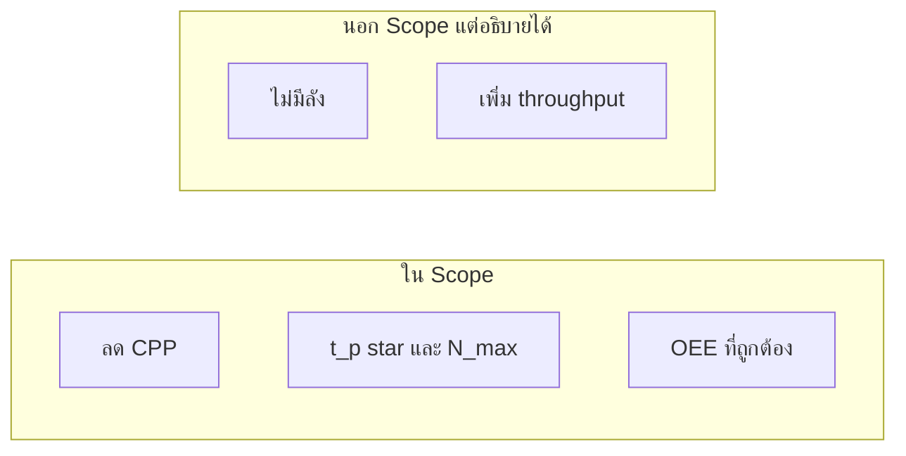
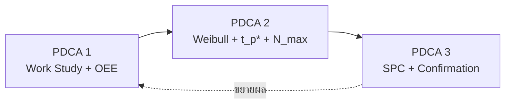

# Phase 0 — กรอบโครงการและนิยามเชิงปฏิบัติการ

> **ระยะเวลา:** สัปดาห์ที่ 1 วัน 1–2 (~4 ชม.)  
> **อ่านก่อน:** [Thesis_Framework_v4_TH_Full-name.md](../../Thesis_Framework_v4_TH_Full-name.md) §0–2, §9  
> **ถัดไป:** [02_Phase1_WorkStudy_OEE.md](02_Phase1_WorkStudy_OEE.md)

---

## เป้าหมายเล็กของโมดูลนี้

หลังจบ Phase 0 คุณต้องอธิบายได้ว่า **"ผลิตภาพ" ในเล่มนี้หมายถึงอะไร**, **PDCA 3 วงจรทำอะไร**, และ **ห้ามสับสนอะไรกับอะไร** ก่อนลงมือจับปากกาบันทึกข้อมูลแม้แต่แถวเดียว

---

## ทำไมต้องรู้ก่อนเก็บข้อมูล

ถ้าเริ่มบันทึกโดยไม่ล็อกนิยามก่อน ข้อผิดพลาดจะ "ฝัง" ในข้อมูลและแก้ยากมาก:

| ผิดพลาด | ผลที่ตามมา |
|---------|-----------|
| เอา ICT ไปคิดอายุมีด | OEE และ Weibull ผิดทั้งคู่ |
| จำแนก failure mode ผิด | Competing risks และ Cf คลาดเคลื่อน |
| นับ downtime "ไม่มีลัง" ใน Availability | OEE ต่ำผิด — โทษเครื่อง CNC ทั้งที่เป็นดีมานด์ |
| ไม่ขอความยินยอมวิดีโอ | ปัญหาจริยธรรม — Gate G1.5 ไม่ผ่าน |

---

## บทเรียน 1: ผลิตภาพ = ลดต้นทุน ไม่ใช่เร่งผลิต

### Hook
ชื่อเรื่องมีคำว่า "เพิ่มผลิตภาพ" — กรรมการมักถามทันที: *"แล้วผลิตเพิ่มกี่เปอร์เซ็นต์?"*

### แก่น
ในโรงงานนี้ **ดีมานด์เป็นตัวกำหนด** — ผลิตเกิน = WIP/ของสะสม ไม่ใช่เป้าหมาย  
เล่มนี้นิยามผลิตภาพเป็น **Resource/Cost Productivity (ผลิตภาพเชิงทรัพยากร/ต้นทุน)** = ลด Input (CPP, ต้นทุนมีด, ของเสีย) ที่ระดับ Output เท่าเดิม

### อุปมา
ร้านข้าวที่ลูกค้าสั่ง 100 จาน/วัน — ทำ 150 จานไม่ได้แปลว่า "มีประสิทธิภาพขึ้น" แต่ทำ 100 จานด้วยวัตถุดิบและแรงงานน้อยลง = ผลิตภาพดีขึ้น  
**ข้อจำกัดอุปมา:** ร้านอาหารไม่มี "ของเสียจากมีดหัก" — แต่แนวคิด "output คงที่ ลด input" ใช้ได้

### ตัวอย่างจากโรงงาน
Downtime สูงสุด ~82% คือ **"ไม่มีลังจากประกอบ"** = No-demand (รอดีมานด์) — **ไม่ใช่ความล้มเหลวของเครื่องกลึง**  
มูลค่าจริงของ thesis: กัน Net Scrap, Regrind Policy, วางแผน PM จาก SCT/OEE ที่ถูก

### ภาพ: สิ่งที่ thesis โฟกัส vs ไม่โฟกัส

### สูตร (นิยามเชิงปฏิบัติ)

$$\text{Productivity} = \frac{\text{Output}}{\text{Input}} \quad \Rightarrow \quad \text{โฟกัส: ลด Input ที่ Output คงที่}$$

$$\text{CPP} = \frac{\text{ค่ามีด + ค่าลับ + Net Scrap + DT cost}}{\text{ชิ้นดีต่อช่วง}}$$

### เช็คความเข้าใจ 1
**คำถาม:** ทำไม thesis ไม่พยายามแก้ปัญหา "ไม่มีลัง"?  
**เฉลย:** เป็น demand pacing ตาม Lean/ISO 22400 — นับเป็น Standby/No-demand ไม่ใช่ความผิดของ MACOD 1569; แก้ต้องประสานแผนกประกอบ (นอก scope แต่เสนอเป็น recommendation ได้)

---

## บทเรียน 2: โครงสร้าง PDCA 3 วงจร

### Hook
งานวิจัยไม่ใช่ "เก็บข้อมูลแล้วค่อยคิด" — แต่ละวงจรมีเป้า Q/C/D ชัดเจน

### แก่น

| วงจร | เป้า | ส่งมอบหลัก |
|------|------|-----------|
| **PDCA 1** | D (Delivery/Baseline) | SCT/ICT, OEE ที่ถูก, คู่มือ downtime |
| **PDCA 2** | C + Availability | Weibull, t_p*, N_max, PM Standard |
| **PDCA 3** | Q + พิสูจน์ผล | SPC, Confirmation Run, Dashboard PoC |

### ภาพ

### MVT vs ของยกระดับ

**MVT (จบได้แน่):** OEE ถูก + Weibull + t_p* + N_max geometry + Honest Cost  
**ของยกระดับ (ขาดได้ไม่ตัน):** Bayesian เต็มรูป, Competing-risks fit เต็ม, Dashboard, Optimal Inspection m*

### เช็คความเข้าใจ 2
**คำถาม:** PDCA 2 หาอะไรเป็นหลัก?  
**เฉลย:** อายุเปลี่ยนมีดที่เหมาะสม t_p* และจำนวนครั้งลับสูงสุด N_max — จากข้อมูล reliability + ต้นทุน

---

## บทเรียน 3: ICT ≠ อายุมีด (กฎทอง)

### Hook
เครื่อง MACOD 1569 เป็น **multi-spindle pipeline** — ชิ้นออกเร็วกว่าที่คุณนึกจาก "เวลากลึง 4 สถานี"

### แก่น

| มิติ | PDCA 1 (Time Study) | PDCA 2 (Tool Life) |
|------|---------------------|---------------------|
| วัดอะไร | **ICT** = piece-out → piece-out (วินาที/ชิ้น) | **อายุมีด** = จำนวนชิ้นต่อรอบติดตั้งมีด |
| ใช้ทำอะไร | OEE Performance | Weibull, t_p* |
| หน่วย | วินาที | ชิ้น (pieces) |

**ห้าม** บวกเวลา 4 สถานีเป็น ICT — สถานีทำงานซ้อนเวลา

### อุปมา
สายพานซูชิ: จานออกทุก 30 วินาที ไม่ได้แปลว่า "ทำจานหนึ่งใช้ 30×4 วินาที" เพราะหลายจานอยู่ในสายพร้อมกัน

### ภาพ: Pipeline MACOD 1569

ICT = เวลาระหว่าง **OUT ครั้งหนึ่ง → OUT ครั้งถัดไป**

### เช็คความเข้าใจ 3
**คำถาม:** ถ้า ICT ≈ 45 วินาที/ชิ้น และอายุมีด ≈ 14,000 ชิ้น — อายุมีดเท่ากับ 14,000 × 45 วินาทีไหม?  
**เฉลย:** ไม่ใช่การคูณตรง ๆ แบบนั้นสำหรับนิยาม ICT; อายุมีดนับเป็นชิ้นที่ผลิตได้ระหว่างติดตั้งมีดครั้งหนึ่ง (นับจากมิเตอร์ชิ้น/HMI) ไม่ใช่ ICT × จำนวนชิ้นในเชิง pipeline overlap

---

## บทเรียน 4: EOL และ Failure Mode

### Hook
คำว่า "มีดพัง" กำกวม — วิจัยต้องนิยามให้วัดและทำซ้ำได้

### แก่น (ตาม ISO 3685 ปรับใช้)

| เกณฑ์ | ความหมาย | เครื่องมือ |
|-------|----------|-----------|
| **Primary EOL** | ขนาด/เกลียววิกฤตเลื่อนแตะ tolerance | Vernier + Plug Gauge Go/No-Go |
| **Secondary** | Flank wear VB ≥ 0.3 mm | USB microscope / ImageJ (ถ้ามี) |
| **Catastrophic** | หัก/บิ่นกะทันหัน | สังเกตหน้างาน |

### Failure Mode สำหรับบันทึก

| failure_mode | ความหมาย | censored_flag |
|--------------|----------|---------------|
| wear | สึกถึงเกณฑ์ | **F** (Failed) |
| breakage | หัก/พังฉับพลัน | **F** |
| censored | ถอดก่อนถึงเกณฑ์ | **C** |

Competing risks แยก **W (wear)** กับ **K (catastrophic)** — ต้นทุนต่างกันมาก

### ตัวอย่าง 3 เคส (ฝึกจำแนก)

| เคส | สิ่งที่เกิด | failure_mode | censored_flag |
|-----|------------|--------------|---------------|
| 1 | เกลียว No-Go ไม่ผ่านหลัง ~13,500 ชิ้น | wear | F |
| 2 | มีดหักกลางกะ ชิ้นเสีย 3 ชิ้น | breakage | F |
| 3 | เปลี่ยนแผนลับก่อนถึงพิกัด (ทดลอง) | censored | C |

### เช็คความเข้าใจ 4
**คำถาม:** ทำไม dimensional drift เป็นเกณฑ์หลักแทน VB โดยตรง?  
**เฉลย:** โรงงานไม่มี toolmaker's microscope; ISO 3685 รองรับ indirect criterion; ผูกอายุมีดกับคุณภาพที่ลูกค้าสนใจโดยตรง; defend ได้ด้วย Gage R&R

---

## บทเรียน 5: จริยธรรมและการเก็บข้อมูล (Gate G1.5)

### Hook
Time Study ใช้วิดีโอ (ไม่มี CCTV signal) — ต้องทำถูกกฎก่อนถ่าย

### แก่น
- แจ้งหัวหน้างานและพนักงานก่อนถ่าย
- ถ่ายจากระยะที่ไม่รบกวนงาน — ลด Hawthorne Effect
- ไม่เผยแพร่ภาพที่ระบุตัวบุคคลนอก scope วิจัย
- เก็บ ≥5 วัน, **ตัดวันแรก** (Familiarization) ออกจากการวิเคราะห์หลัก

### เชื่อม Gate
**G1.5 — Ethics/CCTV Consent:** ไม่ผ่าน = ใช้วิธีจับเวลาอื่นที่ไม่บันทึกภาพพนักงาน

---

## บทเรียน 6: Estimation + CI แทน NHST (เมื่อ N เล็ก)

### Hook
มีดใหม่ติดตามแค่ 5 ตัว — จะบอกกรรมการว่า "p < 0.05 แปลว่าสึกแน่" ไม่ได้

### แก่น
เมื่อ sample เล็ก (n=5–9) และ power ไม่พอ:
- ใช้ **การประมาณค่า (Estimation)** + **ช่วงความเชื่อมั่น (CI)**
- รายงาน **ข้อจำกัด** ตรงไปตรงมา + **Sensitivity Analysis**
- อย่า overclaim จาก p-value

### ตัวอย่าง
"Weibull fit ให้ β̂ = 4.9, 95% CI ของ β คือ [2.1, 8.5] — สนับสนุน wear-out (β>1) แต่ CI กว้างเพราะ n=9"

### เช็คความเข้าใจ 5
**คำถาม:** p > 0.05 จาก t-test ระหว่างกะ แปลว่ากะทำงานเท่ากันไหม?  
**เฉลย:** ไม่จำเป็น — อาจเป็นเพราะ power ไม่พอ; ใช้ Estimation + CI และอธิบายข้อจำกัด (M3 v4)

---

## สรุป Phase 0 (จำ 6 ข้อ)

1. ผลิตภาพ = ลดต้นทุนที่ output เท่าเดิม  
2. PDCA 1→2→3 มีเป้า D → C → Q  
3. ICT (วินาที) ≠ อายุมีด (ชิ้น)  
4. EOL หลัก = dimensional drift; บันทึก F/C ทุกครั้ง  
5. ขอความยินยอมก่อนถ่ายวิดีโอ  
6. N เล็ก → CI + sensitivity ไม่ใช่ NHST อย่างเดียว  

---

## อ่านต่อ / Drill

| หัวข้อ | ไฟล์ |
|--------|------|
| กรอบ v4 เต็ม | [Thesis_Framework_v4_TH_Full-name.md](../../Thesis_Framework_v4_TH_Full-name.md) |
| EOL + Competing Risks ลึก | [Methodology Insert](../Methodology_Insert_v4_ISO3685_CompetingRisks_Regrind.md) §3.2.A |
| PDCA1 pipeline | [PDCA1 Methodology Draft](../PDCA1/03_PDCA1_Methodology_Draft_TH.md) §2 |

---

## เชื่อม Gate ใน Operation Plan

| Gate | ความพร้อมหลัง Phase 0 |
|------|------------------------|
| G1.5 | เข้าใจขั้นตอนขอความยินยอม — พร้อมดำเนินการหลัง Gate |
| (แนวคิด) G2–G4 | รู้ว่า Gate คืออะไร — เรียนลึกใน Phase 2–3 |

---

**แท็ก:** #knowledge-plan #phase0 #definitions #ethics
