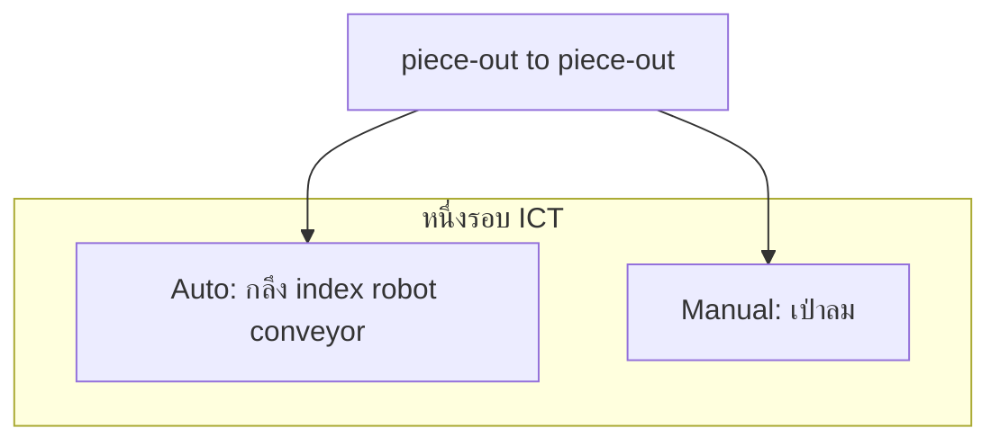
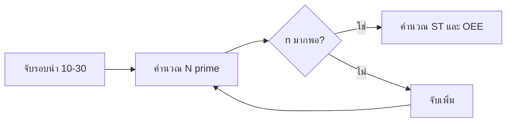

# Phase 1 — Work Study และ OEE ที่ถูกต้อง

> **ระยะเวลา:** สัปดาห์ที่ 1 วัน 3–5 (~6 ชม.)  
> **อ่านก่อน:** [01_Phase0](01_Phase0_Frame_and_Definitions.md) | Framework §3.1, §4.1–4.2  
> **ถัดไป:** [03_Phase2_Reliability_PM_Cost.md](03_Phase2_Reliability_PM_Cost.md)  
> **Lab สถิติ:** [Week1_Plan](../../../DeepReasearchเพื่อการเรียนรู้/UltraLearning-Project/Statistics_For_Engineers/Week_1/Week1_Plan.md)

---

## เป้าหมายเล็กของโมดูลนี้

หลังจบ Phase 1 คุณต้อง **ออกแบบ Time Study ได้**, **คำนวณ N' และ OEE demand-adjusted ได้**, และ **อธิบายได้ว่าทำไม Performance เดิมเกิน 100%**

---

## ทำไมต้องรู้ก่อนเก็บข้อมูล

- SCT/ICT ผิด → OEE ทั้งก้อนไม่น่าเชื่อถือ → สมมติฐาน H₁ defend ไม่ได้  
- จับรอบน้อยเกินไป → CI กว้าง → อาจารย์ถามไม่ตอบ  
- จัดประเภท downtime ผิด → Availability โทษเครื่องทั้งที่รอดีมานด์

---

## บทเรียน 1: Time Study บน Multi-spindle Pipeline

### Hook
ระบบเดิมตั้ง SCT สูงเกินจริง → Performance OEE ทะลุ 100% — นี่คือ "สัญญาณเตือน" ไม่ใช่ความสำเร็จ

### แก่น
1. **ICT (Ideal/Observed Cycle Time)** = เวลาระหว่าง **piece-out → piece-out** (วินาที)  
2. แยกองค์ประกอบ **Auto** (กลึง, index, robot, conveyor) กับ **Manual** (เป่าลม — งานคนเพียงอย่างเดียว)  
3. **ห้าม** ใช้ผลรวม 4 สถานีแทน ICT เมื่อสถานีซ้อนเวลา  
4. เป้าหมายเก็บ **~200–300 รอบ** หลายวัน หลายกะ (หลังคำนวณ N')

### อุปมา
จับเวลา "รถไฟฟ้าออกจากสถานี" ไม่ใช่ "รวมเวลาที่รถจอดทุกสถานีบนเส้นทาง"

### ตัวอย่างการบันทึก (จำลอง)

| รอบ | total_cycle_sec | T_manual | T_auto (=cycle−manual) | กะ | exclude? |
|-----|-----------------|----------|------------------------|-----|----------|
| 1 | 44.2 | 3.1 | 41.1 | A | ไม่ |
| 2 | 43.8 | 2.9 | 40.9 | A | ไม่ |
| 3 | — | — | — | A | ใช่ (เปลี่ยนมีด) |

### ภาพ: แยก Auto / Manual

### สูตร Standard Time (v4 — แยก Allowance)

$$ST = \underbrace{(T_{manual} \times Rating \times (1 + A_{personal+fatigue}))}_{\text{ส่วนคน}} + \underbrace{(T_{auto} \times (1 + A_{machine\_delay}))}_{\text{ส่วนเครื่อง}}$$

ค่าเริ่มต้น (placeholder — ยืนยันใน Assumptions Log):
- $A_{personal+fatigue} = 0.15$ (15%) ส่วน Manual  
- $A_{machine\_delay} = 0.05$ (5%) ส่วน Auto  
- งาน Auto: **Rating = 100%** (ไม่ปรับความเร็ว)

### Performance Rating
ประเมินเฉพาะงาน Manual เปรียบเทียบจังหวะพนักงานกับจังหวะมาตรฐาน (Niebel & Freivalds) — งานเครื่องไม่ rate

### Hawthorne Effect
- ถ่ายวิดีโอในสภาพผลิตปกติ ไม่ให้พนักงาน "แสดง"  
- เก็บ ≥5 วัน, **ตัดวันแรก** ออกจากการวิเคราะห์หลัก  
- รอบที่หยุดฉุกเฉิน/เปลี่ยนมีด → `exclude_flag`

### เช็คความเข้าใจ 1
**คำถาม:** ทำไม overlap_flag = Y เมื่อ Σองค์ประกอบ > 1.05 × ICT ถึงเป็นเรื่องปกติ?  
**เฉลย:** ใน pipeline สถานีทำงานพร้อมกัน — ผลรวมองค์ประกอบมักเกิน ICT; ใช้เตือนไม่ให้เอาผลรวมไปแทน ICT

---

## บทเรียน 2: ขนาดตัวอย่าง N'

### Hook
จับเวลา 10 รอบแล้วสรุปเลย — กรรมการถาม: "แม่นแค่ไหน?"

### แก่น
สูตร N' บอกจำนวนรอบที่ต้องจับเพื่อให้ค่าเฉลี่ยเวลารอบอยู่ใน **±5% ที่ความเชื่อมั่น 95%**

### สูตร

$$N' = \left( \frac{40\sqrt{N\sum X^2 - (\sum X)^2}}{\sum X} \right)^2$$

เมื่อ $X$ = ค่าเวลารอบที่จับไปแล้ว $N$ รอบ (ใช้ตรวจว่า $n \geq N'$)

### ตัวอย่างฝึก (10 รอบจำลอง)

สมมติ $T_{cycle}$ (วินาที): 44, 43, 45, 44, 43, 44, 45, 44, 43, 44

- $\bar{x} \approx 43.9$ วินาที  
- $s$ ต่ำ (~0.7 วินาที) → CV ต่ำ → N' ไม่สูงมาก  
- **หมายเหตุ:** CV ต่ำไม่ได้แปลว่า "ไม่มีความเสี่ยงด้านมีด/ของเสีย" — คนละมิติกับ PDCA 2–3

### ภาพ: ลำดับการใช้ N'

### Drill
ทำด้วยมือหรือ Excel ตาม [Week1_N_prime.md](../../../DeepReasearchเพื่อการเรียนรู้/UltraLearning-Project/Statistics_For_Engineers/Week_1/Week1_N_prime.md)

### เช็คความเข้าใจ 2
**คำถาม:** ถ้า SD ของเวลารอบสูงขึ้น N' จะเป็นอย่างไร?  
**เฉลย:** N' เพิ่ม — ต้องจับรอบมากขึ้นเพื่อความแม่นยำ ±5%

---

## บทเรียน 3: OEE แบบ Demand-adjusted (ISO 22400-2)

### Hook
OEE = A × P × Q — แต่ละตัวต้องนิยามให้ตรงมาตรฐาน ไม่งั้นเลขสวยแต่โกหก

### แก่น — 5 ขั้น

| ขั้น | สูตร/นิยาม |
|------|------------|
| 1 | **Effective Loading** = เวลาเปิดกะ − พักตามระเบียบ − **No-demand** (เช่น ไม่มีลัง) |
| 2 | **Availability** $A$ = Run Time / Effective Loading |
| 3 | **Performance** $P$ = (ICT × ชิ้นที่ผลิต) / Run Time |
| 4 | **Quality** $Q$ = ชิ้นดี / ชิ้นทั้งหมด |
| 5 | **OEE** = $A \times P \times Q$ |

รายงานแยก: **Utilization** = Run Time / เวลาเปิดกะ

### ตัวอย่าง: "ไม่มีลัง" อยู่ตรงไหน

จากข้อมูลเดิม ~1,808 นาที downtime:
- "ไม่มีลังจากประกอบ" ~82% → จัดเป็น **Standby / No-demand**  
- **หักออกจาก Effective Loading** — ไม่นับเป็นความล้มเหลวของเครื่องกลึง  
- เปลี่ยนมีดด้านเกลียว ~2.16% → เกี่ยวข้องกับ PM (เป้าหมาย PDCA 2)

### ภาพ: ไทม์ไลน์หนึ่งกะ

```mermaid
gantt
    title ตัวอย่างการจัดประเภทเวลาในกะหนึ่ง
    dateFormat HH:mm
    axisFormat %H:%M
    section Loading
    EffectiveLoading :a1, 08:00, 8h
  section NoDemand
    ไม่มีลัง :crit, a2, 10:00, 2h
  section Run
    RunTime :a3, 08:00, 6h
```

*(ภาพแนวคิด — สัดส่วนจริงบันทึกจาก Downtime Log 4–8 สัปดาห์)*

### ทำไม Performance > 100% ในระบบเดิม

ถ้า ICT ในระบบ **สูงกว่า** เวลาจริง → ตัวส่วน (ICT × ชิ้น) ใหญ่เกิน → P > 100%  
หลัง Time Study แก้ ICT → คาด P ลงสู่ **80–95%** (Gate G1)

### ตารางจำลอง Downtime Log (ฝึก 1 วัน)

| สาเหตุ | นาที | ISO 22400-2 | นับใน A? |
|--------|------|-------------|----------|
| ไม่มีลัง | 120 | No-demand | หักจาก Effective Loading |
| เปลี่ยนมีดเกลียว | 8 | Unplanned/Planned PM | ใช่ (ลด Run Time) |
| พนักงานพักก่อนเวลา | 15 | ระเบียบ | แยกตามนโยบายโรงงาน |

### เช็คความเข้าใจ 3
**เขียนสูตร:** ลองเขียน 5 ขั้น OEE demand-adjusted จากความจำ และวง "ไม่มีลัง" ว่าอยู่ขั้นตอนไหน

**เฉลย:** ขั้น 1 — หักออกจาก Effective Loading ก่อนคำนวณ Availability

---

## บทเรียน 4: Downtime Log และ Reason Code

### Hook
OEE ขึ้นกับ log หน้างาน — ต้องออกแบบฟอร์มก่อนเก็บ

### แก่น
- เก็บ **4–8 สัปดาห์** baseline  
- ทุกครั้งหยุด: เวลาเริ่ม–จบ, reason code, หมวด ISO 22400-2  
- อ้างอิงเปรียบเทียบ [ข้อมูล ดาวทามเครื่องจักร.csv](../../../รายงาน/ข้อมูลประกอบ/ข้อมูล%20ดาวทามเครื่องจักร.csv) (1,808 นาที)

### Deliverable PDCA 1 (Act)
- SCT/ICT ที่ปรับแล้ว  
- OEE baseline ใหม่  
- คู่มือนับ Downtime ตาม ISO 22400-2  

---

## ฝึกปฏิบัติ Phase 1 (ยังไม่เก็บข้อมูลจริง)

### แบบฝึก A: คำนวณ N'
ใช้ตัวเลข 10 รอบด้านบน — คำนวณ mean, SD, N' ด้วย Excel หรือมือ

### แบบฝึก B: จำลอง OEE หนึ่งกะ
สมมติ:
- เปิดกะ 480 นาที, พักระเบียบ 60 นาที, No-demand 120 นาที  
- Run Time 240 นาที, ผลิต 300 ชิ้น, ICT = 44 วินาที/ชิ้น, ชิ้นเสีย 3 ชิ้น  

ลองคำนวณ A, P, Q, OEE (เฉลยอยู่ท้ายไฟล์)

### แบบฝึก C: ออกแบบฟอร์ม
เปิด [01_Time_Study_Template.csv](../../../รายงาน/ข้อมูลประกอบ/templates/01_Time_Study_Template.csv) — อธิบายความหมายแต่ละคอลัมน์ด้วยคำของตัวเอง

---

## เฉลยแบบฝึก B (OEE จำลอง)

- Effective Loading = 480 − 60 − 120 = **300 นาที**  
- $A = 240/300 = 0.80$  
- ICT × ชิ้น = 44 × 300 = 13,200 วินาที = 220 นาที  
- $P = 220/240 \approx 0.917$  
- $Q = 297/300 = 0.99$  
- $OEE = 0.80 \times 0.917 \times 0.99 \approx 0.726$ (**72.6%**)

---

## สรุป Phase 1

| หัวข้อ | จำ |
|--------|-----|
| ICT | piece-out → piece-out, ไม่บวก 4 สถานี |
| ST | แยก Manual/Auto + Allowance คนละแบบ |
| N' | ±5% @ 95% CI |
| OEE | 5 ขั้น, No-demand หักขั้น 1 |
| Hawthorne | ตัดวันแรก, exclude รอบผิดปกติ |

---

## อ่านต่อ / Drill

| หัวข้อ | ไฟล์ |
|--------|------|
| N' ลึก | [Week1_N_prime.md](../../../DeepReasearchเพื่อการเรียนรู้/UltraLearning-Project/Statistics_For_Engineers/Week_1/Week1_N_prime.md) |
| OEE + reliability | [Week3_OEE_Reliability_Link.md](../../../DeepReasearchเพื่อการเรียนรู้/UltraLearning-Project/Statistics_For_Engineers/Week_3/Week3_OEE_Reliability_Link.md) |
| Methodology บท 3.1 | [03_Chapter_3_Methodology.md](../03_Chapter_3_Methodology.md) §3.1 |
| Workbook | [PDCA1_Time_Study_Workbook_v4.xlsx](../PDCA1/PDCA1_Time_Study_Workbook_v4.xlsx) |

---

## เชื่อม Gate ใน Operation Plan

| Gate | หลัง Phase 1 |
|------|--------------|
| **G1** | เข้าใจว่า Performance ต้อง ≤ 100% หลังแก้ ICT |
| **G1.5** | รู้ขั้นตอนจริยธรรมวิดีโอ (เรียนใน Phase 0) |

---

**แท็ก:** #knowledge-plan #phase1 #work-study #oee #n-prime
