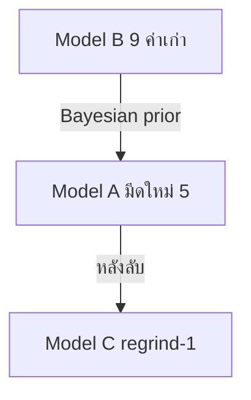
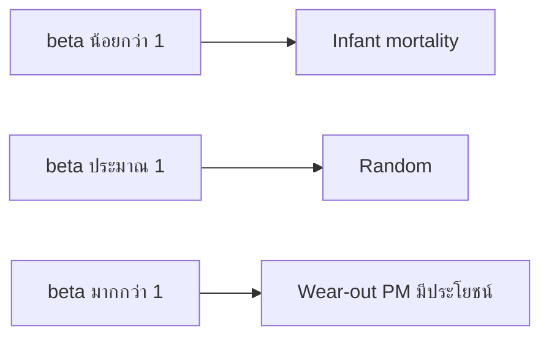

# Phase 2 — Reliability, PM และแบบจำลองต้นทุน

> **ระยะเวลา:** สัปดาห์ที่ 2 วัน 1–4 (~8 ชม.)  
> **อ่านก่อน:** [02_Phase1](02_Phase1_WorkStudy_OEE.md) | Framework §3.2, §4.3–4.9, §7  
> **ถัดไป:** [04_Phase3_QC_SPC_Validation.md](04_Phase3_QC_SPC_Validation.md)  
> **Lab สถิติ:** [Week2_Plan](../../../DeepReasearchเพื่อการเรียนรู้/UltraLearning-Project/Statistics_For_Engineers/Week_2/Week2_Plan.md)

---

## เป้าหมายเล็กของโมดูลนี้

หลังจบ Phase 2 คุณต้อง **อธิบาย Weibull + censoring ได้**, **เข้าใจ competing risks**, **บอกได้ว่า t_p* และ N_max มาจากไหน**, และ **รัน weibull_tool_life.py กับข้อมูล 9 ค่าแล้วตีความผลได้**

---

## ทำไมต้องรู้ก่อนเก็บข้อมูล

ทุกแถวใน Tool_Log ต้องบันทึก **failure_mode** และ **censored_flag** ถูกตั้งแต่แถวแรก — แก้ทีหลังไม่ได้  
ถ้าไม่เข้าใจ stratified A/B/C จะรวมมีดใหม่กับมีดลับผิดชุด → prior และ CI พัง

---

## บทเรียน 1: รากฐานวรรณกรรม — Taylor และ Gilbert

### Hook
กรรมการถาม: "ทำไมไม่ใช้แค่ค่าเฉลี่ย ~14,000 ชิ้น?"

### แก่น

| แหล่ง | แนวคิด | ใช้ใน thesis |
|-------|--------|--------------|
| **Taylor (1907)** | $VT^n = C$ — ความเร็วตัดกับอายุมีด | พื้นฐาน tool life |
| **Gilbert (1950)** | Economic tool life — สมดุลต้นทุน vs อัตราผลิต | แนวคิด t_p* |
| **ISO 3685** | เกณฑ์ VB มาตรฐาน | EOL ที่ defend ได้ |
| **Barlow & Proschan** | Age-replacement | สูตร C(t_p) |
| **RCM** | PM เชิงเศรษฐศาสตร์ | กรอบ PDCA 2 |

### Novelty ที่เคลมได้จริง (v4)
การรวม **Stratified reliability + Age-replacement + Regrind-economic (N_max)** ใน SME ผลิตมาตรวัดน้ำไทย + **Confirmation run**

---

## บทเรียน 2: ISO 3685 และการเก็บข้อมูล Piggyback

### Hook
v3 อยาก run-to-failure 5 ตัวเรียง — v4 เปลี่ยนเพราะผูกขาดเครื่องและไม่จำเป็น

### แก่น — Observational Piggyback
- เก็บจาก **การเปลี่ยนมีดตามการผลิตปกติ** + ติดตามมีดใหม่ 5 ตัว (NEW-01..05)  
- **ไม่จงใจรันจนพังคาเครื่อง** — EOL ที่ VB/tolerance หรือ dimensional drift  
- ทุกครั้งเปลี่ยน: อายุ (ชิ้น) + failure mode + ครั้งลับ

### Stratified Data Protocol

| ชุด | แหล่ง | n | โมเดล |
|-----|-------|---|-------|
| **A** | มีดใหม่ 5 ตัว | 5 | Model A — fit หลัก |
| **B** | ข้อมูลเก่า 9 ค่า | 9 | Prior / อ้างอิง |
| **C** | มีด A หลังลับครั้งที่ 1 | 2–5 | Model C — เสริม |

ข้อมูลเก่า 9 ค่า (ชิ้น): 15,800 / 9,600 / 12,300 / 13,800 / 17,287 / 19,613 / 9,720 / 15,050 / 12,750  
เฉลี่ย ~13,991, CV ~24%

### ภาพ: ชุดข้อมูล



### เช็คความเข้าใจ 1
**คำถาม:** ทำไมไม่รวมมีดใหม่กับมีดลับ 9 ค่าใน fit เดียว?  
**เฉลย:** Stratified — อายุและพฤติกรรมต่างกัน; Model B ใช้เป็น prior/อ้างอิง ไม่ปนกับ Model A

---

## บทเรียน 3: Weibull Distribution

### Hook
ค่าเฉลี่ยอายุมีดหลอก — การกระจายไม่สมมาตร และ PM ต้องดู **รูปร่าง** การเสีย

### แก่น

$$R(t) = e^{-(t/\eta)^\beta}$$

| พารามิเตอร์ | ความหมาย |
|-------------|----------|
| **β (shape)** | β<1 infant mortality, β≈1 random, **β>1 wear-out** → PM มีความหมาย |
| **η (scale)** | characteristic life — R(η)≈36.8% |
| **B10** | อายุที่ R(t)=0.90 — มักใช้สื่อสารกับโรงงาน |

### Right-Censoring (F vs C)

| สัญลักษณ์ | ความหมาย | ใน likelihood |
|-----------|----------|---------------|
| **F (Failed)** | ถึงเกณฑ์ EOL | ใช้ $f(t)$ |
| **C (Censored)** | ถอดก่อนเกณฑ์ | ใช้ $R(t)$ |

$$\ell = \sum_{Failed} \ln f(t_i) + \sum_{Censored} \ln R(t_j)$$

### N เล็ก (5–9): MRR + Bayesian

เมื่อ n น้อย:
- **Median Rank Regression (MRR)** + unbiasing factor ของ β  
- **Bayesian Weibull** — ใช้ Model B (9 ค่า) เป็น informative prior ของ Model A  
- รายงาน **CI ของ β, η** + ข้อจำกัด low power

### ตัวเลขอ้างอิง [ยืนยันจากสคริปต์]

จากข้อมูล 9 ค่า (MLE เต็ม):
- $\hat{\beta} \approx 4.92$ (wear-out ชัด)  
- $\hat{\eta} \approx 15{,}255$ ชิ้น  
- B10 $\approx 9{,}654$ ชิ้น  

### ภาพ: ความหมาย β



### ฝึกปฏิบัติ
```bash
cd รายงาน/scripts
python weibull_tool_life.py
```
อธิบายผล β, η, B10 ด้วยคำของตัวเอง — ดู [Week2_Weibull_Censoring.md](../../../DeepReasearchเพื่อการเรียนรู้/UltraLearning-Project/Statistics_For_Engineers/Week_2/Week2_Weibull_Censoring.md)

### เช็คความเข้าใจ 2
**คำถาม:** ถ้า β̂ ≈ 1.0 จะยังทำ age-replacement แบบเดิมไหม?  
**เฉลย:** ต้องระวัง — random failure ทำ PM ตามอายุอาจไม่คุ้ม; pivot เป็น condition monitoring narrative + รายงานข้อจำกัด (Contingency §14)

---

## บทเรียน 4: Competing Risks (W vs K)

### Hook
มีด "พัง" มี 2 แบบ — สึก (ลับได้, ต้นทุนต่ำ) กับ หัก (ทิ้ง, scrap+downtime สูง)

### แก่น

แต่ละโหมด $j \in \{W, K\}$ มี hazard แยก:

$$h_j(t) = \frac{\beta_j}{\eta_j}\left(\frac{t}{\eta_j}\right)^{\beta_j - 1}$$

ความอยู่รอดรวม:

$$R(t) = \exp\!\big[-(H_W(t) + H_K(t))\big]$$

สัดส่วน catastrophic ณ อายุ $t_p$:

$$p_{cat}(t_p) = \frac{F_K(t_p)}{F_W(t_p) + F_K(t_p)}$$

### ต้นทุนแยก 3 กรณี

| กรณี | ต้นทุน |
|------|--------|
| เปลี่ยนตามแผนที่ $t_p$ | $C_p$ = ค่าลับ + เวลาเปลี่ยนแผน × MHR |
| พังแบบสึก ($W$) | $C_W$ = ลับ + downtime น้อย + scrap บางส่วน |
| พังแบบหัก ($K$) | $C_K$ = **มีดใหม่** + downtime ฉุกเฉิน + scrap มาก |

### ข้อจำกัด
ถ้าเหตุการณ์ K น้อยมาก (0–2 ครั้ง) → ใช้ $\hat{p}_{cat}$ เชิงประจักษ์ + sensitivity แทน fit เต็มรูป

### Drill
[Week2_Competing_Risks.md](../../../DeepReasearchเพื่อการเรียนรู้/UltraLearning-Project/Statistics_For_Engineers/Week_2/Week2_Competing_Risks.md)

### เช็คความเข้าใจ 3
**คำถาม:** ทำไมรวม Cf แบบเดียวทำให้ t_p* คลาดเคลื่อน?  
**เฉลย:** สึกกับหักมีต้นทุนต่างกันมาก — ต้องถ่วงด้วย $p_{cat}$ ไม่ใช่สมมติ catastrophic 100%

---

## บทเรียน 5: Age-Replacement — หา t_p*

### Hook
เปลี่ยนมีดทุก ~14,000 ชิ้นเพราะเคยทำ — แต่จุดคุ้มทุนจริงอาจต่ำกว่าหรือสูงกว่า

### แก่น — Renewal-Reward Cost Rate

$$\boxed{C(t_p) = \frac{C_p R(t_p) + C_W F_W(t_p) + C_K F_K(t_p)}{\displaystyle\int_0^{t_p} R(t)\,dt}}$$

- ตัวเศษ = ต้นทุนคาดหวังต่อรอบ  
- ตัวส่วน = ความยาวรอบคาดหวัง (ชิ้น) = $\mathbb{E}[\min(T, t_p)]$  
- หา **$t_p^*$** ที่ minimize $C(t_p)$ — `scipy.optimize` หรือ grid search

### รูปย่อ (สื่อสารกับกรรมการ)

$$C_f = p_{cat}(t_p)\,C_K + (1-p_{cat}(t_p))\,C_W$$

### Gate
- **G2:** β > 1 พร้อม CI  
- **G3:** CPP ที่ $t_p^*$ ≤ นโยบายเดิม (มี sensitivity)  
- **ห้ามรันเต็มรูป** จนกว่า **n_new ≥ 3** (หรือใช้ prior + ระบุข้อจำกัด)

### เช็คความเข้าใจ 4
**คำถาม:** $t_p^*$ สั้นกว่าอายุเฉลี่ย ~14,000 ได้ไหม?  
**เฉลย:** ได้ — ถ้าต้นทุนการพังสูง (หัก+scrap) การเปลี่ยนก่อนอาจถูกกว่าแม้อายุเฉลี่ยจะยาว

---

## บทเรียน 6: Regrind Policy — N_max

### Hook
จุดขายหลัก v4: "มีดใหม่ 1 ตัว ควรลับซ้ำได้กี่ครั้งก่อนทิ้ง?"

### (ก) ขีดจำกัดทางเรขาคณิต

$$N_{\max}^{geo} = \left\lfloor \frac{L_0 - L_{\min}}{\Delta g} \right\rfloor$$

- $L_0$ = เนื้อที่ลับได้ของมีดใหม่ (มม.)  
- $L_{\min}$ = ความยาวขั้นต่ำที่ยังใช้ได้  
- $\Delta g$ = เนื้อที่ลับออกต่อครั้ง — **วัดก่อน/หลังลับจริง**

### (ข) ขีดจำกัดเชิงเศรษฐศาสตร์

ลับครั้งที่ $k$ คุ้ม $\iff$ $C^{(k)}(t_{p,k}^*) \le C^{(0)}(t_{p,0}^*)$

### (ค) นโยบายที่ใช้

$$\boxed{N_{\max} = \min(N_{\max}^{geo},\ N_{\max}^{econ})}$$

### ภาพ


### เช็คความเข้าใจ 5
**คำถาม:** ทำไม v4 ไม่ใช้ Weibull per-generation ของมีดลับ?  
**เฉลย:** เก็บข้อมูลไม่ทัน (C1) — ใช้ geometry + economic ที่วัดและคำนวณได้จริงใน SME

---

## บทเรียน 7: Net Scrap Loss และ CPP

### Hook
ทองเหลืองรับซื้อเศษสูง — อย่า overstate ต้นทุนวัสดุ

### แก่น

$$\text{Net Scrap Loss} = C_{raw} + C_{value\,added} - V_{salvage}$$

- Salvage มัก 60–75% ของราคาดิบ → **material loss สุทธิเล็ก**  
- มูลค่าที่หลีกเลี่ยงได้จริง = **value-added + downtime**

$$\text{CPP} = \frac{\text{ค่ามีด + ค่าลับ + Net Scrap + DT cost}}{\text{ชิ้นดีต่อช่วง}}$$

$$\text{ROI} = \frac{\text{Net Saving/ปี}}{\text{เงินลงทุนมาตรการ}}$$

### ROI 2 ระดับ (M4)
1. เครื่อง 1569 เดี่ยว (อาจเล็ก)  
2. **Pilot** — ขยายถ้าของบ tooling รวม/ปี (addressable pie)

### Gate G0
ต้องได้ MHR, ราคามีด, ค่าลับ, salvage จากบัญชี — ไม่มี = โมเดล **ILLUSTRATIVE** ห้ามอ้างตัวเลขในเล่ม

อ่านเพิ่ม: [KPI_and_Cost_Model_v2_TH.md](../../KPI_and_Cost_Model_v2_TH.md)

---

## บทเรียน 8: Sensitivity Analysis และ SMED (แนวคิด)

### Sensitivity
Vary β (±30%), η (±20%), MHR, Cf, Net Scrap → Tornado/Spider — แสดงความ **robust** ของ $t_p^*$

### SMED
- วัด baseline changeover ก่อน  
- Cost-benefit ก่อน commit — ถ้า <5 นาที อาจไม่คุ้ม Kaizen  
- เป้า: ลด ≥20% ถ้า baseline >5 นาที

---

## สรุป Phase 2

| หัวข้อ | จำ |
|--------|-----|
| Piggyback | ไม่รันจนพังคาเครื่อง |
| Weibull | β>1 = wear-out; F/C ใน likelihood |
| Competing risks | W vs K, $p_{cat}$ |
| t_p* | minimize C(t_p) renewal-reward |
| N_max | min(geo, econ) |
| Net scrap | หัก salvage, เน้น value-added |

---

## อ่านต่อ / Drill

| หัวข้อ | ไฟล์ |
|--------|------|
| Weibull + censoring | [Week2_Weibull_Censoring.md](../../../DeepReasearchเพื่อการเรียนรู้/UltraLearning-Project/Statistics_For_Engineers/Week_2/Week2_Weibull_Censoring.md) |
| MRR + Bayes | [Week2_Bayes_MRR.md](../../../DeepReasearchเพื่อการเรียนรู้/UltraLearning-Project/Statistics_For_Engineers/Week_2/Week2_Bayes_MRR.md) |
| Competing risks | [Week2_Competing_Risks.md](../../../DeepReasearchเพื่อการเรียนรู้/UltraLearning-Project/Statistics_For_Engineers/Week_2/Week2_Competing_Risks.md) |
| Methodology insert | [Methodology_Insert_v4](../Methodology_Insert_v4_ISO3685_CompetingRisks_Regrind.md) |
| PDCA2 ปฏิบัติ | [01_PDCA2_Plan_and_Guide_TH.md](../PDCA2/01_PDCA2_Plan_and_Guide_TH.md) |
| สคริปต์ | [weibull_tool_life.py](../../../รายงาน/scripts/weibull_tool_life.py), [IMPLEMENTATION_SPEC_v4.md](../../../รายงาน/scripts/IMPLEMENTATION_SPEC_v4.md) |

---

## เชื่อม Gate ใน Operation Plan

| Gate | หลัง Phase 2 |
|------|--------------|
| G0 | เข้าใจตัวแปรต้นทุน — ขอตัวเลขหลังผ่าน Knowledge Gate |
| G2 | เข้าใจ β, CI |
| G3 | เข้าใจ CPP ที่ t_p* + sensitivity |

---

**แท็ก:** #knowledge-plan #phase2 #weibull #competing-risks #t_p #n_max
