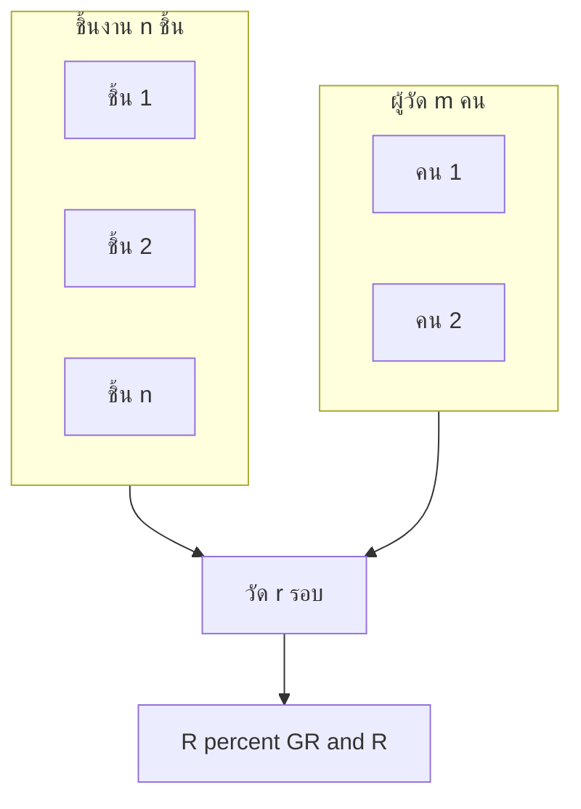

# Phase 3 — QC, SPC และการพิสูจน์ผล

> **ระยะเวลา:** สัปดาห์ที่ 2 วัน 5–7 (~6 ชม.)  
> **อ่านก่อน:** [03_Phase2](03_Phase2_Reliability_PM_Cost.md) | Framework §3.3, §4.7  
> **ถัดไป:** [05_Knowledge_Gate_Checklist.md](05_Knowledge_Gate_Checklist.md)  
> **Lab สถิติ:** [Week1 Gage R&R](../../../DeepReasearchเพื่อการเรียนรู้/UltraLearning-Project/Statistics_For_Engineers/Week_1/Week1_Gage_RR.md), [Week1 SPC](../../../DeepReasearchเพื่อการเรียนรู้/UltraLearning-Project/Statistics_For_Engineers/Week_1/Week1_SPC_ToolWear.md)

---

## เป้าหมายเล็กของโมดูลนี้

หลังจบ Phase 3 คุณต้อง **ออกแบบ Gage R&R ได้**, **เลือกแผนภูมิควบคุมที่เหมาะกับ tool wear**, **เข้าใจ optimal inspection m***, และ **อธิบาย Confirmation Run** ก่อนลงมือวัดชิ้นงานจริง

---

## ทำไมต้องรู้ก่อนเก็บข้อมูล

- วัดขนาดด้วยเวอร์เนียร์ที่ %GR&R สูง → dimensional drift เป็นสัญญาณรบกวน ไม่ใช่สึกมีด  
- ใช้ Shewhart แบบคงที่กับ tool wear → alarm ปลอมจาก trend ปกติ  
- ไม่วางแผน confirmation → โมเดล t_p* ไม่มีหลักฐานพิสูจน์ (C5)

---

## บทเรียน 1: Gage R&R (Measurement System Analysis)

### Hook
"มีดสึกแล้วขนาดเลื่อน" — แน่ใจหรือว่าเลื่อนจริง ไม่ใช่เวอร์เนียร์แกว่ง?

### แก่น
**Gage R&R** แยกความแปรปรวนจาก:
- **Repeatability** — เครื่องมือวัดซ้ำไม่เหมือนกัน  
- **Reproducibility** — คนวัดคนละคนไม่เหมือนกัน  

เกณฑ์ AIAG: **%GR&R < 30%** ถึงจะใช้ข้อมูลวัดเพื่อ SPC/เกณฑ์ EOL ได้อย่างมั่นใจ

### อุปมา
ตาชั่งตลาด — ถ้าชั่งครั้งเดียวกันได้ ±50 กรัม จะไม่ใช้ตัดสินว่าผัก "เบาลง" จากการเหี่ยว

### เครื่องมือในงานนี้

| การวัด | เครื่องมือ |
|--------|-----------|
| Critical dimension | Vernier / Digital Caliper |
| เกลียว Go/No-Go | Plug Gauge |
| VB (เสริม) | USB microscope / ImageJ |

### ออกแบบการทดลอง (ฝึก — ยังไม่วัดจริง)

| องค์ประกอบ | ค่าแนะนำ |
|-----------|----------|
| ชิ้นส่วน | 10 ชิ้น (หรือ 5) |
| ผู้วัด | 2–3 คน |
| รอบวัด | 2–3 ครั้ง/ชิ้น/คน |
| ตัวแปร | มิติวิกฤตหนึ่งจุด + Go/No-Go |

### ภาพ: โครง Gage R&R

### Gate G2.5
%GR&R < 30% สำหรับ Vernier + Plug Gauge **ก่อน** เริ่มเก็บ dimensional drift สำหรับ SPC

### Drill
[Week1_Gage_RR.md](../../../DeepReasearchเพื่อการเรียนรู้/UltraLearning-Project/Statistics_For_Engineers/Week_1/Week1_Gage_RR.md) + [Week1_Drills.md](../../../DeepReasearchเพื่อการเรียนรู้/UltraLearning-Project/Statistics_For_Engineers/Week_1/Week1_Drills.md)

### เช็คความเข้าใจ 1
**คำถาม:** %GR&R = 35% จะทำอะไรต่อ?  
**เฉลย:** ไม่เริ่ม SPC ด้วยข้อมูลนี้ — ปรับวิธีวัด/เครื่องมือ/ความถี่ หรือใช้เครื่องมือแม่นยำกว่า จนกว่า <30%

---

## บทเรียน 2: SPC สำหรับ Tool Wear

### Hook
มีดสึก → ขนาดชิ้น **เดินทางช้า ๆ** (trend) — แผนภูมิ X̄-R แบบคงที่จะ alarm ทุกวัน

### แก่น

| สถานการณ์ | แผนภูมิที่เหมาะ |
|-----------|----------------|
| กระบวนการคงที่ ไม่มี trend | Shewhart (X̄-R, I-MR) |
| **Tool wear monotonic trend** | **Regression-adjusted control chart** |
| จับการสึกเร่งผิดปกติ | **CUSUM** (Cumulative Sum) |

### Regression-adjusted (แนวคิด)
1. สร้างแบบจำลอง: ขนาด = f(อายุมีด) เช่น linear  
2. พล็อต **residual** (ส่วนต่างจากเส้นทำนาย) บน control chart  
3. Alarm เมื่อ residual หลุดขอบเขต — ไม่ใช่เมื่อ trend ปกติ

### เป้าหมายคุณภาพ
รักษา **Q ≥ 98%** จนถึง $t_p^*$ — ถ้าไม่ถึง ลด $t_p^*$ (Gate G3.5)

### ความถี่วัด (แผน)
- Vernier ทุก ~500 ชิ้น (ปรับตาม m*)  
- Go/No-Go ตาม optimal inspection interval

### ภาพ: Trend vs Residual

### Drill
[Week1_SPC_ToolWear.md](../../../DeepReasearchเพื่อการเรียนรู้/UltraLearning-Project/Statistics_For_Engineers/Week_1/Week1_SPC_ToolWear.md)

### เช็คความเข้าใจ 2
**คำถาม:** ทำไมไม่ใช้ Shewhart อย่างเดียวเมื่อมีดสึก?  
**เฉลย:** Shewhart สมมติค่าเฉลี่ยคงที่ — trend ปกติของสึกจะทำให้จุดหลุดขอบเขตแม้กระบวนการยังควบคุมได้

---

## บทเรียน 3: Optimal Inspection Interval (m*)

### Hook
ตรวจทุกชิ้นแพง — ตรวจนาน ๆ ที scrap หลุด

### แก่น — เชื่อม Q กับ C

จำนวน scrap ที่หลุดโดยเฉลี่ยเมื่อมีดเกินเกณฑ์: $q_W \approx m/2$ (detection lag)

$$C_{insp}(m) = \underbrace{\frac{N_{\text{life}}}{m}\cdot c_{check}}_{\text{ต้นทุนตรวจ}} + \underbrace{\frac{m}{2}\cdot L_{scrap}\cdot \Pr(\text{เกินเกณฑ์})}_{\text{ต้นทุน scrap จาก lag}}$$

หา **$m^*$** ที่ minimize $C_{insp}(m)$ → ความถี่ Go/No-Go ที่สมดุล

### อุปมา
ตรวจน้ำรั่วในท่อ — ตรวจถี่เกินเสียค่าแรงงาน ตรวจห่างเกินน้ำท่วมก่อนรู้

### หมายเหตุ MVT
Optimal Inspection เป็น **ของยกระดับ** — ถ้าเวลาไม่พอ ตัดเป็น Future Work ได้ (Contingency §14)

### เช็คความเข้าใจ 3
**คำถาม:** ถ้า $c_{check}$ สูงขึ้น m* จะสั้นหรือยาว?  
**เฉลย:** ยาวขึ้น — ตรวจถี่น้อยลงเพราะต้นทุนตรวจแพงขึ้น (ในแบบจำลองทั่วไป)

---

## บทเรียน 4: Confirmation Run (C5)

### Hook
t_p* จากคอมพิวเตอร์สวย — โรงงานถาม: "ใช้จริงแล้วประหยัดจริงไหม?"

### แก่น
นำ **$t_p^*$ + $N_{\max}$** ไปใช้ผลิตจริง ≥1 รอบมีด แล้วเทียบ:

| มิติ | เปรียบเทียบ |
|------|-------------|
| ต้นทุน | **Predicted CPP** vs **Actual CPP** |
| ความปลอดภัย | จำนวนมีดพังคาเครื่อง ก่อน/หลัง |

**ผ่าน Gate G4:** actual อยู่ในช่วง CI ของ predicted  
**ไม่ผ่าน:** วิเคราะห์ส่วนต่างในบทอภิปราย — ยังจบ thesis ได้ด้วย MVT

### สมมติฐาน H5
ใช้ $t_p^*$ จริงแล้ว CPP ใกล้ทำนาย — พิสูจน์ด้วย confirmation ไม่ใช่แค่โมเดล

### ภาพ: ลำดับ PDCA 3

---

## บทเรียน 5: Dashboard PoC (แนวคิด)

### Hook
WI กับตัวเลข t_p* บนกระดาษ — operator ลืมง่าย

### แก่น (optional / Future Work ได้)
- Google Sheets + Apps Script หรือ static  
- แสดง: OEE summary, tool-life countdown, alert ใกล้ PM  
- สเปก: [Dashboard_OEE_ToolLife_Spec.md](../../dashboard-plan/Dashboard_OEE_ToolLife_Spec.md)

---

## บทเรียน 6: Mock Defense — 5 คำถามที่ต้องเตรียม

จาก [Operation_Plan_v4.md](../Operation_Plan_v4.md) §17:

| # | คำถาม | แนวตอบสั้น |
|---|--------|-----------|
| 1 | ทำไมประหยัดเงินเล็กแต่ยังมีคุณค่า? | Resource productivity + regrind + pilot scale-up |
| 2 | ทำไมไม่เพิ่ม throughput? | Demand-paced; 82% downtime = ไม่มีลัง |
| 3 | N เล็ก น่าเชื่อถือไหม? | CI + sensitivity + ข้อจำกัดตรงไปตรงมา |
| 4 | ทำไมไม่แก้ "ไม่มีลัง"? | ถูกต้องตาม demand; นอก scope |
| 5 | EOL ใช้ dimensional drift defend ได้ไหม? | ISO 3685 indirect + Gage R&R |

### Drill
[Week2_Mock_Defense.md](../../../DeepReasearchเพื่อการเรียนรู้/UltraLearning-Project/Statistics_For_Engineers/Week_2/Week2_Mock_Defense.md)

### ฝึกปฏิบัติ Phase 3
1. ออกแบบตาราง Gage R&R (Vernier + Plug Gauge) — ยังไม่วัด  
2. ตอบ mock Q&A ข้อ 1–3 เป็นลายลักษณ์อักษรหรืออัดเสียง 3–5 นาที/ข้อ  
3. วาดแผนภาพ flow ว่าเมื่อไหร่เริ่ม SPC หลัง G2.5

---

## สรุป Phase 3

| หัวข้อ | จำ |
|--------|-----|
| Gage R&R | <30% ก่อน SPC |
| Tool wear | Regression-adjusted หรือ CUSUM |
| m* | สมดุลต้นทุนตรวจ vs scrap lag |
| Confirmation | predicted vs actual CPP |
| Defense | 5 คำถาม + หลักฐาน |

---

## อ่านต่อ / Drill

| หัวข้อ | ไฟล์ |
|--------|------|
| Gage R&R | [Week1_Gage_RR.md](../../../DeepReasearchเพื่อการเรียนรู้/UltraLearning-Project/Statistics_For_Engineers/Week_1/Week1_Gage_RR.md) |
| SPC tool wear | [Week1_SPC_ToolWear.md](../../../DeepReasearchเพื่อการเรียนรู้/UltraLearning-Project/Statistics_For_Engineers/Week_1/Week1_SPC_ToolWear.md) |
| Mock defense | [Week2_Mock_Defense.md](../../../DeepReasearchเพื่อการเรียนรู้/UltraLearning-Project/Statistics_For_Engineers/Week_2/Week2_Mock_Defense.md) |
| Dimension template | [03_Dimension_Check_Template.csv](../../../รายงาน/ข้อมูลประกอบ/templates/03_Dimension_Check_Template.csv) |

---

## เชื่อม Gate ใน Operation Plan

| Gate | หลัง Phase 3 |
|------|--------------|
| G2.5 | เข้าใจการออกแบบ Gage R&R |
| G3.5 | เข้าใจ Q ≥ 98% จนถึง t_p* |
| G4 | เข้าใจ Confirmation Run |

**ถัดไป:** ทำ [05_Knowledge_Gate_Checklist.md](05_Knowledge_Gate_Checklist.md)

---

**แท็ก:** #knowledge-plan #phase3 #gage-rr #spc #confirmation
