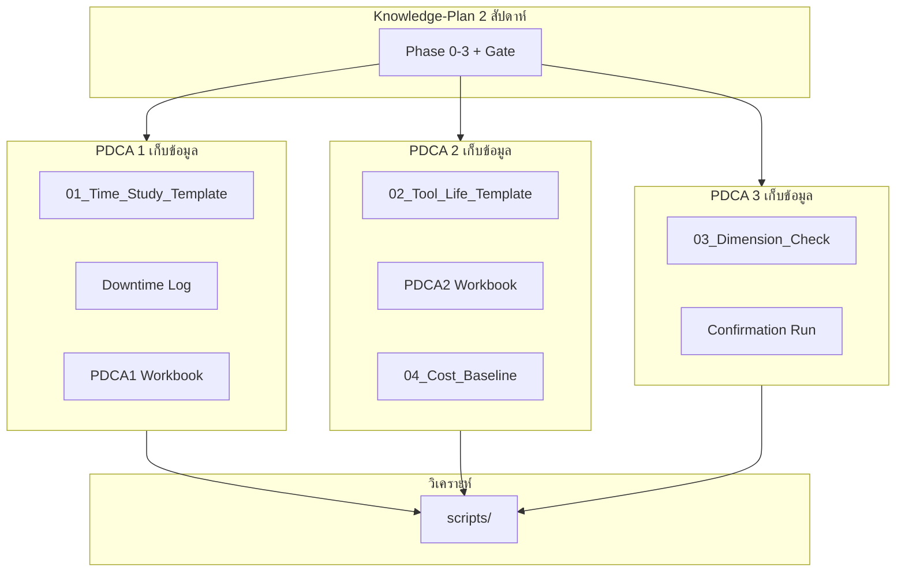

# แผนที่อ่าน (Reading Map) — Knowledge-Plan ↔ Thesis v4

> **วัตถุประสงค์:** ชี้ว่าแต่ละหัวข้อทฤษฎีอ่านจากไหน — ไม่ต้องหาเอง  
> **ใช้คู่กับ:** [00_Knowledge_Plan_Master_TH.md](00_Knowledge_Plan_Master_TH.md)

---

## 1. แผนที่ตาม Phase การเรียน

| Phase | หัวข้อหลัก | Knowledge-Plan | Framework v4 | V4 PDCA | Statistics Lab |
|-------|-----------|----------------|--------------|---------|----------------|
| 0 | กรอบ, นิยาม | [01_Phase0](01_Phase0_Frame_and_Definitions.md) | §0–2, §9 | Assumptions_Log | — |
| 1 | Work Study, OEE | [02_Phase1](02_Phase1_WorkStudy_OEE.md) | §3.1, §4.1–4.2 | PDCA1 draft, Ch.3 §3.1 | Week0, Week1_N', Week3_OEE |
| 2 | Reliability, Cost | [03_Phase2](03_Phase2_Reliability_PM_Cost.md) | §3.2, §4.3–4.9, §7 | Methodology Insert, PDCA2 Guide | Week2 ทั้งหมด |
| 3 | QC, Validation | [04_Phase3](04_Phase3_QC_SPC_Validation.md) | §3.3, §4.7 | Ch.3 §3.3 | Week1_Gage, Week1_SPC, Mock Defense |
| Gate | ทดสอบ | [05_Gate](05_Knowledge_Gate_Checklist.md) | — | Operation Plan §17 | Week1–2 Drills |

---

## 2. แผนที่ตามหัวข้อทฤษฎี (A–Z)

### A — Age-Replacement / t_p*

| ชั้น | ไฟล์ |
|------|------|
| สอน (ไทย) | [03_Phase2 §บทเรียน 5](03_Phase2_Reliability_PM_Cost.md) |
| สูตรเต็ม | [Methodology_Insert §3.3.A.2](../Methodology_Insert_v4_ISO3685_CompetingRisks_Regrind.md) |
| กรอบ | [Thesis_Framework §4.4](../../Thesis_Framework_v4_TH_Full-name.md) |
| สคริปต์ | [age_replacement_optimization.py](../../../รายงาน/scripts/age_replacement_optimization.py) |
| สเปก | [IMPLEMENTATION_SPEC_v4.md](../../../รายงาน/scripts/IMPLEMENTATION_SPEC_v4.md) |

### B — Bayesian / MRR (sample เล็ก)

| ชั้น | ไฟล์ |
|------|------|
| สอน | [Week2_Bayes_MRR.md](../../../DeepReasearchเพื่อการเรียนรู้/UltraLearning-Project/Statistics_For_Engineers/Week_2/Week2_Bayes_MRR.md) |
| กรอบ | Framework §4.3 (H2) |
| ข้อมูล prior | ข้อมูลเก่า 9 ค่า ใน [เปลี่ยนใบมีดเครื่อง1569.csv](../../../รายงาน/ข้อมูลประกอบ/เปลี่ยนใบมีดเครื่อง1569.csv) |

### C — Competing Risks

| ชั้น | ไฟล์ |
|------|------|
| สอน | [Week2_Competing_Risks.md](../../../DeepReasearchเพื่อการเรียนรู้/UltraLearning-Project/Statistics_For_Engineers/Week_2/Week2_Competing_Risks.md) |
| สูตร | [Methodology_Insert §3.2.B](../Methodology_Insert_v4_ISO3685_CompetingRisks_Regrind.md) |
| กรอบ | Framework H1 |

### CPP / Cost Model

| ชั้น | ไฟล์ |
|------|------|
| สอน | [03_Phase2 §บทเรียน 7](03_Phase2_Reliability_PM_Cost.md) |
| โมเดล | [KPI_and_Cost_Model_v2_TH.md](../../KPI_and_Cost_Model_v2_TH.md) |
| Input | [04_Cost_Baseline_Inputs.csv](../../../รายงาน/ข้อมูลประกอบ/templates/04_Cost_Baseline_Inputs.csv) |

### Confirmation Run

| ชั้น | ไฟล์ |
|------|------|
| สอน | [04_Phase3 §บทเรียน 4](04_Phase3_QC_SPC_Validation.md) |
| กรอบ | Framework §3.3 (C5), KPI #9 |
| Gate | Operation Plan G4 |

### EOL / ISO 3685

| ชั้น | ไฟล์ |
|------|------|
| สอน | [01_Phase0 §บทเรียน 4](01_Phase0_Frame_and_Definitions.md), [03_Phase2 §บทเรียน 2](03_Phase2_Reliability_PM_Cost.md) |
| มาตรฐาน | [Methodology_Insert §3.2.A](../Methodology_Insert_v4_ISO3685_CompetingRisks_Regrind.md) |
| วรรณกรรม | [02_Chapter_2 §2.4](../02_Chapter_2_Literature_Review.md) |

### Gage R&R

| ชั้น | ไฟล์ |
|------|------|
| สอน | [04_Phase3 §บทเรียน 1](04_Phase3_QC_SPC_Validation.md) |
| Lab | [Week1_Gage_RR.md](../../../DeepReasearchเพื่อการเรียนรู้/UltraLearning-Project/Statistics_For_Engineers/Week_1/Week1_Gage_RR.md) |
| Gate | Operation Plan G2.5 |

### N' (Sample Size Work Study)

| ชั้น | ไฟล์ |
|------|------|
| สอน | [02_Phase1 §บทเรียน 2](02_Phase1_WorkStudy_OEE.md) |
| Lab | [Week1_N_prime.md](../../../DeepReasearchเพื่อการเรียนรู้/UltraLearning-Project/Statistics_For_Engineers/Week_1/Week1_N_prime.md) |
| กรอบ | Framework §4.2 |

### N_max (Regrind Policy)

| ชั้น | ไฟล์ |
|------|------|
| สอน | [03_Phase2 §บทเรียน 6](03_Phase2_Reliability_PM_Cost.md) |
| สูตร | [Methodology_Insert §3.3.A.3](../Methodology_Insert_v4_ISO3685_CompetingRisks_Regrind.md) |
| กรอบ | Framework C1, §4.6 |

### OEE / ISO 22400

| ชั้น | ไฟล์ |
|------|------|
| สอน | [02_Phase1 §บทเรียน 3](02_Phase1_WorkStudy_OEE.md) |
| Lab | [Week3_OEE_Reliability_Link.md](../../../DeepReasearchเพื่อการเรียนรู้/UltraLearning-Project/Statistics_For_Engineers/Week_3/Week3_OEE_Reliability_Link.md) |
| ข้อมูลเดิม | [ข้อมูล ดาวทามเครื่องจักร.csv](../../../รายงาน/ข้อมูลประกอบ/ข้อมูล%20ดาวทามเครื่องจักร.csv) |
| Wiki | [OEE concept](../../../00_The_Master_Thesis_Wiki/Wiki/Core%20Concepts/OEE%20(Overall%20Equipment%20Effectiveness).md) |

### Optimal Inspection (m*)

| ชั้น | ไฟล์ |
|------|------|
| สอน | [04_Phase3 §บทเรียน 3](04_Phase3_QC_SPC_Validation.md) |
| สูตร | [Methodology_Insert §3.3.A.4](../Methodology_Insert_v4_ISO3685_CompetingRisks_Regrind.md) |
| กรอบ | Framework H4 |

### Productivity (นิยาม)

| ชั้น | ไฟล์ |
|------|------|
| สอน | [01_Phase0 §บทเรียน 1](01_Phase0_Frame_and_Definitions.md) |
| กรอบ | Framework §2.1 (C4) |

### SPC / Tool Wear

| ชั้น | ไฟล์ |
|------|------|
| สอน | [04_Phase3 §บทเรียน 2](04_Phase3_QC_SPC_Validation.md) |
| Lab | [Week1_SPC_ToolWear.md](../../../DeepReasearchเพื่อการเรียนรู้/UltraLearning-Project/Statistics_For_Engineers/Week_1/Week1_SPC_ToolWear.md) |

### Weibull

| ชั้น | ไฟล์ |
|------|------|
| สอน | [03_Phase2 §บทเรียน 3](03_Phase2_Reliability_PM_Cost.md) |
| Lab | [Week2_Weibull_Censoring.md](../../../DeepReasearchเพื่อการเรียนรู้/UltraLearning-Project/Statistics_For_Engineers/Week_2/Week2_Weibull_Censoring.md) |
| สคริปต์ | [weibull_tool_life.py](../../../รายงาน/scripts/weibull_tool_life.py) |
| วรรณกรรม | [02_Chapter_2 §2.3](../02_Chapter_2_Literature_Review.md) |

---

## 3. แผนที่ตาม PDCA Execution (หลังผ่าน Gate)

---

## 4. แผนที่ตาม Decision Gate

| Gate | เรียนใน Knowledge-Plan | ไฟล์ execution |
|------|------------------------|----------------|
| G1.5 Ethics | Phase 0 | WI ยินยอมวิดีโอ (draft) |
| G1 OEE | Phase 1 | PDCA1 workbook, downtime |
| G0 Financial | Phase 2 (แนวคิด) | 04_Cost_Baseline_Inputs.csv |
| G2 Weibull | Phase 2 | weibull_tool_life.py |
| G2.5 Gage R&R | Phase 3 | ออกแบบก่อน 03_Dimension template |
| G3 Cost | Phase 2 | age_replacement_optimization.py |
| G3.5 Quality | Phase 3 | SPC + dimension data |
| G4 Confirmation | Phase 3 | Tool life + cost actual |

---

## 5. Wiki และ Literature Index

| หัวข้อ | Wiki / Index |
|--------|--------------|
| OEE + IoT | [LITERATURE_INDEX_OEE_IOT.md](../../../00_The_Master_Thesis_Wiki/Sources/LITERATURE_INDEX_OEE_IOT.md) |
| มีดกลึง | [LITERATURE_INDEX_มีดกลึง.md](../../../00_The_Master_Thesis_Wiki/Sources/LITERATURE_INDEX_มีดกลึง.md) |
| PM | [LITERATURE_INDEX_PM.md](../../../00_The_Master_Thesis_Wiki/Sources/LITERATURE_INDEX_PM.md) |
| การแสดงข้อมูล | [LITERATURE_INDEX_การแสดงข้อมูล.md](../../../00_The_Master_Thesis_Wiki/Sources/LITERATURE_INDEX_การแสดงข้อมูล.md) |
| MOC รวม | [00_Master_Thesis_MOC.md](../../../00_The_Master_Thesis_Wiki/Wiki/00_Master_Thesis_MOC.md) |
| บริบทผู้วิจัย | [Profile_Context.md](../../../00_The_Master_Thesis_Wiki/Sources/Profile_Context.md) |

---

## 6. ลำดับอ่านแนะนำ (สรุป 1 หน้า)

### สัปดาห์เรียน (ก่อนข้อมูล)
1. [00 Master](00_Knowledge_Plan_Master_TH.md)  
2. [01 Phase0](01_Phase0_Frame_and_Definitions.md) → Framework §0–2  
3. [02 Phase1](02_Phase1_WorkStudy_OEE.md) → Week1_N', Week3_OEE  
4. [03 Phase2](03_Phase2_Reliability_PM_Cost.md) → Methodology Insert → Week2 ทั้งหมด → weibull_tool_life.py  
5. [04 Phase3](04_Phase3_QC_SPC_Validation.md) → Week1_Gage, Week1_SPC  
6. [05 Gate](05_Knowledge_Gate_Checklist.md)

### สัปดาห์ execution (หลัง Gate)
1. [Operation_Plan_v4.md](../Operation_Plan_v4.md) §1, §5  
2. [PDCA2 Guide](../PDCA2/01_PDCA2_Plan_and_Guide_TH.md)  
3. [templates/README.md](../../../รายงาน/ข้อมูลประกอบ/templates/README.md)  
4. [IMPLEMENTATION_SPEC_v4.md](../../../รายงาน/scripts/IMPLEMENTATION_SPEC_v4.md)

---

## 7. Cursor Skills ที่ใช้ได้ระหว่างเรียน

| Skill | เมื่อไหร่ |
|-------|----------|
| `statistics-for-engineers` | คำถาม Weibull, Gage R&R, N', SPC, OEE |
| `opus-4-8-teacher` | ขออธิบายซ้ำแบบสอนเป็นขั้น ๆ |
| `systematic-research-partner` | ทบทวนกรอบวิจัย / defend |

---

**แท็ก:** #knowledge-plan #reading-map #thesis #v4
