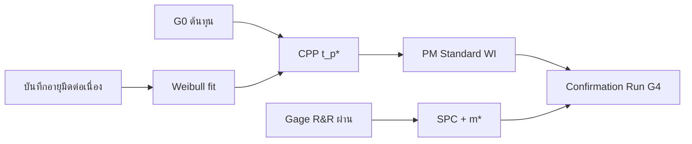

# แผนการดำเนินการ (Execution Plan) — อิงจาก Thesis_Framework_v4

> **อ้างอิงกรอบ:** [Thesis_Framework_v4_TH.md](../Thesis_Framework_v4_TH.md) | ระเบียบวิธี: [Methodology_Insert_v4...md](Methodology_Insert_v4_ISO3685_CompetingRisks_Regrind.md) | KPI/ต้นทุน: [KPI_and_Cost_Model_v2_TH.md](../KPI_and_Cost_Model_v2_TH.md) | สมมติฐาน: [Assumptions_Log.md](Assumptions_Log.md)
> **ชื่อเรื่อง (ล็อก):** การเพิ่มผลิตภาพกระบวนการกลึง CNC ในการผลิตมาตรวัดน้ำ โดยประยุกต์ใช้การศึกษาการทำงานและการบำรุงรักษาเชิงป้องกัน
> **เครื่องเป้าหมาย:** CNC MACOD 1569 / ชิ้นงาน HC15-25 / มีดด้านเกลียว
> **เวลาทำงานของผู้วิจัย:** จ.–ศ. 17:00–21:30 (จากโปรไฟล์)
> **หมายเหตุ:** ไฟล์นี้แทนที่ `00_Operation_Plan_V4.md` (ฉบับเดิมยังเป็นกรอบก่อน v4)

---

## 0. หลักการของแผนนี้
- **เก็บข้อมูลที่กินเวลานานให้เริ่ม "วันนี้"** (อายุมีดเกลียว ~14,000 ชิ้น ≈ 7 วันผลิต/ตัว + No-demand ทำให้ยืดในเชิงปฏิทิน → data เป็น long-pole)
- **ปลดล็อก Critical Path ก่อน** (ตัวเลขต้นทุนจากบัญชี + วัด geometry มีด)
- **Quick win ก่อน** (PDCA 1 แก้ OEE >100%) เพื่อสร้างความน่าเชื่อถือ
- ทุกการเก็บข้อมูลลงเทมเพลตใน [รายงาน/ข้อมูลประกอบ/templates/](../../รายงาน/ข้อมูลประกอบ/templates/)
- ทุกการคำนวณรันด้วยสคริปต์ [รายงาน/scripts/](../../รายงาน/scripts/) ตาม [IMPLEMENTATION_SPEC_v4.md](../../รายงาน/scripts/IMPLEMENTATION_SPEC_v4.md)

---

## 1. งานเร่งด่วนสัปดาห์นี้ (Start-Now / Critical Path)

| ลำดับ | งาน | ทำกับใคร | ผลลัพธ์ที่ปลดล็อก |
|---|---|---|---|
| A | **ขอตัวเลขต้นทุนเป็นทางการ** (Gate 0): Machine-Hour Rate, ราคามีดใหม่, ค่าลับ/ครั้ง, ราคารับซื้อทองเหลืองเศษ, ต้นทุนวัตถุดิบ/ชิ้น, งบ tooling รวม/ปี | ฝ่ายบัญชี/จัดซื้อ | โมเดลต้นทุนทั้งหมด (t_p*, Regrind, CPP, ROI) |
| B | **วัด geometry มีด** (1 วัน): L0 (เนื้อที่ลับได้), Lmin, Δg (วัดความยาวก่อน/หลังลับ) | ช่างลับมีด | N_max ทางเรขาคณิต (จุดขายหลัก) |
| C | **เริ่มบันทึกอายุมีด + Failure Mode ทุกครั้งที่เปลี่ยน** (piggyback การผลิตจริง) | พนักงานเดินเครื่อง | ข้อมูล Weibull (ยิ่งเริ่มเร็วยิ่งได้ sample) |
| D | **เช็กกับวิศวกรโรงงาน:** IoT บันทึก timestamp การเปลี่ยนมีดได้ไหม | วิศวกรโรงงาน | เก็บอายุมีดอัตโนมัติ (ถ้าได้) |
| E | **คุยอาจารย์:** เฟรม v4 เป็น superset ของ "5 ตัว run-to-failure" + ขอเห็นชอบใช้เกณฑ์ EOL ที่ขนาดเลื่อน/VB แทนการรอพังคาเครื่อง | อาจารย์ที่ปรึกษา | อนุมัติทิศทาง + ลดความเสี่ยงเครื่องเสีย |

---

## 2. โครงสร้างเฟส (Phase Map ตาม PDCA v4)

| Phase | PDCA | ชื่อ | เป้า Q/C/D |
|---|---|---|---|
| 0 | — | เตรียมระบบ + ปลดล็อกต้นทุน/เครื่องมือ | ฐาน |
| 1 | PDCA 1 | Work Study + OEE ที่ถูกต้อง | D |
| 2 | PDCA 2 | Stratified Weibull + Competing Risks + Regrind + SMED | C + Availability |
| 3 | PDCA 3 | SPC + Optimal Inspection + Confirmation + Dashboard PoC | Q + พิสูจน์ผล |
| 4 | — | สรุป/เขียนเล่ม/สอบ | — |

---

## 3. ไทม์ไลน์รายสัปดาห์ (กรอบ 18 สัปดาห์ — ปรับตามจริง)

> หมายเหตุ: ปรับ week ให้ตรงปฏิทินจริงของคุณ; ถ้าเริ่มช้า ให้รัน Phase 0–1 คู่ขนานกับการเริ่มเก็บข้อมูล Phase 2 ทันที

| สัปดาห์ | Phase | กิจกรรมหลัก | Input | Output (Deliverable) |
|---|---|---|---|---|
| 1 | 0 | ขอตัวเลขต้นทุน (A), วัด geometry (B), ตั้งเทมเพลต, คุยอาจารย์ (E), เริ่ม Assumptions Log | ข้อมูลบัญชี, มีด | cost CSV เริ่มเต็ม, N_max_geo, แผนอนุมัติ |
| 1–18 | 2 | **เริ่มเก็บอายุมีด + Failure Mode ต่อเนื่อง** (piggyback; EOL = dimensional drift หลัก) | การผลิตจริง + มีดใหม่ 5 ตัว | dataset อายุมีด (A/B) — ดู Sample Calendar §13 |
| 2–3 | 4+1 | **เริ่มเขียนเล่ม:** บทที่ 1 (ร่าง) + บทที่ 2 (ทบทวนวรรณกรรม) | เอกสารอ้างอิง | ร่างบท 1–2 |
| 2–4 | 1 | Time Study ≥30 รอบ, แยก Auto/Manual, Hawthorne, **เก็บ downtime+reason code 4–8 สัปดาห์**, Gage R&R (Vernier/Plug Gauge) | CCTV, Vernier | SCT/ICT, OEE baseline, นิยาม downtime (ISO 22400) |
| 4–5 | 4+3 | **เขียนเล่ม:** บทที่ 3 ร่าง (3.1 Time Study, OEE) | ผล PDCA 1 | ร่างบท 3 ส่วน 3.1 |
| 5 | 2 | รัน scripts ด้วย fallback ([IMPLEMENTATION_SPEC_v4](../../รายงาน/scripts/IMPLEMENTATION_SPEC_v4.md)) | scripts | pipeline ทดสอบผ่าน |
| 5–6 | 2 | RCA (Fishbone/5-Why), เริ่ม fit Weibull (ข้อมูลเก่า+ที่ทยอยได้) | dataset, scripts | RCA, Weibull เบื้องต้น + CI |
| 6–8 | 4+3 | **เขียนเล่ม:** บทที่ 3 ต่อ (3.2–3.3 + Methodology Insert) | ผล PDCA 2 | ร่างบท 3 สมบูรณ์ |
| 7–9 | 2 | Age-Replacement (competing risks) หา t_p* — **Gate: n_new ≥ 3 ก่อนรันเต็ม** | weibull params, cost CSV (G0) | t_p*, N_max, Regrind Matrix, Sensitivity |
| 9–10 | 2 | SMED: baseline changeover + Cost-Benefit ก่อน commit | จับเวลาเปลี่ยนมีด | ผล SMED (ถ้าคุ้ม) |
| 10–13 | 3 | วัด Critical Dimension (EOL หลัก), Optimal Inspection (m*), Regression-adjusted/CUSUM — **หลัง G2.5 ผ่าน** | Vernier/Plug Gauge | SPC, m*, ยืนยัน Q≥98% |
| 9–12 | 4 | **เขียนเล่ม:** บทที่ 4 ร่าง (ผลตามที่ได้) | ผล PDCA 1–3 | ร่างบท 4 |
| 13–15 | 3+4 | Confirmation Run (G4) + **เขียน:** บท 4 เติม + บท 5 ร่าง + Dashboard PoC (ถ้ามีเวลา) | PM standard | ผลพิสูจน์โมเดล, ร่างบท 5 |
| 16–17 | 4 | ปรับแก้ทั้งเล่ม + สรุปผู้บริหาร + รายงานอาจารย์ทุก 2 สัปดาห์ | ผลทั้งหมด | ร่างเล่มสมบูรณ์ |
| 18 | 4 | **Mock defense + buffer/slip** (ดู §17) | ร่างเล่ม | พร้อมสอบป้องกัน |

> **Writing Pipeline แบบ incremental:** ดูรายละเอียดใน §16 — อย่ารอเขียนทั้งเล่มสัปดาห์ 16–18

---

## 4. Decision Gates (ผ่านก่อนข้าม — ปรับให้ตรง v4)

| Gate | เงื่อนไขผ่าน | ถ้าไม่ผ่าน |
|---|---|---|
| **G0 — Financial Baseline** | ได้ MHR + ต้นทุน scrap/salvage/มีด/ลับ จากผู้มีอำนาจ | โมเดลเป็น ILLUSTRATIVE เท่านั้น ห้ามอ้างในเล่ม → เปิด Contingency §14 |
| **G1 — OEE Reality Check** | Performance หลังแก้ SCT ≤ 100% | กลับไปทบทวน Time Study/ICT |
| **G1.5 — Ethics / CCTV Consent** | ได้ความยินยอม/แจ้งฝ่ายบริหารและพนักงานเรื่องใช้ CCTV จับเวลา | ใช้วิธีจับเวลาอื่นที่ไม่บันทึกภาพพนักงาน |
| **G2 — Weibull Validity** | β > 1 (wear-out) พร้อม CI | ถ้า β≈1 → condition monitoring narrative; รายงานข้อจำกัด N เล็ก |
| **G2.5 — Gage R&R (MSA)** | %GR&R < 30% (AIAG) สำหรับ Vernier + Plug Gauge ก่อนเริ่ม SPC | ปรับวิธีวัด/ความถี่ก่อนเก็บ dimensional drift |
| **G3 — Cost-Benefit** | CPP ที่ t_p* ≤ นโยบายเดิม (มี sensitivity ยืนยัน robust) | คงนโยบายเดิม + รายงานเหตุผล |
| **G3.5 — Quality Stability** | Q ≥ 98% และ in-control จนถึง t_p* | ลด t_p* ลงเพื่อรักษาคุณภาพ |
| **G4 — Confirmation** | actual CPP ใกล้ predicted (อยู่ในช่วง CI) | วิเคราะห์ส่วนต่างในบทอภิปราย; ยังจบได้ด้วย MVT |

---

## 5. แผนเก็บข้อมูล (Data Collection) → ไฟล์ปลายทาง

| ข้อมูล | ความถี่ | เครื่องมือ | บันทึกที่ |
|---|---|---|---|
| รอบเวลา (Auto/Manual) | ≥30 รอบ หลายกะ | CCTV + PotPlayer | [01_Time_Study_Template.csv](../../รายงาน/ข้อมูลประกอบ/templates/01_Time_Study_Template.csv) |
| Downtime + reason code + period | 4–8 สัปดาห์ (baseline) | Check Sheet หน้างาน | สร้างใน Assumptions Log + อ้างอิงข้อมูลเดิม 1,808 นาที |
| อายุมีด + Failure Mode (F_wear/F_cat/C) + ครั้งลับ | ทุกครั้งที่เปลี่ยน | บันทึกหน้างาน/IoT | [02_Tool_Life_RunToFailure_Template.csv](../../รายงาน/ข้อมูลประกอบ/templates/02_Tool_Life_RunToFailure_Template.csv) |
| ขนาดวิกฤต — **EOL หลัก = dimensional drift** | Vernier ทุก 500 / Go-NoGo ทุก ~m* | Vernier/Plug Gauge | [03_Dimension_Check_Template.csv](../../รายงาน/ข้อมูลประกอบ/templates/03_Dimension_Check_Template.csv) |
| VB (เสริม ถ้าวัดได้) | ตาม Methodology Insert §3.2.A.3 | USB microscope / มือถือ+ImageJ | บันทึกใน Assumptions Log |
| ต้นทุน + geometry มีด (L0/Lmin/Δg) | ครั้งเดียว/อัปเดต | บัญชี/ช่างลับ | [04_Cost_Baseline_Inputs.csv](../../รายงาน/ข้อมูลประกอบ/templates/04_Cost_Baseline_Inputs.csv) |

---

## 6. การส่งมอบเข้าบทปริญญานิพนธ์ (Deliverable → Chapter)

| ผลงาน | เข้าบท |
|---|---|
| SCT/ICT, OEE demand-adjusted | บทที่ 3 (3.1) + บทที่ 4 (4.1) |
| Weibull (stratified+competing risks), t_p* | บทที่ 3 (3.2–3.3, insert) + บทที่ 4 (4.2–4.3) |
| Regrind Policy (N_max), SMED, CPP/ROI | บทที่ 4 (4.3) |
| SPC, Optimal Inspection, Confirmation Run | บทที่ 4 (4.x) |
| Net Saving (ปี/เครื่อง + pilot), ข้อเสนอแนะ | บทที่ 5 |
| Dashboard PoC | บทที่ 5 (Future Work) + [Dashboard spec](../dashboard-plan/Dashboard_OEE_ToolLife_Spec.md) |

---

## 7. KPI ที่ติดตาม (จาก v4 §5)
1. OEE Performance: >100% → 80–95%
2. สัดส่วนเปลี่ยนมีด planned: unplanned → ~0
3. CPP (แยก New/Regrind): ลด X%
4. Changeover (SMED): ลด ≥20% (ถ้า baseline >5 นาที)
5. Quality Rate: ≥98%
6. จำนวนมีดพังคาเครื่อง: ลดลง
7. Net Scrap Loss/ปี (หัก salvage): ลดลง
8. N_max (ครั้งลับที่เหมาะสม): กำหนดได้
9. Predicted vs Actual CPP (Confirmation): ส่วนต่าง < CI

---

## 8. ความเสี่ยง + Minimum Viable Thesis (กันงานตัน)

**MVT (แกนที่จบได้แน่ ถ้าเวลา/ข้อมูลไม่พอ):**
OEE ที่ถูกต้อง + Weibull มีดเกลียว (ใหม่+เก่า) + t_p* เชิงเศรษฐศาสตร์ + N_max geometry + Honest Cost

**ของยกระดับ (ทำได้ดี ขาดได้ไม่ตัน):** Competing-risks fitting เต็มรูป, Bayesian, Confirmation Run, Dashboard PoC, Optimal Inspection

| ความเสี่ยง | รับมือ |
|---|---|
| ตัวเลขต้นทุนได้ช้า (G0) | เดินงาน Time Study/เก็บอายุมีดไปก่อน, ใส่สมมติฐาน + sensitivity; เปิด Contingency §14 |
| Kaizen กินเวลา >3 ชม./สัปดาห์ | ตัดงาน "ของยกระดับ" ก่อน (§12); ใช้ข้อมูล thesis ใน slide Kaizen |
| เขียนเล่มท้ายไม่ทัน | กระจายตั้งแต่สัปดาห์ 2 (§16); สัปดาห์ 18 เป็น buffer |
| รอบมีดยาว/No-demand ทำ sample ช้า | piggyback + รวมข้อมูลเก่า 9 ค่า + Bayesian prior; ปรับ Sample Calendar §13 |
| catastrophic เกิดน้อย (fit K ไม่ได้) | ใช้ p_cat_override + รายงานข้อจำกัด |
| เวลาผู้วิจัยจำกัด (เย็นวันธรรมดา) | AI ช่วยคำนวณ/ร่าง ผู้วิจัย review; โฟกัส MVT ก่อน |
| Confirmation ไม่ผ่าน G4 | วิเคราะห์ส่วนต่างเป็นผลงาน; ยังจบ thesis ได้ด้วย MVT |

---

## 9. สิ่งที่ต้องขอจากแต่ละฝ่าย (Stakeholder Asks)
- **ฝ่ายบัญชี/จัดซื้อ:** MHR, ต้นทุนวัตถุดิบ/ชิ้น, ราคามีดใหม่, ค่าลับ, ราคารับซื้อเศษทองเหลือง, งบ tooling รวม/ปี
- **ช่างลับมีด:** L0, Lmin, Δg/ครั้ง, จำนวนครั้งลับสูงสุดที่เคยทำ
- **วิศวกรโรงงาน:** export ข้อมูล IoT (count, run/stop, timestamp เปลี่ยนมีด)
- **อาจารย์ที่ปรึกษา:** อนุมัติทิศทาง v4 (เฟรมเป็น superset ของไอเดียท่าน) + เกณฑ์ EOL
- **หัวหน้า/เจ้าของ:** อนุญาตเก็บข้อมูล + ความยินยอมใช้ CCTV จับเวลา (labor/privacy) — Gate G1.5
- **หัวหน้างาน/operator:** sign-off PM Standard WI หลัง Confirmation (factory handoff)

---

## 10. หลักคิดประจำโครงการ (One-Liner)
> เริ่มเก็บข้อมูลวันนี้ ปลดล็อกตัวเลขต้นทุนก่อน ทำ quick win แก้ OEE ให้ถูก แล้วค่อยต่อยอดเป็นมาตรฐานมีด+พิสูจน์ผล — โดยมี MVT รองรับไม่ให้ตัน

---

## 11. งบเวลาและการจัดสรรชั่วโมง (Hour Budget)

**สมมติฐานเวลา:**
- จ.–ศ. 17:00–21:30 ≈ **2.5 ชม./วัน × 5 = 12.5 ชม./สัปดาห์**
- หัก Kaizen/ประชุมอังคาร ≈ 2–3 ชม. → **เหลือ ~9–10 ชม./สัปดาห์สำหรับ thesis**

**เป้าหมายการจัดสรร (รวม 18 สัปดาห์):**

| กลุ่มงาน | % เป้าหมาย | ชม.รวมโดยประมาณ |
|---|---|---|
| PDCA 1 (Work Study + OEE) | 25% | ~22–23 ชม. |
| PDCA 2 (Weibull + t_p* + Regrind) | 35% | ~32–34 ชม. |
| PDCA 3 (SPC + Confirmation) | 20% | ~18–20 ชม. |
| เขียนเล่ม (กระจายตลอด) | 30% | ~27–29 ชม. |

**ตารางสัปดาห์ละชั่วโมง (ตัวอย่าง):**

| สัปดาห์ | Phase หลัก | Thesis (ชม.) | Kaizen (ชม.) | เขียนเล่ม (ชม.) |
|---|---|---|---|---|
| 1–4 | 0+1 | 6–7 | 2–3 | 1–2 |
| 5–9 | 2 | 7–8 | 2–3 | 1–2 |
| 10–13 | 3 | 6–7 | 2–3 | 2–3 |
| 14–17 | 3+4 | 4–5 | 2–3 | 4–5 |
| 18 | 4 | 2 | 0–2 | 3–4 (buffer) |

> ทุกครั้งที่ใส่ตัวเลขในเล่ม → บันทึกใน [Assumptions_Log.md](Assumptions_Log.md)

---

## 12. การจัดการ Kaizen vs ปริญญานิพนธ์ (Time Firewall)

**กฎหลัก:**
1. **ข้อมูลเก็บชุดเดียว** (OEE, downtime, tool life) แต่ **รายงาน/deliverable แยก**
2. **Kaizen slide อังคาร:** ใช้ผล quick win ที่มีอยู่แล้ว (OEE ถูก, Pareto downtime) — ไม่ต้องทำงานใหม่
3. **ห้ามขยาย Kaizen** ไปเครื่องอื่น หรือปัญหา "ไม่มีลัง" (นอก scope — เป็น demand pacing)
4. ถ้า Kaizen กิน **>3 ชม./สัปดาห์** → ตัดงาน "ของยกระดับ" ก่อน (ตาม MVT §8)

**เชื่อมข้อมูล Kaizen ↔ Thesis:**

| ข้อมูล | ใช้ใน Kaizen | ใช้ใน Thesis |
|---|---|---|
| OEE ที่ถูกต้อง | slide แสดงผล quick win | บท 3–4 |
| Pareto downtime | แสดงสาเหตุหยุด | บท 4 + defend "ไม่มีลัง" |
| อายุมีด + failure mode | ไม่ต้องนำเสนอลึก | Weibull + t_p* |

---

## 13. Dependency Graph + Sample Calendar

**Gate สำคัญ:** ห้ามรัน Age-Replacement เต็มรูปจนกว่า **n_new ≥ 3** (หรือใช้ prior + ระบุข้อจำกัดในเล่ม)

**Sample Calendar (ตัวอย่าง — ปรับตาม No-demand จริง):**

| มีด # | เริ่มใช้ (สัปดาห์) | คาด EOL (สัปดาห์) | ชิ้นงานสะสม (ประมาณ) | หมายเหตุ |
|---|---|---|---|---|
| 1 (ใหม่) | W1 | W8–10 | ~14,000 | ปรับตาม No-demand |
| 2 (ใหม่) | W3 | W10–12 | ~14,000 | — |
| 3 (ใหม่) | W5 | W12–14 | ~14,000 | **n=3 → เริ่ม fit เต็ม** |
| 4–5 (ใหม่) | W7–9 | W14–16 | ~14,000 | เสริม CI |
| เก่า (9 ค่า) | — | — | ~13,991 avg | ใช้เป็น prior |

> อัปเดตตารางนี้ทุกศุกร์ใน Weekly Review (§15)

---

## 14. Contingency Matrix (Trigger Replan)

| Trigger | สัญญาณ | Action | ตัดออก (ถ้าจำเป็น) |
|---|---|---|---|
| G0 ไม่ผ่านภายใน W4 | ยังไม่มี MHR | ใช้ ILLUSTRATIVE + sensitivity; **ห้ามอ้างตัวเลขในเล่ม**; escalate บัญชี | — |
| n_new < 3 ถึง W8 | มีดใหม่ช้า | ใช้ Model B + Bayesian prior; ลด competing-risks เป็น p_cat_override | Optimal Inspection |
| β ≈ 1 | wear-out ไม่ชัด | pivot เป็น condition monitoring narrative; รายงานข้อจำกัด | Competing-risks fitting เต็ม |
| Confirmation ไม่ผ่าน G4 | CPP actual ห่าง predicted | วิเคราะห์ส่วนต่างเป็นผลงาน; ปรับ t_p*; ยังจบ thesis ได้ด้วย MVT | — |
| เวลาไม่พอ W14 | ยังไม่ถึง Confirmation | ตัด Dashboard PoC, Optimal Inspection → เขียนเป็น Future Work | Dashboard PoC, m* |

---

## 15. Weekly Cadence (กันตกหล่น)

| วัน | กิจกรรม | เวลา |
|---|---|---|
| จ.–พฤ. (เย็น) | งาน thesis ตาม Phase ปัจจุบัน | 2.5 ชม./วัน |
| อังคาร | Kaizen meeting (ใช้ข้อมูล thesis) | ~2–3 ชม. |
| ศุกร์ | Weekly review: RAG + อัปเดต Assumptions Log + sample count | 30–45 นาที |

**RAG ต่อสัปดาห์:**

| สถานะ | เงื่อนไข | การกระทำ |
|---|---|---|
| 🟢 Green | Gate ผ่าน, sample ตามแผน, ไม่มี blocker | ดำเนินตามแผน |
| 🟡 Amber | ช้า 1 สัปดาห์ หรือ blocker ที่รอคนอื่น | ติดตาม stakeholder; ปรับ Sample Calendar |
| 🔴 Red | ช้า >2 สัปดาห์ หรือ Gate fail | **เปิด Contingency Matrix §14** |

**รายงานอาจารย์:** ทุก 2 สัปดาห์ — 1 slide: Gate status + sample count + blocker

---

## 16. Writing Pipeline (กระจาย ไม่ทิ้งท้าย)

| สัปดาห์ | บทที่เขียน/อัปเดต |
|---|---|
| 2–3 | บทที่ 1 (ร่าง) + บทที่ 2 (Taylor, Gilbert, ISO 3685, RCM) |
| 4–5 | บทที่ 3 ร่าง (3.1 Time Study, OEE) |
| 6–8 | บทที่ 3 ต่อ (3.2–3.3 + Methodology Insert) |
| 9–12 | บทที่ 4 ร่าง (ผลตามที่ได้) |
| 13–15 | บทที่ 4 เติม Confirmation + บทที่ 5 ร่าง |
| 16–17 | ปรับแก้ทั้งเล่ม + สรุปผู้บริหาร |
| 18 | Mock defense + buffer |

> ~12.5 ชม./สัปดาห์ × 3 สัปดาห์ (แบบเดิม) = ~37 ชม. **ไม่พอ** สำหรับบท 1–5 — จึงกระจายตั้งแต่สัปดาห์ 2

---

## 17. Defense Prep (มุมมองอาจารย์/กรรมการ)

**คำถามที่ต้องเตรียมคำตอบ (พร้อมหลักฐาน):**

1. **ทำไมผลประหยัดเงินเล็ก แต่ยังมีคุณค่า?** → Resource productivity + regrind policy + pilot scale-up
2. **ทำไมไม่เพิ่ม throughput?** → Demand-paced, กัน WIP (Lean) — 82% downtime = "ไม่มีลัง"
3. **N เล็ก น่าเชื่อถือไหม?** → CI + sensitivity + ข้อจำกัดตรงไปตรงมา
4. **ทำไมไม่แก้ปัญหา "ไม่มีลัง"?** → ถูกต้องตาม demand; นอก scope; recommendation
5. **EOL ใช้ dimensional drift ไม่วัด VB โดยตรง defend ได้ไหม?** → ISO 3685 indirect criterion + Gage R&R (G2.5)

**Mock Q&A:** สัปดาห์ 18 — 1 รอบ (ตัวเองหรือเพื่อนร่วมห้องถาม)

---

## 18. Artifacts เพิ่มเติม

| ไฟล์ | วัตถุประสงค์ |
|---|---|
| [Assumptions_Log.md](Assumptions_Log.md) | บันทึกสมมติฐานทุกตัวเลข — อัปเดตทุกศุกร์ |
| [Methodology_Insert_v4...md](Methodology_Insert_v4_ISO3685_CompetingRisks_Regrind.md) | แปะบทที่ 3 |
| [IMPLEMENTATION_SPEC_v4.md](../../รายงาน/scripts/IMPLEMENTATION_SPEC_v4.md) | สเปกสคริปต์ v4 |
| WI + หนังสือยินยอม CCTV (draft) | Ethics deliverable (G1.5) |
| PM Standard WI + sign-off หัวหน้างาน | Factory handoff (Act) |

---

**แท็ก:** #thesis #operation-plan #v4 #cadence #contingency #kaizen-firewall
