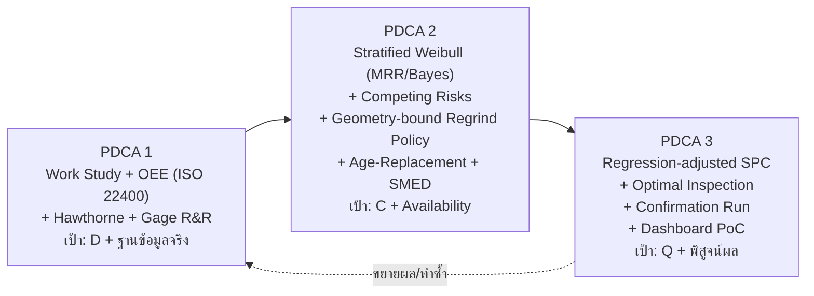

# กรอบการทำปริญญานิพนธ์ (ฉบับ v4 — แก้ช่องว่างการออกแบบการทดลอง + ยกระดับความ defendable)

> **ชื่อเรื่อง (ล็อก — ห้ามแก้):** การเพิ่มผลิตภาพกระบวนการกลึง CNC ในการผลิตมาตรวัดน้ำ โดยประยุกต์ใช้การศึกษาการทำงานและการบำรุงรักษาเชิงป้องกัน
> *(Productivity Improvement of CNC Turning Process in Water Meter Production by Applying Work Study and Preventive Maintenance)*
>
> **ผู้จัดทำ:** ธีรศักดิ์ คิดอ่าน (680401700600) — วศ.บ. วิศวกรรมอุตสาหการ มหาวิทยาลัยเกษมบัณฑิต
> **อาจารย์ที่ปรึกษา:** ผศ. สหรัตน์ วงษ์ศรีษะ (หลัก), ผศ. ชานนท์ มูลวรรณ (ร่วม), อ. วีรญา กรทิพย์ (ร่วม)
> **สถานะ:** v4 — แก้ "ช่องว่างเชิงการออกแบบการทดลอง" ที่ v3 ยังเหลือ (feasibility, แหล่งข้อมูลของ Regrind Policy, นิยามสิ้นอายุ, การพิสูจน์ผล, การป้องกันชื่อเรื่อง)
> **อ้างอิง:** [[Thesis_Framework_v3_TH]], [[Thesis_Framework_v2_TH]], [[KPI_and_Cost_Model_v2_TH]], [[Profile_Context]]

---

## 0. บทนำ: ทำไมต้องมี v4

v3 แข็งเรื่อง "ความเข้มงวดของเครื่องมือสถิติ" แต่ยังเหลือ **ช่องว่างเชิงการออกแบบการทดลอง (Experimental Design)** ที่กระทบความเป็นไปได้จริงและจุดขายหลัก v4 แก้ 5 จุดวิกฤตและเสริมความ defendable ดังสรุป

### 0.1 สรุปการเปลี่ยนแปลงหลัก v3 -> v4

| รหัส | ประเด็น | v3 | v4 (แก้ใหม่) |
|---|---|---|---|
| C1 | ฐานข้อมูลของ Regrind Policy | ต้องการ Weibull per-generation (เก็บไม่ทัน) | เปลี่ยนเป็น **Geometry-bound + Economic limit** (วัดเนื้อมีดที่ลับได้ ÷ เนื้อที่ลับออก/ครั้ง) |
| C2 | วิธีเก็บอายุมีด | Controlled Run-to-Failure 5 ตัวเรียงกัน (ผูกขาดเครื่อง) | **Observational piggyback** บนการผลิตจริง + 5 ตัวติดตาม โดย **ไม่จงใจรันจนพังคาเครื่อง** |
| C3 | นิยาม "สิ้นอายุมีด" | กำกวม (พัง/เกิน Spec) | **ISO 3685: flank wear VB threshold** (วัดได้ ทำซ้ำได้ ปลอดภัยต่อเครื่อง) |
| C4 | ความหมาย "ผลิตภาพ" ในชื่อเรื่อง | ไม่นิยาม (เสี่ยงโดนจี้) | นิยามเป็น **Resource/Cost Productivity** (ลด CPP ที่ output เท่าเดิม) |
| C5 | การพิสูจน์ผล | มีแค่โมเดล t_p* | เพิ่ม **Confirmation Run** (predicted vs actual) อย่างน้อย 1 รอบ |
| H1 | โครงสร้าง Cf | สมมติ catastrophic 100% | **Competing Risks** (สึก vs หัก) -> Cf ถ่วงด้วย p_cat |
| H2 | Weibull N เล็ก | MLE + sensitivity | เพิ่ม **MRR + Bias correction + Bayesian prior** จากข้อมูลเก่า 9 ค่า |
| H3 | Net Scrap Loss | หัก salvage (ถูกต้อง) | ชี้ชัดว่า **salvage ทองเหลืองสูง -> material loss เล็ก** มูลค่าหลักคือ value-added + downtime |
| H4 | เชื่อม Q-C | ยังไม่เชื่อม | เพิ่ม **Optimal Inspection Interval** (detection lag = scrap qty) |
| H5 | การวัด | Vernier วัดชิ้นงาน | แยก **วัด tool wear (VB, microscope)** ออกจาก part dim + Gage R&R ทั้งสอง |
| M1 | AI Debate Log | เป็นภาคผนวกในเล่ม | **ย้ายออกเป็น working note ภายใน** (กัน academic integrity issue) |
| M2 | วรรณกรรม/Novelty | "ไม่มี undergrad ไทยทำ" | อ้างจริง: **Taylor, Gilbert economic tool life, ISO 3685, RCM, Bagga 2023** |
| M3 | สมมติฐาน | NHST ทุกข้อ | จุดที่ power ไม่พอใช้ **Estimation + CI** |
| M4 | ROI | ระดับเครื่องเดียว | เฟรมเป็น **Pilot** + ขอ "งบ tooling รวมทั้งโรงงาน/ปี" เป็น addressable pie |
| M5 | จริยธรรม | ไม่กล่าวถึง | เพิ่ม **ความยินยอม CCTV / labor-privacy** |

---

## 1. ข้อมูลจริงที่ใช้เป็นฐาน (Baseline Facts)

### 1.1 อายุมีดด้านเกลียว (จากไฟล์จริง, n = 9 ค่า — ส่วนใหญ่เป็นมีดลับ)
ค่าที่บันทึก (ชิ้น): 15,800 / 9,600 / 12,300 / 13,800 / 17,287 / 19,613 / 9,720 / 15,050 / 12,750
- เฉลี่ย ~13,991 / min 9,600 / max 19,613 / SD ~3,332 / CV ~24%

> หมายเหตุ v4: ข้อมูลชุดนี้ "ไม่รวม" เข้ากับมีดใหม่ในโมเดลเดียว (คง Stratified จาก v3) แต่ **ใช้เป็น Bayesian prior** ของ Model B ได้ (ดู H2 / ข้อ 4.3)

### 1.2 โครงสร้าง Downtime (รวม 1,808 นาที) — คงการตีความ ISO 22400 จาก v3
| อันดับ | สาเหตุ | นาที | % | จัดประเภท (ISO 22400-2) |
|---|---|---|---|---|
| 1 | ไม่มีลังจากประกอบ | 1,483 | 82.02% | Standby / No-demand (ไม่นับใน OEE) |
| 2 | เปลี่ยนมีดปาดหน้า | 112 | 6.19% | ไม่เกี่ยวข้อง (เลิกใช้) |
| 3 | พนักงานพักก่อนเวลา | 81 | 4.48% | ระเบียบ (นอกขอบเขตหลัก) |
| 4 | แขนกลเหวี่ยงชนเครื่อง | 60 | 3.32% | Unplanned Downtime |
| 5 | เปลี่ยนมีดด้านเกลียว | 39 | 2.16% | เป้าหมาย PM/SMED |
| 6–10 | อื่น ๆ | 33 | 1.83% | ย่อย |

> มูลค่าจริงไม่ได้อยู่ที่ "ลด downtime รวม" แต่อยู่ที่ (1) กัน Net Scrap Loss, (2) Regrind Policy, (3) วางแผนแม่นจาก SCT/OEE ที่ถูกต้อง

---

## 2. วัตถุประสงค์และนิยามผลิตภาพ (สำคัญต่อการป้องกันชื่อเรื่อง — C4)

1. เพื่อศึกษาสภาพปัญหาและประเมินประสิทธิภาพปัจจุบันของกระบวนการกลึง CNC (MACOD 1569, HC15-25)
2. เพื่อปรับปรุงผลิตภาพของกระบวนการกลึง CNC ด้วย Work Study + Preventive Maintenance

### 2.1 นิยาม "ผลิตภาพ" ที่ใช้ในเล่ม (Operational Definition)
\[ \text{Productivity} = \frac{\text{Output}}{\text{Input}} \]
- เนื่องจาก Output ถูกจำกัดด้วยดีมานด์ (ผลิตเกิน = WIP/Overproduction) การเพิ่ม throughput จึง **ไม่ใช่เป้าหมายที่เหมาะสม**
- เล่มนี้จึงนิยามผลิตภาพเป็น **Resource / Cost Productivity** = ลด Input (ต้นทุนต่อชิ้น CPP, ต้นทุนมีด/ปี, ของเสีย) ที่ระดับ Output เท่าเดิม
- ข้อความป้องกันตอนสอบ: "การเพิ่มผลิตภาพในบริบทที่ดีมานด์เป็นตัวกำหนด = การใช้ทรัพยากรอย่างมีประสิทธิภาพมากขึ้น ไม่ใช่การเร่งผลิตเกินความต้องการ"

---

## 3. โครงสร้าง PDCA 3 รอบ (v4)

### 3.1 PDCA 1 — Work Study + OEE ที่ถูกต้อง (เป้า: D)

**Plan**
- ทบทวน SCT/ICT ในระบบเครื่อง; ออกแบบ Time Study (กล้องวงจรปิดที่มีอยู่ + PotPlayer)
- กำหนดขนาดตัวอย่าง N' (ข้อ 4.2)
- มาตรการลด Hawthorne Effect: ใช้กล้องที่ติดอยู่แล้ว, เก็บ >=5 วัน, ตัดวันแรก (Familiarization)
- จริยธรรม (M5): ขอความยินยอม/แจ้งฝ่ายบริหารและพนักงานเรื่องการใช้ภาพ CCTV เพื่อจับเวลา (labor + privacy)

**Do**
- จับเวลา >=30 รอบ หลายกะ; แยก Auto Machining Time vs Manual Time ชัดเจน

**Check**
- คำนวณ Mean, SD, Normal Time, Standard Time (แยก Allowance — ข้อ 4.2)
- คำนวณ OEE แบบ Demand-adjusted (ข้อ 4.1); เทียบ OEE เดิม vs ใหม่ อธิบายเหตุ Performance >100% -> 80–95%

**Act**
- ส่งมอบ: SCT/ICT ที่ถูกต้อง, OEE baseline สมจริง, คู่มือนับ Downtime (ISO 22400-2)

### 3.2 PDCA 2 — มาตรฐานมีดเชิงเศรษฐศาสตร์ (เป้า: C + Availability) ★ จุดเด่น

**Plan**
- **C2 — วิธีเก็บข้อมูลแบบ Observational Piggyback (ไม่ผูกขาดเครื่อง/ไม่จงใจให้พังคาเครื่อง):**
  - เก็บอายุมีดจาก "การเปลี่ยนมีดตามการผลิตปกติ" ที่โรงงานทำอยู่แล้ว + ติดตามมีดใหม่ 5 ตัว
  - ทุกครั้งที่เปลี่ยน บันทึกอายุ (ชิ้น) + Failure Mode + จำนวนครั้งลับ ลง [02_Tool_Life_RunToFailure_Template.csv](../รายงาน/ข้อมูลประกอบ/templates/02_Tool_Life_RunToFailure_Template.csv)
- **C3 — นิยามสิ้นอายุตาม ISO 3685:** end-of-life = flank wear VB แตะเกณฑ์ (เช่น VB = 0.3 mm) หรือ dimensional drift แตะ tolerance — ไม่ต้องรอหักคาเครื่อง
- **Stratified Data Protocol (คงจาก v3):**

  | ชุด | แหล่งที่มา | n (คาด) | สถานะ | โมเดล |
  |---|---|---|---|---|
  | A | มีดใหม่ 5 ตัว (ติดตามจนถึง VB) | 5 | New | Model A |
  | B | ข้อมูลเก่า 9 ค่า (มีดลับ mixed) | 9 | Regrind mixed | Model B (ใช้เป็น prior/อ้างอิง) |
  | C | มีดชุด A หลังลับครั้งที่ 1 (ถ้าเวลาอนุญาต) | 2–5 | Regrind-1 | Model C (เสริม) |

- **Right-Censored Protocol (คงจาก v3):** mark F (Failed = ถึง VB) / C (Censored = ถอดก่อนถึง VB) -> ใช้ Censored MLE

**Do**
- บันทึกอายุ + Failure Mode (F/C) + ครั้งลับ + **สภาพเนื้อมีดที่ลับได้ (สำหรับ C1)**
- SMED: วัด Baseline Changeover ก่อน แล้ว Cost-Benefit ก่อน commit (ถ้า <5 นาที อาจไม่คุ้ม)
- **H5 — การวัด:** วัด tool wear (VB) ด้วยกล้อง toolmaker's microscope แยกจากการวัดชิ้นงานด้วย Vernier; ทำ Gage R&R ทั้งสองวิธี (เกณฑ์ %GR&R < 30% ตาม AIAG)

**Check**
- **Weibull (ข้อ 4.3):** Fit แยกสถานะ ด้วย **MRR + bias correction** (N เล็ก) และ/หรือ **Bayesian** โดยใช้ Model B (9 ค่า) เป็น prior; รายงาน CI ของ β, η
- **Competing Risks (H1):** ประมาณสัดส่วนการพังแบบหัก (p_cat) แยกจากการสึก -> ใช้ใน Cf (ข้อ 4.4)
- **Age-Replacement (ข้อ 4.4):** หา t_p* แยกสถานะ
- **C1 — Regrind Policy แบบ Geometry-bound + Economic (จุดขายที่ "เก็บข้อมูลได้จริง"):**
  - Geometry limit: `N_max_geo = grindable_stock / stock_removed_per_regrind` (วัดเนื้อมีดได้ใน 1 วัน)
  - Economic limit: regress อายุมีด vs จำนวนครั้งลับ -> หาว่าครั้งที่ k ทำให้ CPP เกิน CPP_new เมื่อไร
  - **N_max = min(geometry, economic)**

**Act**
- PM Standard: เปลี่ยนมีดที่ t_p*; **Regrind Policy: ลับได้ไม่เกิน N_max ครั้ง**; Work Instruction
- ส่งมอบ: Weibull models, t_p*, Regrind Policy (geometry+economic), WI, CPP/ROI

### 3.3 PDCA 3 — พิสูจน์คุณภาพ + พิสูจน์ผล + Dashboard PoC (เป้า: Q + พิสูจน์ผล)

**Plan**
- แผนวัด Critical Dimension; เลือกความถี่สุ่ม
- **H4 — Optimal Inspection Interval:** หาความถี่ Go/No-Go ที่สมดุล (ต้นทุนตรวจ vs scrap จาก detection lag) — เชื่อม Q กับ C
- Gage R&R ก่อนเริ่ม (คงจาก v3)

**Do**
- วัดขนาดตลอดอายุมีด 1–2 รอบ; วัด VB ควบคู่

**Check**
- **Regression-adjusted Control Chart** (Tool wear = monotonic trend) หรือ CUSUM (จับ wear เร่งผิดปกติ) — คงจาก v3
- ตรวจ Q >= 98% จนถึง t_p*

**Act — C5: Confirmation / Validation Run (ใหม่ v4)**
- นำ t_p* + Regrind Policy ไปใช้จริงช่วงทดลอง (>=1 รอบมีด) แล้วเทียบ **CPP จริง (actual) vs CPP ที่ทำนาย (predicted)** + เทียบจำนวนมีดพังคาเครื่อง ก่อน/หลัง
- ถ้า actual สอดคล้อง predicted ภายในช่วง CI -> ยืนยันโมเดล; ถ้าไม่ -> วิเคราะห์ส่วนต่างในบทอภิปราย
- สร้าง **Dashboard PoC** (Google Sheets + Apps Script หรือ static): OEE summary, Tool-life countdown, alert ใกล้ PM
- ส่งมอบ: SPC, Confirmation result (predicted vs actual), Dashboard PoC, PM+WI ยืนยัน

---

## 4. โมเดล/สูตรหลัก (คำนวณด้วย Python — ดู `รายงาน/scripts/`)

### 4.1 OEE แบบ Demand-adjusted (คงจาก v3, อ้าง ISO 22400-2)
- Effective Loading = เวลาเปิดกะ − พักตามระเบียบ − No-demand
- Availability = Run Time / Effective Loading
- Performance = (ICT × ชิ้นที่ผลิต) / Run Time
- Quality = ชิ้นดี / ชิ้นทั้งหมด ; OEE = A×P×Q
- รายงานแยก Utilization = Run Time / เวลาเปิดกะ

### 4.2 Standard Time — แยก Allowance (คงจาก v3)
\[ ST = \big(Manual\,Time \times Rating \times (1+A_{personal+fatigue})\big) + \big(Auto\,Time \times (1+A_{machine\,delay})\big) \]
\[ N' = \left( \frac{40\sqrt{N\sum X^2 - (\sum X)^2}}{\sum X} \right)^2 \quad (95\%\,CI,\ \pm5\%) \]

### 4.3 Weibull — Stratified + Small-sample treatment (H2)
\[ R(t)=e^{-(t/\eta)^\beta},\quad B10:\ R(t)=0.90 \]
- Fit แยกสถานะ; ใช้ **Censored MLE**: \( \ell=\sum_{Failed}\ln f(t_i)+\sum_{Censored}\ln R(t_j) \)
- **N เล็ก (5–9):** ใช้ **Median Rank Regression (MRR)** + **unbiasing factor ของ β**, หรือ **Bayesian Weibull** โดยใช้ Model B (9 ค่า) เป็น informative prior ของ Model A
- รายงาน CI ของ β, η ตามจริง + ระบุ low power ของ Anderson–Darling

### 4.4 Age-Replacement + Competing Risks (H1)
\[ C(t_p)=\frac{C_p R(t_p)+C_f[1-R(t_p)]}{\int_0^{t_p} R(t)\,dt} \]
- **Cf แบบ competing risks:** \( C_f = p_{cat}\,(\text{มีดใหม่}+\text{Net Scrap}+\text{DT ฉุกเฉิน}) + (1-p_{cat})\,(\text{ค่าลับ}+\text{DT น้อย}) \)
- Cp = ค่าลับ + (SMED time × MHR)
- สมมติฐาน: ภายในแต่ละสถานะ renew เป็น as-good-as-new ของสถานะนั้น (Renewal ใช้ได้); หา t_p* เชิงตัวเลข (`scipy.optimize`)

### 4.5 Net Scrap Loss (คงจาก v3 + ข้อชี้ H3)
\[ \text{Net Scrap Loss} = C_{raw} + C_{value\,added} - V_{salvage} \]
> H3: ทองเหลืองมี V_salvage สูง (มัก 60–75% ของราคาดิบ) -> **material loss สุทธิเล็ก** มูลค่าที่หลีกเลี่ยงได้จริงส่วนใหญ่คือ **C_value_added (เวลาเครื่อง+คน) + Downtime** ต้องเขียนให้ชัดเพื่อกัน overstate

### 4.6 Regrind Policy — Geometry + Economic (C1, แทน per-generation statistics)
- Geometry: \( N_{max,geo} = \dfrac{\text{grindable stock (mm)}}{\text{stock removed per regrind (mm)}} \)
- Economic: ลับครั้งที่ k คุ้ม \( \iff CPP_{regrind\text{-}k}(t_{p,k}^*) \le CPP_{new}(t_{p,new}^*) \)
- \( N_{max} = \min(N_{max,geo},\ N_{max,econ}) \)

### 4.7 Optimal Inspection Interval (H4 — เชื่อม Q-C)
- จำนวน scrap ที่หลุดเมื่อมีดเริ่มเสีย ≈ ความถี่การตรวจ (detection lag)
- หา interval ที่ minimize: ต้นทุนตรวจ + ต้นทุน scrap คาดหวัง

### 4.8 Sensitivity Analysis (คงจาก v3)
Vary β (±30%), η (±20%), MHR (300–600), Cf (±50%), Net Scrap (±30%) -> Tornado/Spider; แสดงความ Robust ของ t_p*

### 4.9 CPP / ROI (เฟรม Pilot — M4)
\[ CPP=\frac{\text{ค่ามีด+ค่าลับ+Net Scrap+DT cost}}{\text{ชิ้นดีต่อช่วง}},\quad ROI=\frac{\text{Net Saving/ปี}}{\text{เงินลงทุนมาตรการ}} \]
> M4: รายงาน ROI 2 ระดับ — (1) เครื่อง 1569 เดี่ยว (อาจเล็ก), (2) **ถ้าขยายทั้งงบ tooling โรงงาน** (ขอตัวเลขงบ tooling รวม/ปี เป็น addressable pie) เพื่อให้เจ้าของเห็นคุณค่าเชิงขยายผล

---

## 5. KPI (v4)

| # | ตัวชี้วัด | Baseline | เป้าหมาย | หมายเหตุ |
|---|---|---|---|---|
| 1 | OEE Performance | >100% (ผิด) | 80–95% | แก้ความถูกต้อง ไม่ใช่ประหยัดเงิน |
| 2 | สัดส่วนเปลี่ยนมีด Planned | ต่ำ/ไม่ชัด | Unplanned -> ~0 | ความน่าเชื่อถือ |
| 3 | CPP (แยกสถานะมีด) | TBD | ลด X% จาก t_p* | New/Regrind แยก |
| 4 | Changeover (SMED) | ต้องวัดก่อน | ลด >=20% ถ้า baseline >5 นาที | Cost-benefit ก่อน |
| 5 | Quality Rate | ~98–99% | รักษา >=98% | ป้องกัน |
| 6 | จำนวนมีดพังคาเครื่อง | TBD | ลดลง | มูลค่าหลัก |
| 7 | Net Scrap Loss/ปี (หัก salvage) | TBD | ลดลง | ระวัง material loss เล็ก (H3) |
| 8 ★ | N_max (ครั้งลับที่เหมาะสม) | ไม่มีมาตรฐาน | กำหนด N_max | จุดเด่น (geometry+econ) |
| 9 ★ | Predicted vs Actual CPP (Confirmation) | — | ส่วนต่าง < CI | **พิสูจน์ผลจริง (C5)** |

---

## 6. การประเมินต้นทุนอย่างซื่อสัตย์ (คงจาก v3 + เสริม)
- Downtime มีด ~2% -> เงินประหยัดตรงน้อย
- มูลค่าหลัก: (1) กัน Net Scrap Loss (เน้น value-added/downtime ไม่ใช่วัสดุ — H3), (2) Regrind Policy, (3) วางแผนแม่นขึ้น, (4) ขยายผล (Pilot — M4)
- แยกชัด: Realized vs Avoided vs Recommendation

---

## 7. การทบทวนวรรณกรรม/ตำแหน่งงานวิจัย (M2 — ใหม่ v4)

ต้องวาง gap เทียบของจริง ไม่ใช่ "ไม่มี undergrad ไทยทำ":
- **Taylor, F.W. (1907)** — Taylor tool life equation (VT^n = C) รากฐานอายุมีด
- **Gilbert (1950)** — Economic tool life (minimum cost vs maximum production rate)
- **ISO 3685** — Tool-life testing for single-point turning (เกณฑ์ VB) ← มาตรฐานหลักของการทดลอง
- **Reliability-Centered Maintenance / Age-Replacement (Barlow & Proschan)** — รากฐาน PM เชิงเศรษฐศาสตร์
- **Eddouh et al. (2023), Maukar et al. (2016)** — PM cost optimization (มีในข้อเสนอแล้ว)
- **Bagga et al. (2023)** — ML tool-life prediction (มีในข้อเสนอแล้ว)
- **ISO 22400-2:2014** — KPI/Downtime classification
- **Novelty ที่เคลมได้จริง:** การรวม **Stratified reliability + Age-replacement + Regrind-economic decision (N_max)** ในบริบท **SME ผลิตมาตรวัดน้ำของไทย** พร้อม confirmation run

---

## 8. สมมติฐาน (M3 — ปรับเป็น Estimation ที่ power ไม่พอ)

| รหัส | ข้อความ | วิธีพิสูจน์ |
|---|---|---|
| H1 | SCT เดิมคลาดเคลื่อน -> Performance >100% | One-sample t-test (power พอ) |
| H2 | อายุมีดเป็น Wear-out (β>1) | Weibull fit + CI ของ β (estimation) |
| H3 | t_p* เชิงเศรษฐศาสตร์ < นโยบายเดิม | เทียบ CPP (estimation + sensitivity) |
| H4 | มี N_max ที่ทำให้ลับซ้ำคุ้ม | geometry + economic (estimation) |
| H5 | ใช้ t_p* จริงแล้ว CPP ใกล้ทำนาย | **Confirmation run (predicted vs actual)** |

> หมายเหตุ: ที่ N เล็ก ใช้ "ประมาณค่า + ช่วงความเชื่อมั่น" แทนการทดสอบนัยสำคัญแบบ binary

---

## 9. ความเสี่ยงและการรับมือ (v4)

| ความเสี่ยง | การรับมือ |
|---|---|
| Run-to-failure ผูกขาด/เสี่ยงเครื่อง | Observational piggyback + EOL ที่ VB (ไม่รอหักคาเครื่อง) |
| Regrind Policy ไม่มีข้อมูล per-generation | ใช้ geometry-bound + economic (เก็บได้จริง) |
| N=5 power ต่ำ | MRR + bias correction + Bayesian prior + sensitivity + รายงาน CI |
| โมเดลไม่ได้พิสูจน์ | Confirmation run (C5) |
| ชื่อเรื่องเคลม "เพิ่มผลิตภาพ" | นิยาม Resource/Cost Productivity (ข้อ 2.1) |
| Net Scrap overstate | หัก salvage + เน้น value-added (H3) |
| ROI เครื่องเดียวเล็ก | เฟรม Pilot + addressable tooling pie (M4) |
| Control chart alarm จาก trend | Regression-adjusted / CUSUM |
| เครื่องมือวัดไม่น่าเชื่อถือ | Gage R&R (VB + part dim) |
| ใช้ภาพ CCTV | ขอความยินยอม/แจ้งฝ่ายบริหารและพนักงาน |

---

## 10. ผลลัพธ์/ไฟล์ของโครงการ v4 (แผนผังความเชื่อมโยงไฟล์ทั้งหมด)

### 10.1 เอกสารกรอบ (Framework)
- กรอบนี้: [Thesis_Framework_v4_TH.md](Thesis_Framework_v4_TH.md)
- อ้างอิงเดิม: [Thesis_Framework_v3_TH.md](Thesis_Framework_v3_TH.md), [Thesis_Framework_v2_TH.md](Thesis_Framework_v2_TH.md), [KPI_and_Cost_Model_v2_TH.md](KPI_and_Cost_Model_v2_TH.md), [Profile_Context.md](Profile_Context.md)

### 10.2 ระเบียบวิธีเชิงทฤษฎี (พร้อมแปะบทที่ 3) ★
- [V4/Methodology_Insert_v4_ISO3685_CompetingRisks_Regrind.md](V4/Methodology_Insert_v4_ISO3685_CompetingRisks_Regrind.md) — ISO 3685 + Competing Risks + Geometry-bound Regrind (สมการถูกต้อง 100%)

### 10.3 บทร่างปริญญานิพนธ์
- บทที่ 3 (วิธีดำเนินการ): [V4/03_Chapter_3_Methodology.md](V4/03_Chapter_3_Methodology.md)
- บทที่ 4 (ผลและวิเคราะห์): [V4/04_Chapter_4_Results_and_Analysis.md](V4/04_Chapter_4_Results_and_Analysis.md)
- แผนปฏิบัติการ/บทอื่น: [V4/](V4/)

### 10.4 ข้อมูลและการคำนวณ
- เทมเพลตเก็บข้อมูล: [รายงาน/ข้อมูลประกอบ/templates/](../รายงาน/ข้อมูลประกอบ/templates/) ([README](../รายงาน/ข้อมูลประกอบ/templates/README.md))
- ข้อมูลจริง: [เปลี่ยนใบมีดเครื่อง1569.csv](../รายงาน/ข้อมูลประกอบ/เปลี่ยนใบมีดเครื่อง1569.csv), [ข้อมูล ดาวทามเครื่องจักร.csv](../รายงาน/ข้อมูลประกอบ/ข้อมูล%20ดาวทามเครื่องจักร.csv)
- สคริปต์วิเคราะห์ (ปัจจุบัน): [รายงาน/scripts/](../รายงาน/scripts/) ([README_analysis](../รายงาน/scripts/README_analysis.md))
- **สเปกอัปเดตสคริปต์ให้ตรง v4 (ส่งต่อ AI):** [รายงาน/scripts/IMPLEMENTATION_SPEC_v4.md](../รายงาน/scripts/IMPLEMENTATION_SPEC_v4.md) — competing-risks, MRR/Bayesian, optimal-inspection, geometry regrind

### 10.5 Dashboard (PDCA 3)
- สเปก: [dashboard-plan/Dashboard_OEE_ToolLife_Spec.md](dashboard-plan/Dashboard_OEE_ToolLife_Spec.md)
- แอปต่อยอด: [dashboard-app/](../dashboard-app/)

> **M1 — สำคัญ:** "AI Debate Log" (ภาคผนวก ก. ของ v3) ให้คงไว้เป็น **working note ภายในเท่านั้น ห้ามนำเข้าเล่มปริญญานิพนธ์ที่เข้าเล่ม** — methodology ในเล่มต้อง defendable ด้วยวรรณกรรม (ข้อ 7) ไม่ใช่ "เพราะ AI เห็นพ้อง"

**แท็ก:** #thesis #framework #v4 #oee #pm #weibull #iso3685 #competing-risks #regrind-policy #confirmation-run #ie
